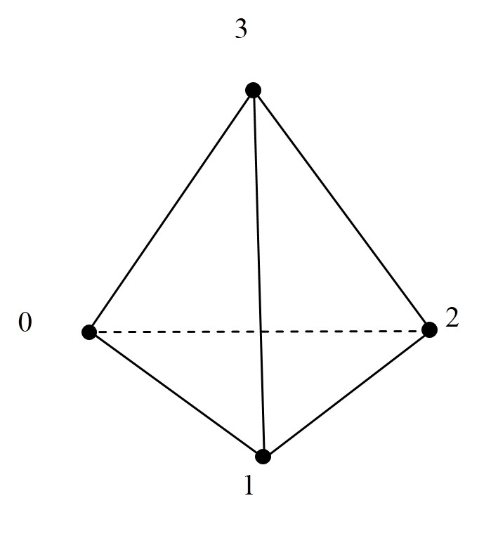

# 手册前言

JAUMIN框架入门手册，适合新手熟悉框架并快速上手。

**阅读顺序**：首先阅读第1章、第2章，对JAUMIN框架函数调用流程有所了解，然后参考附录中一个简单问题的完整代码，就细节进行进一步学习，细节知识在第3~7章查阅。

**章节简介：**

第1章：介绍JAUMIN框架以及必备知识，会引入一些并行相关的概念，这些概念贯穿整个手册，请**仔细阅读**；

第2章：介绍JAUMIN框架函数调用流程，请**仔细阅读**；

第3～7章：数值计算流程的细节知识点，**按需查阅**；

附录信息涵盖面较广，**按需查阅**。


[TOC]


# 第1章

本章分为两部分。第一部分介绍 JAUMIN框架，包括框架的定位，提供的功能支持，在各学科及工程领域的应用；第二部分介绍JAUMIN使用的必备知识，会引入一些并行相关的概念，这些概念会贯穿整个手册。

## 1.1 JAUMIN简介

JAUMIN，北京应用物理与计算数学研究所研制，全称是并行自适应非结构网格应用支撑软件框架(J parallel Adaptive Unstructured Mesh applications INfrastructure)，J代表北京应用物理与计算数学研究所。

### 1.1.1 什么是框架


### 1.1.2 JAUMIN提供的功能和支持


### 1.1.3 JAUMIN在各学科及工程领域的应用


## 1.2 预备知识

数值模拟过程将原来在空间与时间坐标中连续的物理量的场，用一系列有限个离散点（节点）上的值的集合代替，这些离散点上变量值之间的代数方程称作离散方程。通过求解代数方程可获得所求变量的近似值。图1.1左是将空间离散为许多小的网格单元，将整个空间上连续物理量的求解转换为每个网格单元上物理量的求解。

**什么是并行？难点是什么？**

在求解问题规模较大时，**串行**程序（图1.1左）将整个求解域上的物理量计算交给一个处理器，不能充分利用硬件资源，速度慢。当采用多个处理器处理一个问题时，也就是**并行**（图1.1右），会考虑将整个网格域分割成多个**网格片**（网格片由若干网格单元及其上的物理量数据构成，是并行计算的基本单位）并派发到不同处理器进行处理，这样无疑会缩短时间，但这个过程中会引入一些问题，比如：

①每个网格片不是孤立的，它会依赖周围网格片上的数据结果；

②某个网格片算完了，但它依赖的周围数据还在计算中，这个网格片就必须等待。

这些问题直接影响结果准确性和程序效率，在并行计算中都是需要考虑的。在并行中这两个问题对应**数据通讯**和**负载平衡**问题。


<p align="center"></p>
<p align="center">图1.1 串行与并行 （右图并行计算中一个处理器处理两个网格片）</p>
**JAUMIN帮助用户解决并行难题：并行思考，串行编程**

由于并行计算引入的问题（数据通讯和负载平衡）归根究底是与待求解的问题不相关的，是追求更快的计算手段引入的，对于关注物理问题的工程师来说，学习并行知识会浪费大量时间。可否用已经掌握的串行程序，稍加变动，使其能够适应并行计算呢？

JAUMIN 框架便是针对这种需求产生的，它要求用户将放在整个求解域的目光转移到一个网格片，对网格片**串行编程**，JAUMIN框架会自动遍历所有的网格片进行计算，同时完成数据通讯和负载平衡。

串行编程时，JAUMIN要求用户将目光放在一个网格片上，这个网格片是任意一片，用户思考这任一网格片在边界区域该如何处理，与网格片相邻该如何处理，是否要用到相邻网格片的信息，哪些数据要用邻网格片的信息，要用多大范围的邻片信息等等问题，这些问题的思考便是框架要求的**并行思考**。

**JAUMIN中的数据通讯**

网格片由网格信息和其上的数据信息构成。每个网格片上可以存一系列数据，如压力，密度，温度等数据，这便是**数据片**。数据片是网格片的一部分，一个网格片上可以包含多个数据片，分别存储不同的物理量，如压力数据片，密度数据片，温度数据片。部分数据片依赖相邻网格片上数据片的信息，不同数据片依赖程度也不相同，这个由用户采取的方法决定，需要由用户给定，更具体内容将在第4章说明。

数据片向外扩展一层或多层网格单元，新增的区域称为该数据片**影像区**，延扩的网格单元个数为**影像区宽度**。如图1.2所示，图中是两层影像区，称**影像区宽度为2**。若有数据片拓展了影像区，则数据片除了网格片内部的值，还会包含影像区部分的值。这里需要说明的是：每个网格片仍然是互不重叠的，图1.2白色区域是一个网格片，对应图1.1中网格片（2），不会因为影像区的存在而扩大。影像区是在计算某些物理量时需要一些当前网格片之外的数据信息，便在物理量已有的数据后多存一些数据参与计算，多存放部分数据的长度是根据采用的离散方法和网格确定的。投射到空间上便是白色区域对应网格片，已有的数据对应白色区域网格单元上的数据，增加部分数据对应影像区网格单元上的数据。放在整个计算域来看，网格片互不重叠，整个数据片对应的网格会有交叉，交叉部分便是JAUMIN框架进行数据通讯的部分。

<p align="center"></p>
<p align="center">图1.2 影像区</p>
可以发现，一旦影像区的值确定了，单个网格片上的计算便按照串行程序进行，改变的只是整个计算域缩为一个网格片。关于影像区是如何确定下来的，这点是JAUMIN框架在各个网格片上通讯处理实现的，用户现阶段可以不必关心。在这里需要记住：**影像区范围是用户确定的，影像区的值视为已知使用**。

## 小结

这一章介绍了 JAUMIN ，就**并性思考，串行编程**作了解释。阅读完本章，需要对并行计算及JAUMIN的一些知识有所了解：**网格片，数据片，影像区，影像区宽度，并性思考串行编程**。

本章之后，将正式利用JAUMIN框架编写计算程序，JAUMIN的安装信息参考**附录**。


# 第2章

这一章从数值模拟的流程出发，介绍JAUMIN框架的调用流程，然后介绍流程中几个部分的具体实现和JAUMIN中一些个性化工具，最后给出3-8章内容的介绍。

## 2.1 数值模拟的一般流程

数值模拟的一般流程如图2.1左所示，不同的数值解法（有限差分法FDM，有限元法FEM，有限体积法FVM等）主要的区别是只存在于区域离散、方程离散、求解离散方程三个方面的细节。

在编写代码之前，用户必须先确定好离散区域（网格文件）、离散方程、边界和初始条件离散，将控制方程的求解转化为节点上离散方程的求解，并确定离散方程如何求解。程序的编写是求解离散方程，这一步基本流程如2.1右图所示。

<p align="left"></p>
<p align="center">图2.1 数值模拟一般流程</p>
## 2.2 JAUMIN流程

在JAUMIN中，问题的求解过程是分三个层次调用完成的：**Main（程序主体）----Level层次（离散方程求解顺序控制）-----Patch层次（求解过程的具体实现）**，这三部分是需要用户实现的部分。整个流程如图2.2所示。

**Main程序主体：“启动JAUMIN框架----数据文件的读入----建立算法-----初始化-----时间步循环推进计算-----终止JAUMIN框架“**；

**Level层次：”初始化----时间步长----推进一个时间步执行计算-----更新数据**；初始化只有一次，另外的部分由Main程序主体中的时间步循环控制执行次数；

**Patch层次:网格层上的每个流程步在网格片上的具体实现**。


<p align="left"></p>
<p align="center">图2.2 JAUMIN嵌套调用流程</p>
**注意**：所有网格片构成整个计算域一层网格，称作**网格层**。

JAUMIN流程与图2.1所示的流程一致，与串行编程几乎没有区别，只是将整个流程分作如图2.2所示三个层次。分作三个层次是因为：JAUMIN针对网格片串行编程，对应的是Patch层次；框架内部会遍历所有的网格片执行同样的操作并完成数据通讯，这部分在网格层和网格片之间由**构件**完成；Level层次执行的流程便是串行程序在整个求解域上一个完整时间步的操作，故命名Level层次；Main函数控制更上层的流程。

**构件**连接Level层次和Patch层次，可以理解为在Level层次上使用构件便可以对所有网格片执行同样的操作，更多具体信息会在第5章解释，这部分也是JAUMIN串行编程的关键所在。JAUMIN流程图三个层次之外的部分（时间算法函数细节和构件实现细节）是隐藏在框架中的，用户无需干涉，在这里只是辅助说明整个流程。

在了解整个流程之后，便可以搭建三个层次的代码了，只需把必要的成员函数写上即可。下面给出Main函数的算法和计算部分、Level层次的函数和Patch层次的函数，对应的编号与2.2流程图中一致。

### 2.2.1 Main主程序

这里只写了算法和计算部分详细信息，分别对应图2.2中Main主函数的③、④。

算法区域的代码，PoissonLevel类中主要是搭建网格层上计算流程，Poisson类中主要是编写网格片上数值计算代码。

计算部分的代码，由框架调用用户编写的level层次和patch层次的数值计算代码，完成初始化与时间推进求解。

```c++
/****************************************************************************
*                                3.算法                                      *
****************************************************************************/
// (3.1) 网格片（Poisson是patch层次的实现类）
Poisson* Poisson_patch =
     new Poisson("Poisson_patch", input_db->getDatabase("Poisson"));

// (3.2) 网格层（PoissonLevel是level层次的实现类）
PoissonLevel* Poisson_level =
        new PoissonLevel("Poisson_level", Poisson_patch);

// (3.3) 时间算法
tbox::Pointer<algs::HierarchyTimeIntegrator<NDIM> > time_integrator =
    new algs::HierarchyTimeIntegrator<NDIM>(
        "HierarchyTimeIntegrator",
        input_db->getDatabase("HierarchyTimeIntegrator"), patch_hierarchy,
        Poisson_level, true);
/****************************************************************************
*                                 4.计算                                     *
****************************************************************************/
//（4.1）初始化
time_integrator->initializeHierarchy();

//（4.2）推进计算（loop时间步）
double loop_time = time_integrator->getIntegratorTime();  //当前时刻
double loop_time_end = time_integrator->getEndTime();     //终止时间

int iteration_num = time_integrator->getIntegratorStep();  //当前时间步数序号
 
while ((loop_time < loop_time_end) && time_integrator->stepsRemaining()) {
iteration_num = time_integrator->getIntegratorStep() + 1;  //步数序号加1
double dt_actual = time_integrator->advanceHierarchy();    //时间步进，返回时间步长
loop_time += dt_actual;                                    //时间累计
}
```

### 2.2.2 Level层次

Level层次对应的的类PoissonLevel  从algs::TimeIntegratorLevelStrategy类派生，基类algs::TimeIntegratorLevelStrategy中声明了main函数中类algs::HierarchyTimeIntegrator和用户定义的流程算法之间的调用接口，更多细节可以参考TimeIntegratorLevelStrategy.h头文件。

```c++
//1.构造函数
PoissonLevel::PoissonLevel(const string& object_name,
                                           Poisson* patch_strategy) {

}

//析构函数
PoissonLevel::~PoissonLevel() {}

//2.创建构件，是PoissonLevel类必须实现的一个函数
void PoissonLevel::initializeLevelIntegrator(
    tbox::Pointer<algs::IntegratorComponentManager<NDIM> > manager) {
     //这部分参考第5章 构件 进行填充
}

//3.初始化
void PoissonLevel::initializeLevelData(
    const tbox::Pointer<hier::BasePatchLevel<NDIM> > level,
    const double init_data_time, const bool initial_time) {
     //这部分参考第5章 构件 进行填充
}
//4.计算时间步长
double PoissonLevel::getLevelDt(
    const tbox::Pointer<hier::BasePatchLevel<NDIM> > level,
    const double dt_time, const bool initial_time, const int flag_last_dt,
    const double last_dt) {
     //这部分参考第5章 构件 进行填充     
}
//5.一个时间步计算，是PoissonLevel类必须实现的一个函数
int PoissonLevel::advanceLevel(
    const tbox::Pointer<hier::BasePatchLevel<NDIM> > level,
    const double current_time, const double predict_dt, const double max_dt,
    const double min_dt, const bool first_step, const int step_number,
    double& actual_dt) {
      //根据计算方法参考第5章 构件 进行填充     
     actual_dt = predict_dt;
     return (0);
}
//6.更新数值解
void PoissonLevel::acceptTimeDependentSolution(
    const tbox::Pointer<hier::BasePatchLevel<NDIM> > level,
    const double new_time, const bool last_step) {
      //这部分参考第5章 构件 进行填充
}
```

从程序的注释中可以看到，Level层与构件关系密切，可从第五章查阅相关信息。上面给出的是相对常用的接口，更多接口可参考TimeIntegratorLevelStrategy.h头文件。

### 2.2.3 Patch层次

Patch层次对应的的类Poisson  从algs::StandardComponentPatchStrategy派生，基类algs::StandardComponentPatchStrategy中定义了各构件和网格片计算程序之间的接口，下面给出的是相对常用的接口，细节可以参考StandardComponentPatchStrategy.h头文件。

```c++
//1.构造函数
Poisson::Poisson(const string& object_name,
             tbox::Pointer<tbox::Database> input_db) {
    // 注册变量和数据片.
    registerModelVariables();
}
// 注册变量和数据片.
void Poisson::registerModelVariables() {
     //这部分参考第四章 变量与数据片                  
}
//析构函数
Poisson::~Poisson() {};

//2.数据片注册到构件，是Poisson类必须实现的一个函数
void Poisson::initializeComponent(
    algs::IntegratorComponent<NDIM>* component) const {
      //这部分参考第四章 变量与数据片 与第五章 构件
}

//3.网格片上初始化
void Poisson::initializePatchData(hier::Patch<NDIM>& patch, const double time,
                                const bool initial_time,
                                const string& component_name) {
     //参考3-7章
}
//4.网格片上时间步长
double Poisson::getPatchDt(hier::Patch<NDIM>& patch, const double time,
                         const bool initial_time, const int flag_last_dt,
                         const double last_dt, const string& component_name) {
     //参考3-7章
}
//网格片上计算一个时间步
void Poisson::computeOnPatch(hier::Patch<NDIM>& patch, const double time,
                           const double dt, const bool initial_time,
                           const string& component_name) {
     //参考3-7章 
}
```


## 2.3 Main主程序

从流程图可以知道**Main程序主体流程：“启动JAUMIN框架----数据文件的读入----建立算法-----初始化-----时间步循环推进计算-----终止JAUMIN框架“**。下面将介绍启动终止、数据文件读入，在了解这几部分之后，整个main流程便基本介绍清楚了。关于输出、重启动、日志文件和计时器的内容参考**附录**。一个完整的Main函数主体也在**附录**中给出了。

### 2.3.1 JAUMIN框架的启动与终止

利用 JAUMIN 框架进行编程，程序必须调用函数 tbox::MPI::init() 和 tbox::MPI::finalize() 分别启动和终止MPI系统，在这两个函数之间调用tbox::JAUMINManager::startup() 和 tbox::JAUMINManager::shutdown()，用于启动和终止JAUMIN系统。

下面以一个Helloworld的例子说明：

```c++
#include <string>
#include "jaumin/MPI.h"
#include "jaumin/JAUMINManager.h"

int main(int argc,char* argv[]){
    //初始化MPI和JAUMIN环境。
    JAUMIN::tbox::MPI::init(&argc,&argv);
    JAUMIN::tbox::JAUMINManager::startup();
    
    //输出
    std::cout<<"Hello,world!"<<std::endl;
    
    //释放JAUMIN和MPI内部资源
    JAUMIN::tbox::JAUMINManager::shutdown();
    JAUMIN::tbox::MPI::finalize();
    
    return(0);
}
```

对上面程序的几点解释：

1. 注意头文件，在使用JAUMIN框架中的函数时，要注意是否包含对应头文件。头文件的分类可以参考**附录**。

2. 类tbox::MPI 和类tbox::JAUMINManager 均是静态类，前者提供JAUMIN框架和JAUMIN应用程序可能用到的消息传递通信函数，后者提供JAUMIN框架的管理函数。

3. 关于编译和运行参考相关**附录**。在终端会输出

   ```c++
      Hello,world!
   ```

### 2.3.2 JAUMIN框架读取输入文件

#### 2.3.2.1 读入.input文件

JAUMIN支持程序从指定的文件中读取计算参数，计算参数以“**关键词=值**”的形式给出，一行列出一个参数。若干参数被封装在一对括弧"{ }"中，括弧前给定一个名称，称“{}"内包含的内容为一个**数据库**，括弧前的名称为**数据库名称**。输入文件.input格式比较简单，用户可以直接从JAUMIN给出的示例程序中复制并修改。下面是个简要示例，取了.input文件中的一部分：

```c++
Main{
    log_all_nodes = FALSE
    ...
    javis_dump_interval = 100
    javis_dump_dirname = "javis_test2d_Rectangle"
    javis_number_procs_per_file = 1
    ...
}
....
GridGeometry{
    MeshImportationParameter{
        file_name = "../input/mesh_2d_20000.k"
    }
} 
....
```

解释：这里截取出的两段包含三个数据库：Main，GridGeometry ,  MeshImportationParameter。数据库可以嵌套，一个数据库可以包含多个子数据库。这里数据库GridGeometry 包含MeshImportationParameter子数据库。

在JAUMIN中，输入文件中的所有数据库都会被读取并存储在名为“input_db"大型数据库中，这个大型数据库称为**根数据库**。从根数据库中，可以由数据库名称获得输入文件中所有的数据库，进一步可以通过关键词访问对应的值，也可以将计算结果以“**关键词=值**“的形式存入数据库。JAUMIN支持多种类型的参数值，包括所有基本数据类型，以及JAUMIN提供的数据类型，如类tbox::DataBase和类hier::Box<DIM> 。这些数据可以以单个数据的形式列出，也可以以数组的形式列出，对于数组，连续输入的参数值之间用逗号”，“分割，较长的数组可在连续多行中依次列出，更多具体接口从Database.h中查找。下表是部分接口及功能描述：

<p align="center">表2.1 </p>
<table>
    <tr>
        <td>接口</td>
        <td>功能</td>
    </tr>
    <tr>
        <td>getDatabase()</td>
        <td>读取一个与指定关键字关联的子数据库</td>
    </tr>
    <tr>
        <td>getString()</td>
        <td>读取一个与指定关键字关联的字符串. 若数据库中不存在该关键字, 则出错</td>
    </tr>
    <tr>
        <td>getIntegerWithDefault()</td>
        <td>读取一个与指定关键字关联的整数. 若数据库中不存在该关键字,则返回缺省值</td>
    </tr>
    <tr>
        <td>getBoolWithDefault()</td>
        <td>读取一个与指定关键字关联的逻辑型布尔值. 若数据库中不存在该关键字,则返回缺省值</td>
    </tr>
    <tr>
        <td>getDoubleWithDefault()</td>
        <td>读取一个与指定关键字关联的double数. 若数据库中不存在该关键字,则返回缺省值</td>
    </tr>
针对给出的.input文件片段，取出具体的值的具体操作由下面程序给出，
示例代码如下：

```c++
#include "MPI.h"
#include "JAUMINManager.h"
#include "InputManager.h"
using namespace JAUMIN;

int main(int argc,char* argv[]){
    //初始化MPI和JAUMIN环境。
    tbox::MPI::init(&argc,&argv);
    tbox::JAUMINManager::startup();
    
    // 解析命令行参数,srgv[1]此处是input文件名
    string  input_filename = argv[1];

    //解析输入文件的参数到根数据库input_db，接口parseInputFile
    tbox::Pointer<tbox::Database> input_db =new
        								tbox::InputDatabase("input_db");
    tbox::InputManager::getManager()->parseInputFile(input_filename, input_db);

    //从根数据库中获取名为Main的子数据库
    tbox::Pointer<tbox::Database> main_db = input_db->getDatabase("Main");
 
    //从Main子数据库通过关键词获得对应的值
    bool log_all_nodes = 
        main_db->getBoolWithDefault("log_all_nodes", false);
    int javis_dump_interval =
        main_db->getIntegerWithDefault("javis_dump_interval", 0);
    string javis_dump_dirname = 
        main_db->getString("javis_dump_dirname");
    int javis_number_procs_per_file =
          main_db->getIntegerWithDefault("javis_number_procs_per_file", 1);
    //从GridGeometry数据库里的MeshImportationParameter数据库获得文件名，一种更直接的写法
    string mesh_file = input_db->getDatabase("GridGeometry")
                         ->getDatabase("MeshImportationParameter")
                         ->getString("file_name");
    
	//输出显示
    std::cout<<log_all_nodes<<std::endl;
    std::cout<<javis_dump_interval<<std::endl;
    std::cout<<javis_dump_dirname<<std::endl;
    std::cout<<javis_number_procs_per_file<<std::endl;
    std::cout<<mesh_file<<std::endl;
    
    //释放JAUMIN和MPI内部资源
    JAUMIN::tbox::JAUMINManager::shutdown();
    JAUMIN::tbox::MPI::finalize();
    
    return(0);
}
```

程序的输出如下，bool为0表示FALSE

```c++
0
1
javis_poisson_2d
1
../input/mesh_2d_20000.k
```


#### 2.3.2.2 读入网格文件

目前为止，JAUMIN支持的输入网格文件格式比较单一，目前仅限于.k文件与.j文件，常用k文件。关于k文件的内容在**附录**中可以查看。.input文件中需要写出k文件的路径（上面.input文件的代码中可以看到），在主程序中，只需要在网格文件名前面追加input文件的路径，JAUMIN框架会自动读取k文件并保存在根数据库中。具体如何在网格文件名前面追加input文件的路径可以参考示例程序，这部分用户可以直接挪用，不必关注更多细节。


## 2.4 JAUMIN中的工具

### 2.4.1 灵敏指针类

JAUMIN框架提供**灵敏指针类**（smart  pointer） tbox::Pointer ,可以避免内存泄露。对JAUMIN 提供的的类，灵敏指针的使用方法与C++提供的标准指针相同，如下面程序13行所示。关于灵敏指针的用法可以查看Pointer.h文件。

这里**建议**：JAUMIN框架外用户自己定义的类用C++提供的标准指针，指向JAUMIN框架中的类用灵敏指针。下面程序网格片类和网格层类是用户自己定义的，采用标准指针，时间算法类是JAUMIN框架提供的，采用灵敏指针。

灵敏指针指向的内存空间由 JAUMIN管理，不会出现内存泄露；标准指针指向的内存空间不会被JAUMIN释放，故对于标准指针指向的内存空间用户需要自行管理，防止内存泄露，如下述程序24、25行所示，释放的是标准指针指向的内容。

```c++
/*******************************************************************************
*                                 算法                                          *
*******************************************************************************/
// (1) 网格片
Poisson* Poisson_patch =
    new Poisson("Poisson_patch", input_db->getDatabase("Poisson"));

// (2) 网格层
PoissonLevel* Poisson_level =
    new PoissonLevel("Poisson_level", Poisson_patch);

// (3) 时间算法
tbox::Pointer<algs::HierarchyTimeIntegrator<NDIM> > time_integrator =
    new algs::HierarchyTimeIntegrator<NDIM>(
        "HierarchyTimeIntegrator",
        input_db->getDatabase("HierarchyTimeIntegrator"), patch_hierarchy,
        Poisson_level, true);
/************************************************************************************
*                               模  拟  结  束                                       *
************************************************************************************/
    // 释放对象.
if (Poisson_patch) delete Poisson_patch;
if (Poisson_level) delete Poisson_level;
```

### 2.4.2 灵敏数组类

JAUMIN框架提供**灵敏数组类**（smart  array） tbox::Array ,可以避免内存泄露，是标准数组的替代。建议用户使用灵敏数组。灵敏数组的接口参考Array.h头文件，下面给出常见操作的具体内容。

```c++
//创建一个灵敏数组ean_extent
tbox::Array<int> ean_extent

//设置数组大小
ean_extent.resizeArray(3);
//获取数组元素个数
int numdata = ean_extent.getSize();
//获取数组首地址
int* add = ean_extent.getPointer();
//获取第i个数组元素
int data = ean_extent[i];
```

## 小结

本章重点是JAUMIN框架的流程；随后介绍了Main函数的各部分以及JAUMIN框架的工具。通过本章的学习，用户必须了解：**JAUMIN的流程，流程中各部分对应串行中的部分，搭建三个层次的代码，写出Main函数，指针与数组工具**。

**附录**中给出了一个Poisson方程的完整求解代码，用户在阅读完本章搭建出流程后，可以参考附录，对应3-7章的内容完善这个问题的求解。

对于求解过程中用到的信息和对应章节如下：

第3章**网格**：支持的网格类型，网格几何信息，邻接拓扑关系；

第4章**变量与数据**：变量在JAUMIN框架中如何使用，如何创建矩阵；

第5章**构件**：level网格层与patch网格片之间通过构件关联，串行编程并行计算的关键所在；

第6章**解法器**：求解矩阵方程；

第7章**可视化**：后处理。


# 第3章 网格

采用数值离散方法求解方程，必然需要网格相关信息。JAUMIN框架支持多种网格类型、支持用户获取网格相关信息、支持用户通过实体集标记一系列实体结构。

本章内容分布为：

**网格类型**：9种网格类型及结点编码顺序-------------------------------------------------------------------------------参考3.1节

**网格数目**：网格单元、边、面、结点数目-------------------------------------------------------------------------------参考3.2节

**几何信息**：单元、面、边的中心坐标及节点坐标----------------------------------------------------------------------参考3.3节

**邻接拓扑关系**：任一网格结构（点/线/面/单元）周围的网格结构信息-----------------------------------------参考3.5节

**实体集**：实体集的概念、用处-----------------------------------------------------------------------------------------------参考3.6节


## 3.1 网格类型

用户可以在CellType.h文件中查询到JAUMIN框架中支持的网格单元类型。

JAUMIN框架支持多维度，多几何形状的网格类型，如表3.1所示，目前支持9类基本实体网格类型（包括点）。

<p align="center">表3.1 网格拓扑关系
<table>
 <tr> 
     <th width="16%">网格类型</th>
     <th width="22%">示意图</th>
     <th width="15%">结点编号顺序<br>(拓扑关系)</th>
     <th width="44%">拓扑数组</th>
  </tr>
  <tr>
        <td rowspan="1"> 线段 </td>
     <td rowspan="1"></td>
     <td rowspan="1"> <边，结点></td>
     <td>null</td>              
  </tr>
 <tr> 
     <td rowspan="2"> 三角形 </td>
     <td rowspan="2"></td>
     <td rowspan="2"> <边，结点></td>
     <td>ext=[0,2,4,6]</td>
</tr>
<tr>
	<td>idx=[0,1,1,2,2,0]</td>
</tr>
     <tr> 
     <td rowspan="2"> 四边形 </td>
     <td rowspan="2">  </td>
     <td rowspan="2"> <边，结点></td>
     <td>ext=[0,2,4,6,8]</td>
</tr>
<tr>
	<td>idx=[0,1,1,2,2,3,3,0]</td>
</tr>
       <tr> 
     <td rowspan="1"> 任意多边形 </td>
     <td rowspan="1">  </td>
     <td rowspan="1"> <边，结点></td>
     <td>null</td>
</tr>
     <tr> 
     <td rowspan="4"> 四面体 </td>
     <td rowspan="4"> </td>
     <td rowspan="2"> <边，结点> </td>
     <td> ext=[0,2,4,6,8,10,12]</td>
     <tr>
          <td>idx=0,1,0,2,0,3,1,2,1,3,2,3</td>
     </tr>
     <td rowspan="2"><面，结点></td>
         <td>ext=[0,3,6,9,12]</td>
     <tr>
          <td>idx=[0,1,3,1,2,3,2,0,3,0,2,1]</td>
     </tr>
</tr>
<tr> 
     <td rowspan="4"> 三棱柱 </td>
     <td rowspan="4"></td>
     <td rowspan="2"> <边，结点> </td>
     <td> ext=[0,2,4,6,8,10,12,14,16,18]</td>
     <tr>
          <td>idx=[0,1,0,2,1,2,3,4,3,5,4,5,1,4,2,5,0,3]</td>
     </tr>
     <td rowspan="2"><面，结点></td>
         <td>ext=[0,3,6,10,14,18]</td>
     <tr>
          <td>idx=[0,2,1,3,4,5,0,1,4,3,1,2,5,4,0,3,5,2]</td>
     </tr>
</tr>
<tr> 
     <td rowspan="4"> 金字塔形 </td>
     <td rowspan="4"> </td>
     <td rowspan="2"> <边，结点> </td>
     <td> ext=[0,2,4,6,8,10,12,14,16]</td>
     <tr>
          <td>idx=[0,1,1,2,2,3,3,0,4,0,4,1,4,2,4,3]</td>
     </tr>
     <td rowspan="2"><面，结点></td>
         <td>ext=[0,4,7,10,13,16]</td>
     <tr>
          <td>idx=[0,3,2,1,4,0,1,4,1,2,4,2,3,4,3,0]</td>
     </tr>
</tr>
<tr> 
     <td rowspan="4"> 六面体 </td>
     <td rowspan="4"> </td>
     <td rowspan="2"> <边，结点> </td>
     <td> ext=[0,2,4,6,8,10,12,14,16,18,20,22,24]</td>
     <tr>
          <td>idx=[0,1,1,2,2,3,3,0,4,5,5,6,6,7,7,4,0,4,1,5,2,6,3,7]</td>
     </tr>
     <td rowspan="2"><面，结点></td>
         <td>ext=[0,4,8,12,16,20,24]</td>
     <tr>
          <td>idx=[0,3,2,1,4,5,6,7,0,1,5,4,1,2,6,5,2,3,7,6,3,0,4,7]</td>
     </tr>
</tr>
</table>


**混合网格**：划分网格时难免会碰到混合网格，JAUMIN框架支持.k文件中的混合网格，如图3.1所示。

<p align="center">


<p align="center"> 图3.1 混合网格</p>
JAUMIN框架提供<单元，结点>、<边，结点>和<面，结点>三种网格拓扑关系，分别表示单元、各边、各面所有结点的编号顺序。

<单元，结点>拓扑关系从.k文件中直接获取。<边，结点>，<面，结点>拓扑关系由JAUMIN框架规定。

表3.1给出了<边，结点>和<面，结点>拓扑关系，用户亦可通过框架内拓扑规则推导出。通过ext和idx数组分别存储索引范围和索引关系，如图3.2所示


<p align="center">图3.2 三棱柱网格<线-点>拓扑关系</p>
三棱柱共有九条边，通过<边，结点>拓扑关系可知，每条边有两个结点，分别为(0,1)，(0,2)，(1,2)，(3,4)，(3,5)，(4,5)，(1,4)，(2,5)，(0,3)。共有五个面，通过<面，结点>拓扑关系可知，每个面上的结点分别为(0,2,1)，(3,4,5)，(0,1,4,3)，(1,2,5,4)，(0,3,5,2)。

JAUMIN框架中所有网格类型的ext数组和idx数组如表3.1所示。

**注意**：

1.在JAUMIN框架中的“单元”，其实际含义是“网格单元”，与力学中的element有区别。例如，<单元，结点>关系就是<网格单元，结点>关系。

2.<单元，结点>、<边，结点>和<面，结点>三种拓扑关系，能够告知用户任一网格类型的面、边、结点的局部编号排序方式。除非特殊需要，用户仅作了解。

## 3.2 网格数目

用户可以在Patch.h文件中查询获取网格数目的功能接口。

**网格数目**：JAUMIN框架支持用户获取网格片（可含影像区）上单元、面、边、结点的数目。

Patch类也称为网格片类，其位于Patch.h文件中，提供的相关接口如表3.2所示。其中width代表影像区宽度，当width=n，即获取包含第n层影像区的网格片上的数目，默认为0。

<p align="center">表3.2 获取网格数目函数接口</p>
<table>
<tr>
                      <td>函数接口</td>
                      <td>功能</td>
  </tr>
  <tr>
                      <td>getNumberOfCells(width)</td>
                      <td>获取当前网格片上单元数目</td>
  </tr>
    <tr>
                      <td>getNumberOfFaces(width)</td>
                      <td>获取当前网格片上面数目（仅适用于3维）</td>
  </tr>
    <tr>
                      <td>getNumberOfEdges(width)</td>
                      <td>获取当前网格片上边数目</td>
  </tr>
    <tr>
                      <td>getNumberOfNodes(width)</td>
                      <td>获取当前网格片上结点数目</td>
  </tr>
</table>

实例代码如下：

```c++
//必要头文件
#include Patch.h

//已知：hier::Patch<NDIM> patch。网格片对象包含网格片相关信息

// 获取当前网格片上单元数目
  int num_cells = patch.getNumberOfCells(0);
// 获取当前网格片，包括第一层影像区上的结点数目
  int num_nodes = patch.getNumberOfNodes(1);
```

**注意**：

1.用户需要调用Patch类中相关函数接口，所以必须有Patch类实例化的对象（通常情况下，框架接口会提供）。

2.“面”这种网格结构，只有三维才存在。因此，二维情况下，调用patch类的接口可以获取单元，线，结点的数目；三维情况下，调用patch类的接口可以获取单元，面，线，结点的数目。

3.表3.2中参数列表width表示影像区宽度，缺省情况下为0，表示获取网格片内部单元/点/边/面的数目。如果值为n，则表示获取网格片内部和前n层影像区中单元/点/边/面的总数。

## 3.3 网格几何信息

用户可以在PatchGeometry.h文件查询到网格几何信息。

**网格几何信息**：JAUMIN框架支持用户获取单元中心点、面中心点、边中心点、各结点坐标信息。

PatchGeometry类称为网格片几何类，其位于PatchGeometry.h文件中，提供的相关接口如表3.3所示。

<p align="center"> 表3.3 获取网格几何信息函数接口</p>
<table>
<tr>
<td>函数接口</td>
<td>功能</td>
</tr>
<tr>
<td>getCellCoordinates() </td>
<td> 获取网格片上单元中心点坐标</td>
</tr>
<tr>
<td>getFaceCoordinates() </td>
<td> 获取网格片上面中心点坐标</td>
</tr>
<tr>
<td> getEdgeCoordinates() </td>
<td> 获取网格片上边中心点坐标</td>
</tr>
<tr>
<td> getNodeCoordinates()</td>
<td> 获取网格片上结点坐标</td>
</tr>
<tr>
<td>getCellGlobalIds() </td>
<td>获取网格片上单元全局ID</td>
</tr>
<tr>
<td>getFaceGlobalIds() </td>
<td>获取网格片上面全局ID</td>
</tr>
<tr>
<td>getEdgeGlobalIds()</td>
<td>获取网格片上边全局ID</td>
</tr>
<tr>
<td>getNodeGlobalIds()</td>
<td>获取网格片上结点全局ID</td>
</tr>
</table>

示例代码如下：

```c++
//必要头文件
#include "Patch.h"
#include "PatchchGeometry.h"
#incude “NodeData.h” //结点类型数据片类，第4章介绍

//已知：hier::Patch<NDIM> patch。Patch类创建的对象patch，包含网格片相关信息；

//第一步：patch_geo为PatchGeometry类实例化的对象，包含网格片上几何信息
tbox::Pointer<hier::PatchGeometry<NDIM> > patch_geo =patch.getPatchGeometry();
//第二步：node_coords为点坐标的灵敏指针
tbox::Pointer<pdat::NodeData<NDIM, double> > node_coords =
      											patch_geo->getNodeCoordinates();
//第三步：获取灵敏指针地址，作为数组首地址
	double* node_data = node_coords->getPointer();
```

**注意**：

1.如上代码所示，用户需要先获取PatchGeometry类的一个实例化对象patch_geo，可通过调用对象patch中的函数getPatchGeometry()得到。

2.面中心点只有在三维情况下才存在。

3.更多网格几何的接口参考头文件PatchGeometry.h。

## 3.4 网格邻接拓扑关系

用户可以在PatchTopology.h文件查询到网格邻接拓扑关系。

**网格邻接拓扑关系**：用户JAUMIN框架支持用户获取任一网格结构（点/线/面/单元）周围的网格结构信息。例如，<单元，结点>邻接拓扑关系表示网格片上任一单元周围结点的编号信息（全局编号）。

如图3.2所示，JAUMIN框架使用位置数组与索引数组存储邻接拓扑关系。

**索引数组**：以<单元，结点>邻接拓扑关系为例，按照单元编号顺序存储了单元的邻接结点编号信息。

**位置数组**：又称为索引范围数组，以<单元，结点>邻接拓扑关系为例，按照单元编号顺序记录了每个单元的<单元，结点>关系数组在索引数组的起始位置。

图3.2中，显示了<单元，结点>的邻接关系，用户获取这两个数组后，可以计算出任一单元周围结点的的编号。

<p align="center"></p>
<p align="center">图3.2 邻接关系存储</p>
PatchTopology类也称为网格片拓扑类，其位于PatchTopology.h文件中，提供的相关接口如表3.4所示。

<p align="center">表3.4 网格邻接拓扑关系函数接口</p>
<table>
<tr>
<td>函数接口</td>
<td>功能</td>
</tr>
<tr>
<td>getCellAdjacencyCells(extent,indices)</td>
<td>获取<单元,单元>的位置、索引数组</td>
</tr>
<tr>
<td>getCellAdjacencyFaces(extent,indices)</td>
<td>获取<单元,面>的位置、索引数组</td>
</tr>
  <tr>
<td>getCellAdjacencyEdges(extent,indices)</td>
<td>获取<单元,边>的位置、索引数组</td>
</tr>
  <tr>
<td>getCellAdjacencyNodes(extent,indices)</td>
<td>获取<单元,结点>的位置、索引数组</td>
</tr>
  <tr>
<td>getFaceAdjacencyCells(extent,indices)</td>
<td>获取<面,单元>的位置、索引数组</td>
</tr>
<tr>
<td>getFaceAdjacencyFaces(extent,indices)</td>
<td>获取<面,面>的位置、索引数组</td>
</tr>
  <tr>
<td>getFaceAdjacencyEdges(extent,indices)</td>
<td>获取<面,边>的位置、索引数组</td>
</tr>
  <tr>
<td>getFaceAdjacencyNodes(extent,indices)</td>
<td>获取<面,结点>的位置、索引数组</td>
</tr>
  <tr>
<td>getEdgeAdjacencyCells(extent,indices)</td>
<td>获取<边,单元>的位置、索引数组</td>
</tr>
<tr>
<td>getEdgeAdjacencyFaces(extent,indices)</td>
<td>获取<边,面>的位置、索引数组</td>
</tr>
  <tr>
<td>getEdgeAdjacencyEdges(extent,indices)</td>
<td>获取<边,边>的位置、索引数组</td>
</tr>
  <tr>
<td>getEdgeAdjacencyNodes(extent,indices)</td>
<td>获取<边,结点>的位置、索引数组</td>
</tr>
  <td>getNodeAdjacencyCells(extent,indices)</td>
<td>获取<结点,单元>的位置、索引数组</td>
</tr>
<tr>
<td>getNodeAdjacencyFaces(extent,indices)</td>
<td>获取<结点,面>的位置、索引数组</td>
</tr>
  <tr>
<td>getNodeAdjacencyEdges(extent,indices)</td>
<td>获取<结点,边>的位置、索引数组</td>
</tr>
  <tr>
<td>getNodeAdjacencyNodes(extent,indices)</td>
<td>获取<结点,结点>的位置、索引数组</td>
</tr>
</table>

示例代码如下：

```c++
//必要头文件
#include "Patch.h"
#include "PatchTopology.h"

//已知：hier::Patch<NDIM> patch。网格片对象，包含网格片相关信息；

// 第一步：获取patch_top，包含网格片上邻接拓扑关系
	tbox::Pointer< hier::PatchTopology< NDIM > > patch_top = patch.getPatchTopology();
// 第二步：获取<单元, 单元>拓扑关系，得到位置数组与索引数组
	tbox::Array<int> cell_adj_cell_extent, cell_adj_cell_index;
	patch_top->getCellAdjacencyCells(cell_adj_cell_extent, cell_adj_cell_index);
```

**注意**：

1.如上代码所示，用户需要先获取PatchTopology类的一个实例化对象patch_top，可通过调用对象patch中的函数getPatchTopology()得到。

2.网格邻接拓扑关系获取的编号是全局编号，而3.1节中的单元拓扑关系的编号是局部编号。

3.关于图3.2与表3.4的进一步解释：

表3.4中，extent是位置数组， indices是索引数组。图3.2左是一个网格结构，单元和结点的编号在图上已经标注，构成单元的结点在体点表中列出；如图3.2右下，在JAUMIN框架中，采用一维压缩方式存储。以<单元，结点>为例：indices数组中，第extent[i]]位置到第extent[i+1]-1个位置上的值，表示第i个单元邻接的结点(即该单元周围结点的编号)。请用户对照图3.2，通过处理extent，indices数组获取邻接关系的示例代码如下：

```c++
vector<vector<int>> a;//存储所有单元的邻接结点编号
vector<int> b;//存储一个单元的邻接结点编号
for(i=0;i<extent.size()-1;++i){
	for(j=extent[i];j<extent[i+1];++j){
		b.push_back(indices[j]);
  }
	a.push_back(b);
  b.clear();
}
```

## 3.5 实体集

用户可以在EntityUtilities.h（实体类型查询）、EntitySet.h（实体集合类）、Ptach.h、PatchGeometry.h文件查询到实体集相关信息。

**实体集**：在JAUMIN框架中，将结点，边，面，单元等四种网格结构称为**实体**，同类型实体的子集称为实体集。实体集主要用途是标识材料属性、边界条件等。实体集中的实体只能是结点，边，面，单元中一种，对应的，JAUMIN中的实体集类型包括NODE型、EDGE型、FACE型、CELL型。

JAUMIN框架使用整型对每个实体集编号，编号EntityID与实体集的组成在.K文件中定义。每个实体集与一个<实体集编号ID，实体集类型>对应。

<p align="center">  </p>
<p align="center"> 图3.3 实体集示意图</p>
图3.3左为边界定义了3个Edge型实体集，实体集索引号分别为0、1、2，实体集类型均为边，通过这个编号可推断出上下两个边界是同一类边界，需要进行相同的处理，至于是否和左右两边相同则无法知道，因为用户可以根据自己的习惯将它们分开编号，尽管是同一类边界进行的处理也可能相同。分开编号是被允许的。

图3.3右中的实体集随着网格片被剖分成多个子集，每个网格片就只会存储实体集属于本网格片的部分。

表3.5列出了Patch.h中实体集相关接口，表3.6列出了PatchGeometry.h中实体集相关接口。

<p align="center">表3.5 Patch.h中实体集相关接口</p>
<table>
<tr>
<td>函数接口 </td>
<td>功能</td>
</tr>
<tr>
<td>getNumberOfEntities() </td>
<td>获取网格片（可包含影像区）上指定类型实体数目</td>
</tr>
<tr>
<td>hasEntitySet()</td>
<td>判断网格片（可包含影像区）上是否有指定类型实体集</td>
</tr>
<tr>
<td>getEntityIndicesSet()</td>
<td>获取网格片（可包含影像区）上指定类型实体集的编号索引数组</td>
</tr>
<tr>
<td>findEntityInSet()</td>
<td>判断某实体是否在某个实体集内</td>
</tr>
</table>


<p align="center">表3.6 PatchGeometry.h中实体集相关接口</p>
<table>
<tr>
<td>函数接口 </td>
<td>功能</td>
</tr>
<tr>
<td>getCoordinates() </td>
<td>获取指定类型实体坐标</td>
</tr>
<tr>
<td>getNumberOfEntitySet()</td>
<td>获取当前网格片上的实体集总数目</td>
</tr>
<tr>
<td>getEntitySet()</td>
<td>获取指定编号的实体集</td>
</tr>
<tr>
<td>hasEntitySet()</td>
<td>判断是否有指定类型和编号的实体集</td>
</tr>
<tr>
<td>getEntityIndicesInSet()</td>
<td>获取指定类型，编号的实体集中的实体编号索引数组</td>
</tr>
<tr>
<td>findEntityInSet()</td>
<td>判断某实体是否在某个实体集内</td>
</tr>
</table>

```C++
//必要头文件
#include "Patch.h"
#include "PatchGeometry.h"
#include "NodeData.h" //结点数据类，后续介绍
//已知：hier::Patch<NDIM> patch。Patch类创建的对象patch，包含网格片相关信息；

/*********************通过patch类接口获取实体集信息****************************/
int Entity_num=patch.getNumberOfEntity();

/*********************通过PatchGeometry类接口获取实体集信息****************************/
//示例获取节点坐标
//第一步：获取patch_geo，其为PatchGeometry类创建的对象，包含网格片上几何信息
	tbox::Pointer< hier::PatchGeometry<NDIM>> patch_geo = patch.getPatchGeometry();
//第二步：获取网格片上所有Node型实体的坐标，返回指针node_data
	tbox::Pointer<pdat::NodeData<NDIM,double> > node_data =patch_geo->getCoordinates(EntityUtilities:: Node);
//第四步：通过node_data->getNumberOfEntity()获取实体总数，构造一个Array数组
	tbox::Array<hier::DoubleVector<NDIM>> node_coords(node_data->getNumberOfEntity(1));
//第五步：将结点坐标存入node_coords
  	  for(int i=0;i<node_coords.size();i++){
   	     //NDIM为维度
   	     for(int j=0;j<NDIM;j++){
   	         node_coords[i][j]=(*node_data)(j,i);
   	     }
  	  }
```

**注意**：

1.再次解释实体集的概念与用处：在做数值计算时，无论是采用计算软件或者自行编程，都会遇到处理边界这个问题，在利用计算软件的时候，需选定一条线或者一个面或者一个端点，为其取名并给定性质：绝热边界/自由边界/固壁面等。在自行编程的时候也是如此，按照物理问题对一部分单元或者点/边/面进行特殊的操作。这种操作在JAUMIN中便是对实体集的操作。

2.区分实体与实体集的概念：实体是指点，线，面，单元；实体集是一系列同类型实体的集合。

3.上述代码中，NodeData类继承自PatchData类，PatchData类中有getNumberOfEntity()函数，可获取网格片上（可包含影像区）上的指定类型的实体总数。


## 小结

本章的内容是用户编写数值计算程序的基础。通过学习本章内容，希望用户能简要了解JAUMIN框架支持的网格类型与实体集的基本概念。同时，用户能够获取网格相关的基本信息，如网格片上的实体数量，网格相关坐标，网格邻接拓扑关系等。


# 第4章 变量与数据

数值计算必然需要定义变量与管理数据。在JAUMIN框架中，**变量**用于声明物理量（区别于计算机语言的变量），而**数据片**用于存储物理量的值。数据片的创建与使用是学习JAUMIN的关键，本章主要目的是让用户理解数据片的概念，并学会如何创建数据片。

用户需要先创建变量和上下文，随后将其与影像区宽度绑定，从而建立数据片（即一个<变量，上下文，影像区宽度>确定一个数据片）。JAUMIN框架通过数据片来存储数据，帮助用户管理数据。用户仅需学习如何定义变量，数据片，以及了解数据片的数据结构即可。

本章内容分布为：

**创建变量**（变量的定义，类型，创建）----------------------------------------------------------------------------------参考4.1节

**创建上下文**（上下文的定义，创建）-------------------------------------------------------------------------------------参考4.2节

**创建数据片**（数据片的定义，类型，创建）----------------------------------------------------------------------------参考4.3节

**浅谈数据片**（数据片的具体使用，区别，存储方式）---------------------------------------------------------------参考4.4节

## 4.1 创建变量

**变量**：JAUMIN框架中的变量是指定义在网格结构（点，线，面，单元）上的物理量，与计算机语言的“变量”不同，它仅声明物理量，没有存储物理量的值。

在JAUMIN框架中，变量分为两类：

一.普通类型变量。该类型变量是将物理量定义在网格的几何位置上（点心，面心，边心等等）。

二.矩阵与向量。该类型变量的定义需要自由度信息。

希望用户在学习与使用的过程中，自行体会两种变量的区别。

### 4.1.1 普通类型变量

**变量类型**：根据变量（物理量）分布在网格上的几何位置来定义变量类型，JAUMIN框架提供了8种变量类型，包括中心量（CellVariable），结点量（NodeVariable），边心量（EdgeVariable），面心量（FaceVariable），粒子量（ParticleVariable），外表面边心量（OuterEdgeVariable），外表面面心量（OuterFaceVariable），外表面结点量（OuterNodeVariable），各种类型变量相对网格的几何位置如图4.1所示。

|  |  |  |  |
| :----------------------------------------------------------: | :----------------------------------------------------------: | :----------------------------------------------------------: | :----------------------------------------------------------: |
|                            结点量                            |                            边心量                            |                            面心量                            |                            中心量                            |
|  |  |  |  |
|                         外表面结点量                         |                         外表面边心量                         |                         外表面面心量                         |                            粒子量                            |

<p align="center"> 图4.1 变量定义在网格几何位置上<p>
**变量深度：**表示变量分量的个数。例如：在三维空间中，物理量”速度“包含了三个方向的分量，则该变量的深度为3。

**变量群数：**群体是多个数据元素组成的集合体，群数则是此类集合体的数目。例如：将所有结点的”速度“的三个方向分量分别包含在群体1，群体2，群体3中，此时群数为3。

用户可通过设置变量类型，变量深度，变量群数来确定数据片（4.3节介绍）存储数据的数据格式。以图4.2的结点量为例，在结点上存储结点坐标(x,y,z)，有两种方法：

①定义结点量，深度为3，结点量为n，群数为1，则数据片上的数据结构为一个数组：

[x1,x2,x3......xn,y1,y2,y3......yn,z1,z2,z3......zn]

②定义结点量，深度为1，结点量为n，群数为3，则数据片上的数据结构为一个数组：

[x1,y1,z1,x2,y2,z2,x3,y3,z3,......xn,yn,zn]

注意：将数据传入Fortran子程序时，是将数据首地址传递给形参。

设深度为i，实体数为j，群数为k。JAUMIN框架用一维数组存储数据，将数据首地址传入Fortran子程序后，Fortran存放数据从低维开始，建议用户建立三维数组，大小为（k,j,i），即（群数，实体数，深度）。

<p align="center">             </p>
<p align="center"> 图4.2 </p>
如图4.3所示，普通类型变量的创建均需要由变量类型，变量名，群数，深度共同决定。

<p align="center">   </p>
<p align="center"> 图4.3 创建普通类型变量</p>
表4.1列出了不同变量类型的接口。其中，name是变量名，group是群数，depth是深度。

<p align="center"> 表4.1 创建普通类型变量的构造函数 </p>
<table>
<tr>
<td> 构造函数</td>
<td> 变量类型</td>
<td> 头文件</td>
</tr>
    <tr>
<td> pdat::CellVariable<DIM,Type>("name",group,depth)</td>
<td> 中心量</td>
<td> "cellVariable.h"</td>
</tr>
    <tr>
<td> pdat::NodeVariable<DIM,Type>("name",group,depth)</td>
<td> 结点量</td>
<td> "NodeVariable.h"</td>
</tr>
    <tr>
<td> pdat::EdgeVariable<DIM,Type>("name",group,depth)</td>
<td> 边心量</td>
<td> "EdgeVariable.h"</td>
</tr>
    <tr>
<td> pdat::FaceVariable<DIM,Type>("name",group,depth)</td>
<td> 面心量</td>
<td> "FaceVariable.h"</td>
</tr>
    <tr>
<td> pdat::ParticleVariable<DIM,Type>("name",group,depth)</td>
<td> 粒子量</td>
<td> "ParticleVariable.h"</td>
</tr>
<tr>
<td>pdat::OuterEdgeVariable<DIM,Type>("name",group,depth)</td>
<td> 外表面边心量</td>
<td> "OuterEdgeVariable.h"</td>
</tr>
<tr>
<td> pdat::OuterFaceVariable<DIM,Type>("name",group,depth)</td>
<td> 外表面面心量</td>
<td> "OuterFaceVariable.h"</td>
</tr>
<tr>
<td> pdat::OuterNodeVariable<DIM,Type>("name",group,depth)</td>
<td> 外表面结点量</td>
<td>"OuterNodeVariable.h"</td>
</tr>
</table>

示例代码如下：

```C++
//必要头文件
#include "CellVariable.h"

//创建一个变量d_cell_volume，其为单元中心量，名为cell_volume，群数为1，深度为1（缺省时为1）
	tbox::Pointer<pdat::CellVariable<NDIM,double>> d_cell_volume = new pdat::CellVariable<NDIM,double>("cell_volume",1,1);  
```

**注意**：

1.变量的创建可以看作是为后续数据片（4.3节）的创建做准备，变量的定义包含了某些数据结构信息，确定了对应数据片中数据结构的排布方式。


### 4.1.2 矩阵、向量

用户可以在DOFInfo.h文件查询到自由度信息。矩阵与向量的创建必然依赖自由度信息。具体自由度信息如何创建，请查看第6.1.1节。

**自由度**：定义在实体上（如点，边，面，单元等）的待求变量的个数。

**自由度类型**：自由度类型分别有node，edge，face，cell这四种，由此区分自由度定义在什么类型实体上。图6.1中的自由度类型为node，所以其待求变量是定义在每个结点上的。

创建矩阵与向量之前，需要先创建自由度信息。如图4.4所示，自由度信息的创建由自由度类型与影像区宽度共同确定。

<p align="center"> </p>
<p align="center"> 图4.4 创建矩阵与向量</p>
矩阵与向量类型变量的构造函数如表4.2所示，创建它们需要由变量类型，变量名，自由度信息，深度共同决定（如图4.4所示）。

<p align="center"> 表4.2 创建矩阵与向量的构造函数
<table>
  <tr>
                      <td>构造函数</td>
                   <td>变量类型</td>
                      <td>头文件</td>
  </tr>
    <tr>
                      <td>CSRMatrixVariable&ltNDIM,double&gt()</td>
                   <td>矩阵</td>
                  <td>CSRMatrixVariable.h</td>
  </tr>
    <tr>
                      <td>VectorVariable&ltNDIM,double&gt()</td>
                   <td>向量</td>
                  <td>VectorVariable.h</td>
  </tr>
</table>

示例代码如下：

```c++
//必要头文件
#include "DOFInfo.h"
#include "CSRMatrixVariable.h"
#include "VectorVariable.h"

//定义一个自由度信息对象dof_info，自由度定义在节点上,影响区宽度为1.
//输入参数依次为：前四个逻辑型参数意为结点、边、面、单元上是否有自由度，最后参数为影响区宽度。
tbox::Pointer<solv::DOFInfo<NDIM> > dof_info = new solv::DOFInfo<NDIM>（true,false,false,false,1）
//创建向量MAT，类型为CSRMatrixVariable（矩阵），名为Matrix，深度为1
	tbox::Pointer<pdat::CSRMatrixVariable<NDIM, double> > MAT = new pdat::CSRMatrixVariable<NDIM, double>("Matrix",dof_info,1)
//创建向量VEC，类型为VectorVariable（向量），名为VECTOR，深度为1
  tbox::Pointer<pdat::VectorVariable<NDIM, double> > VEC = new pdat::VectorVariable<NDIM, double>("VECTOR",dof_info,1)
```

**注意**：

1.矩阵与向量的创建方式与普通类型变量有所区别，请用户仔细区分。

## 4.2 创建上下文

**上下文（context）:**在工程问题中变量所处的环境（context），在框架中被称为**上下文**，两者表示含义相同。在物理问题的求解过程中，在相邻两个时间步内物理量会有更新，即当前时间步（计算步）物理量，求解过程量，下个时间步（计算步）上的物理量。JAUMIN框架将变量与context 绑定（<变量,context>），表示指定时间点/运算步骤上的物理量。

上下文的创建比较简单，实例代码如下：

```C++
//必要头文件
#include "VariableDatabase.h"
#include "VariableContext.h"

//第一步：创建变量管理器variable_db，是一个静态对象，单一实例
	hier::VariableDatabase<NDIM>*variable_db =
                      hier::VariableDatabase<NDIM>::getDatabase();
//第二步：创建上下文d_current，命名为CURRENT
	tbox::Pointer<hier::VariableContext> d_current = 
                      variable_db->getContext("CURRENT");
```

**注意**：

1.上下文起到一个标记的作用，框架通过上下文去观测物理量环境的变化。

## 4.3 创建数据片

**数据片**：第二章已经提过数据片的一些概念。JAUMIN框架中，通过绑定<变量，上下文，影像区宽度>确定一个数据片。数据片的主要功能是存储数据，JAUMIN框架辅助管理数据。

**数据片类型**：JAUMIN框架提供10种数据片类型，分别对应8种普通类型变量，外加上矩阵与向量。如表4.3所示。

在JUAMIN框架中，用户需要先根据变量、上下文和影像区宽度去注册数据片到数据管理器中，由数据管理器来创建数据片，返回一个唯一的数据片ID号。**此时，数据片尚未分配内存，用户只能获取到数据片的ID号，4.4.2节讲述了如何通过ID号获取数据片。**。

<p align="center"> </p>
<p align="center"> 图4.5 创建矩阵与向量</p>
表4.3列出了10种类型数据片的构造函数。

<p align="center">  表4.3 数据片类型 </p>
<table>
<tr>
<td> 构造函数</td>
<td> 数据片类型</td>
<td> 头文件</td>
</tr>
    <tr>
<td> pdat::CellData&lt;NDIM, Type&gt; </td>
<td> 中心量的数据片</td>
<td> "CellData.h"</td>
</tr>
    <tr>
<td> pdat::NodeData&lt;NDIM, Type&gt;</td>
<td> 结点量的数据片</td>
<td> "NodeData.h"</td>
</tr>
    <tr>
<td> pdat::EdgeData&lt;NDIM, Type&gt;</td>
<td> 边心量的数据片</td>
<td> "EdgeData.h"</td>
</tr>
    <tr>
<td> pdat::FaceData&lt;NDIM, Type&gt;</td>
<td> 面心量的数据片</td>
<td> "FaceData.h"</td>
</tr>
    <tr>
<td> pdat::ParticleData&lt;NDIM, Type&gt;</td>
<td> 粒子量的数据片</td>
<td> "ParticleData.h"</td>
</tr>
<tr>
<td>pdat::OuterEdgeData&lt;NDIM, Type&gt;</td>
<td> 外表面边心量的数据片</td>
<td> "OuterEdgeData.h"</td>
</tr>
<tr>
<td> pdat::OuterFaceData&lt;NDIM, Type&gt;</td>
<td> 外表面面心量的数据片</td>
<td> "OuterFaceData.h"</td>
</tr>
<tr>
<td> pdat::OuterNodeData&lt;NDIM, Type&gt;</td>
<td> 外表面结点量的数据片</td>
<td>"OuterNodeData.h"</td>
</tr>
    <tr>
<td> pdat::VectorDatae&lt;NDIM, Type&gt;</td>
<td> 向量变量的数据片</td>
<td>"VectorData.h"</td>
</tr>
    <tr>
<td> pdat::CSRMatrixData&lt;NDIM, Type&gt;</td>
<td> 矩阵变量的数据片</td>
<td>"CSRMatrixData.h"</td>
</tr>
</table>

示例代码如下：

```C++
//必要头文件
#include "VariableDatabase.h"

//已知：创建变量管理器hier::VariableDatabase<NDIM>*variable_db，由4.2节示例代码创建
//已知：单元中心变量d_cell_volume，上下文d_current，矩阵变量MAT，向量变量VEC

//注册数据片，获取数据片ID
//注册单元中心量数据片
	int d_cell_volume_current_id=variable_db->registerVariableAndContext(d_cell_volume,d_current，1)
//注册矩阵数据片
	int d_mat_current_id=variable_db->registerVariableAndContext(MAT,d_current，1)
//注册向量数据片
	int d_vec_current_id=variable_db->registerVariableAndContext(VEC,d_current，1)


```

**注意**：

1.一个ID号对应着唯一的数据片。在后续过程中，用户可以通过ID号获取数据片。

2.创建数据片后，尚未分配内存，数据片内存的分配，请看第5章。

## 4.4 浅谈数据片

由4.1至4.3节可知，<变量，上下文，数据片影像区宽度>共同确定一个数据片，用户得到数据片唯一ID号。此时，数据片存储的形式，待分配内存的大小全都被确定下来。当数据片建立完毕后，用户接下来会对数据片进行一系列操作，包括为分配内存，初始化，数值计算赋值等等。

本节简要介绍一下数据片与构件的联系，如何获取数据片，不同类型数据片之间的区别。

### 4.4.1 通过构件处理数据片

数据片上存储了物理量的值，用户编写计算代码为数据片赋值。JAUMIN框架希望用户能够基于框架中的功能类（即构件）去处理数据片上的数据，包括为数据片分配内存，初始化，数值计算赋值等等。

用户需要学会如何搭建构件去处理数据片，具体详情请查看第5章。

### 4.4.2 数据片的获取

假设已为数据片分配完内存（查看5.4.1节，5.4.2节），用户需要通过Patch类实例化的对象调用getPatchData()函数，获取数据片。

```C++
//必要头文件
#include "NodeData.h"
#include "CSRMatrixData.h"
#include "VectorData.h"

//已知：hier::Patch<NDIM> patch。Patch类创建的对象patch，包含网格片相关信息。

//提取数据片
//获取单元中心量数据片
	tbox::Pointer<pdat::NodeData<NDIM, double> > d_volume_data =
                patch.getPatchData(d_cell_volume_current_id);
//获取矩阵数据片
	tbox::Pointer<pdat::CSRMatrixData<NDIM, double> > d_mat_data =
                patch.getPatchData(d_mat_current_id);
//获取向量数据片
	tbox::Pointer<pdat::VectorData<NDIM, double> > d_vec_data =
                patch.getPatchData(d_vec_current_id);
//通过getPointer()获取数组指针
double* volume = d_volume_data->getPointer();

```

**注意**：

1.关于具体如何处理数据片，后续章节介绍。

### 4.4.3 数据片之间的区别（功能与存储形式）

表4.4列出了不同类型数据片的区别，希望用户能在学习与使用JAUMIN框架的过程中体会其中的区别。

<p align="center"> 表4.4 不同类型数据片的区别</p>
<table>
  <tr>
                      <th></th>
                      <th>区别</th>
                      <th >普通类型数据片</th>
                      <th >矩阵类型数据片</th>
                      <th >向量类型数据片</th>
  </tr>
    <tr>
                      <td rowspan="2">创建方式</td>
                      <td>相同点</td>
                      <td colspan="3">都是<变量，上下文，数据片影响区宽度>确定一个数据片</td>
  </tr>
  <tr>
                      <td>不同点</td>
                      <td>普通类型变量需要变量名，深度，群数</td>
                      <td>矩阵类型变量需要变量名，深度，自由度信息</td>
                      <td>向量类型变量需要变量名，深度，自由度信息</td>
  </tr>
      <tr>
                      <td rowspan="2">存储格式</td>
                      <td>相同点</td>
                      <td colspan="3">都能存储数据</td>
  </tr>
  <tr>
                      <td>不同点</td>
                      <td>采用一维数组形式存储数据</td>
                      <td>采用链表形式存储数据，可以转化为CSR存储格式</td>
                      <td>采用一维数组形式存储数据</td>
  </tr>
        <tr>
                      <td rowspan="2">映射关系</td>
                      <td>相同点</td>
                      <td colspan="3">null</td>
  </tr>
  <tr>
                      <td>不同点</td>
                      <td>通过几何分布映射</td>
                      <td>通过自由度索引关系映射</td>
                      <td>通过自由度索引关系映射</td>
  </tr>
          <tr>
                      <td rowspan="2">功能</td>
                      <td>相同点</td>
                      <td colspan="3">null</td>
  </tr>
  <tr>
                      <td>不同点</td>
                      <td>用于存储分布于网格上的物理量。<br>CellData与NodeData类型数据片可以用于可视化输出。</td>
                      <td>通常情况下，存储某些系数矩阵并提供某些功能接口（诸如装配，转化为CSR格式等）<br>可以用于解法器（第6章）。</td>
                      <td>通常情况下，存储某些系数向量并提供某些功能接口<br>可以用于解法器（第6章）。</td>
  </tr>
</table>

**存储形式**：

普通类型数据片是以一维数组的方式存储数据。用户可以直接获取数组指针，然后对数组作处理。

矩阵类型数据片（CSRMatrixData类）的数据结构为链表形式，调用成员函数assemble()后，可转化为CSR存储形式。用户可以调用成员变量赋值。

向量类型数据片（VectorData类）以一维数组的方式存储数据，用户既可以调用成员变量赋值，也可以获取数组指针赋值。


表4.5列出了不同类型数据片提供的接口。具体情况请查看表4.3中列出的头文件。

<p align="center"> 表4.5 不同类型数据片提供的接口</p>
<table>
  <tr>
                      <th colspan="2">普通类型数据片</th>
                      <th colspan="2">矩阵类型数据片</th>
                      <th colspan="2">向量类型数据片</th>
  </tr>
  <tr>
                      <th width="10%">函数</th>
                      <th width="20%">功能</th>
                      <th width="15%">函数</th>
                      <th width="20%">功能</th>
                      <th width="15%">函数</th>
                      <th width="20%">功能</th>
  </tr>
    <tr>
                      <td>getGroup()</td>
                      <td>获取数据片群数（即分量）</td>
                      <td>assemble()</td>
                      <td>将链表结构数据片转化为CSR格式</td>
                      <td>setVectorValue()</td>
                      <td>设置向量元素值</td>  
  </tr>
    <tr>
                      <td>getDepth()</td>
                      <td>获取数据片深度</td>
                      <td>disassemble()</td>
                      <td>将CSR格式矩阵拆解为链表结构</td>
                      <td>addVectorValue()</td>
                      <td>累加向量元素值</td> 
  </tr>
  <tr>
                      <td>getPointer()</td>
                      <td>获取数组指针</td>
                      <td>getValuePointer()</td>
                      <td>获取CSR数值数组</td>
                      <td>getPointer()</td>
                      <td>获取数组指针</td>
  </tr>
    <tr>
                      <td>fillAll()</td>
                      <td>填充数据片所有分量的值</td>
                      <td>getRowStartPointer()</td>
                      <td>获取CSR行偏移量数组的指针</td>
                      <td></td>
                      <td></td>
  </tr>
  <tr>
                      <td>fill()</td>
                      <td>填充数据片某个分量的值</td>
                      <td>getColumnIndicesPointer()</td>
                      <td>获取CSR列号数组</td>
                      <td></td>
                      <td></td>
  </tr>
  <tr>
                      <td></td>
                      <td></td>
                      <td>addMatrixValue()</td>
                      <td>累加矩阵元素值</td>
                      <td></td>
                      <td></td>    
  </tr>
    <tr>
                      <td></td>
                      <td></td>
                      <td>setMatrixValue()</td>
                      <td>设置矩阵元素值</td>
                      <td></td>
                      <td></td>      
  </tr>
</table>


## 小结

JAUMIN框架统一管理数据，以便并行计算，要求用户使用数据片去存储数据。本章介绍了变量、上下文、数据片的定义与创建方式，以及不同类型数据片之间的区别。希望用户能够根据需求，按照步骤正确创建数据片。第5章将讲述如何使用数据片。

# 第5章 构件

上一章提到过，JAUMIN框架使用数据片去存储数据，其主要目的是让用户按照框架规则管理数据，方便并行计算。同时，JAUMIN框架为用户提供一些**功能构件**，辅助用户处理数据片。

不同的功能构件具有不同的职责，其内部有许多功能接口。JAUMIN框架运行时，内部会自行调用接口去处理数据片，包括为数据片开辟内存，释放内存，赋予初值，数值计算，数据通信等等。

JAUMIN框架希望用户以搭建**功能构件**的方式编写数值计算程序。

本章内容主要有：

**构件介绍**（构件的定义，类型以及构件搭建流程）-------------------------------------------------------------------参考5.1节

**创建构件**（如何创建构件）--------------------------------------------------------------------------------------------------参考5.2节

**注册数据片到构件**（重点讲述将数据片注册到初值构件与内存构件）------------------------------------------参考5.3节

**构件对数据片的操作**（数据片的初始化，内存开辟，时间步长设置，数值计算）--------------------------参考5.4节


## 5.1 构件介绍

**构件**：面向软件体系架构的可复用软件模块。在JAUMIN框架中，构件是被封装的对象类，当做功能模块去使用。

前面提到过，用户必须继承TimeIntegratorLevelStrategy类与StandardComponentPatchStrategy类，并重构一些必要的函数，程序运行时，JAUMIN框架会自行调用用户重构的函数。

图5.1所示，创建TimeIntegratorLevelStrategy类的子类LevelCompute，创建StandardComponentPatchStrategy类的子类PatchCompute。

TimeIntegratorLevelStrategy类帮助用户搭建网格层上的总体计算流程：创建构件-->初始化数据片-->设置时间步长-->数值计算，而实现这一过程需要搭建构件。

StandardComponentPatchStrategy类辅助用户在对应的接口下完成对每个网格片的具体数值计算。框架运行时，会根据构件调用对应的接口。

<p align="center"><p>
<p align="center">图5.1 构件的使用<p>
图5.1的描述尚不准确，希望用户在后续的学习与实践中，能进一步掌握构件的功能与用法，适应在JAUMIN框架下通过搭建构件去编写程序。


JAUMIN 框架提供的构件种类众多，常用的几种：初值构件，内存构件，步长构件，数值构件和复制构件。其功能等信息如表5.1所示。更多构件可以查看附录。

<p align="center">表5.1 基本构件</p>
<table>
 <tr> 
     <th width="22%">构件名</th>
     <th width="30%"> 构件类</th>
     <th width="48%">作用</th>
  </tr>
 <tr> 
     <td > 初值构件</td>
     <td > InitializeIntegratorComponent</td>
     <td>为注册的数据片分配内存并初始化。</td>
</tr>
    <tr>
 <tr> 
     <td > 内存构件</td>
     <td > MemoryIntegratorComponent</td>
     <td>为注册的数据片申请或释放内存</td>
</tr>
    <tr>
    <td> 数值构件</td>
	<td>NumericalIntegratorComponent</td>
     <td>1.由源数据片填充目的数据片  2.遍历所有网格片为注册的数据片进行数值计算</td>
</tr>
    <tr>
	<td > 步长构件 </td>
	<td>DtIntegratorComponent</td>
	<td>1.由源数据片填充目的数据片 2.遍历所有网格片为注册的数据片计算时间步长 3.返回步长的最小值</td>
    </tr>
    <tr>
	<td > 复制构件 </td>
	<td>DtIntegratorComponent</td>
	<td>将源数据片复制给目的数据片</td>
    </tr>
</table>

**注意**：

1.能够分配内存的构件只有初值构件和内存构件，二者在使用上略有差别：

初值构件在调用成员函数initializeLevelData()后，便为注册在初始构件的数据片分配内存，一直到程序结束内存才被释放掉。

内存构件在任何需要开辟内存空间或者释放内存空间的地方直接使用即可。


## 5.2 创建构件

如图5.1所示，构件的创建是在algs::TimeIntegratorLevelStrategy派生类LevelComponent的initializeLevelIntegrator()函数中完成。

```c++
//必要头文件
#include "LevelComponent.h" //LevelComponent类继承TimeIntegratorLevelStrategy类
#include "InitializeIntegratorComponent.h"   //初值构件类
#include "NumericalIntegratorComponent.h"	 //数值构件类
#include "MemoryIntegratorComponent.h"		 //内存构件类
#include "DtIntegratorComponent.h"			 //步长构件类

//已知：LevelComponent类成员变量为：LevelComponent* d_patch_strategy
//已知：构件管理器tbox::Pointer<algs::IntegratorComponentManager<NDIM>> manager

//传入参数manager为构件管理器类，创建的构件会被加入构件管理器的数组中。
	
//创建初值构件comp_init，命名为"COMP_INIT"，用于初始化，
tbox::Pointer<algs::InitializeIntegratorComponent<NDIM>>comp_init = 
new algs::InitializeIntegratorComponent<NDIM>("COMP_INIT",d_patch_strategy,manager);
//创建数值构件comp_mat，命名为"COMP_MAT",预用来计算左端项矩阵
tbox::Pointer<algs::NumericalIntegratorComponent<NDIM>>comp_mat = 
new algs::NumericalIntegratorComponent<NDIM>("COMP_MAT",d_patch_strategy,manager);
//创建数值构件comp_rhs,命名为"COMP_RHS"，预用来计算右端项
tbox::Pointer<algs::NumericalIntegratorComponent<NDIM>>comp_rhs = 
new algs::NumericalIntegratorComponent<NDIM>("COMP_RHS",d_patch_strategy,manager);
//创建数值构件comp_bdry,命名为"COMP_BDRY"，预用来处理边界条件
tbox::Pointer<algs::NumericalIntegratorComponent<NDIM>>comp_bdry = 
new algs::NumericalIntegratorComponent<NDIM>("COMP_BDRY",d_patch_strategy,manager);
//创建内存构件comp_alloc_mat,命名为"ALLOC_MAT"，预分配矩阵内存
tbox::Pointer<algs::MemoryIntegratorComponent<NDIM>>comp_alloc_mat = 
new algs::MemoryIntegratorComponent<NDIM>("ALLOC_MAT",d_patch_strategy,manager);
//创建内存构件comp_alloc_vec,命名为"ALLOC_VEC"，预分配向量内存
tbox::Pointer<algs::MemoryIntegratorComponent<NDIM>>comp_alloc_vec = 
new algs::MemoryIntegratorComponent<NDIM>("ALLOC_VEC",d_patch_strategy,manager);
//创建步长构件comp_step,命名为"COMP_STEP"，预计算时间步长
tbox::Pointer<algs::DtIntegratorComponent<NDIM>>comp_step = 
new algs::DtIntegratorComponent<NDIM>("COMP_STEP",d_patch_strategy,manager);


```

**注意**：

1.当用户彻底了解构件功能后，用户可根据构件的功能自行判断需要哪些构件，需要创建几个构件。例如：左端矩阵、右端向量和解向量都需要开辟内存，因此需要内存构件；

2.创建复制构件示例如下：

```C++
//复制构件: 接受数值解
  tbox::Pointer<algs::CopyIntegratorComponent<NDIM> > d_copy_solution = 
    		new algs::CopyIntegratorComponent<NDIM>( "COPY_SOLUTION", 
                                                    d_patch_strategy, manager);

```


## 5.3 注册数据片到构件

前面第4章讲述了如何创建数据片，但是并未对数据片分配内存并初始化。数据片的内存分配与初始化均交由构件来完成，在此之前，用户需要将数据片注册到初值构件或内存构件。下面重点说明一下两种构件的区别：

将数据片注册到初值构件后，通过初值构件调用成员函数initializeLevelData()，JAUMIN框架自行为注册在初值构件的数据片开辟内存空间，用户无需自行释放内存。

将数据片注册到内存构件后，用户需要主动调用allocatePatchData()函数去开辟内存空间，如有需要，还会主动调用deallocatePatchData()函数释放内存空间。通过内存构件开辟数据片内存的具体细节在**5.4.2节**。

表5.1列出了注册数据片到各个构件的接口，其功能有所区别。

<p align="center">表5.1 注册数据片到构件的接口</p>
<table>
  <tr>
                      <th>构件名</th>
                      <th>构件类</th>
                      <th>注册数据片到对应构件的接口</th>
                      <th>功能</th>
  </tr>
    <tr>
                      <td>初值构件</td>
                      <td>InitializeIntegratorComponent</td>
                      <td>registerinitPatchData()</td>
                      <td>注册需要初始化的数据片，JAUMIN框架主动分配内存</td>
  </tr>
      <tr>
                      <td>内存构件</td>
                      <td>MemoryIntegratorComponent</td>
                      <td>registerPatchData()</td>
                     <td>注册需要分配内存的数据片</td>
  </tr>
        <tr>
                      <td>数值构件</td>
                      <td>NumericalIntegratorComponent</td>
                      <td>registerCommunicationPatchData()</td>
                      <td>注册待填充的数据片，将已存在的数据片值复制到待填充数据片上</td>
  </tr>
          <tr>
                      <td>步长构件</td>
                      <td>DtIntegratorComponent</td>
                      <td>registerCommunicationPatchData()</td>
                      <td>注册待填充的数据片，将已存在的数据片值复制到待填充数据片上</td>
  </tr>
          <tr>
                      <td>复制构件</td>
                      <td>CopyIntegratorComponent</td>
                      <td>registerCopyPatchData()</td>
                      <td>注册待复制的源数据片和目的数据片</td>
  </tr>
</table>

**注意**：注册数据片到数值构件、步长构件、复制构件暂时不作介绍。

示例在派生类PatchCompute的initializeComponent()函数下注册数据片到构件，代码如下：

```c++
#include "PatchCompute.h" //开辟内存是在patch计算类中完成
#include "initializeComponent.h"   //

void PatchCompute::initializeComponent(
	tbox::Pointer<algs::IntegratorComponent<NDIM>> comp) const{
    //获取构件名
    const string& comp_name = comp->getName();
    //将数据片注册到不同构件中。
    if(comp_name="COMP_INIT"){
    comp->registerinitPatchData(PLOT_id)
    //如果传入了内存构件ALLOC_MAT
		}else if(comp_name="ALLOC_MAT"){
    //内存构件调用register函数，将数据片ID为SOL_id，RHS_id的数据片注册到内存构件中，仅分配内存
        comp->registerPatchData(SOL_id);
        comp->registerPatchData(RHS_id);
       //如果传入了内存构件ALLOC_VEC                                                     
    }else if(comp_name="ALLOC_VEC"){
    //内存构件调用register函数，将数据片ID为MAT_id的数据片注册到内存构件中，仅分配内存
        comp->registerPatchData(MAT_id);
    }else if(comp_name="COMP_MAT"){
    }else if(comp_name="COMP_RHS"){
    }else if(comp_name="COMP_SOL"){
    }
}

```

**注意**：

1.填充与复制区别：填充是只将数据片空缺的地方填上数据，已有数据的地方不变动。复制是将数据片的数据复制替换上新数据。

2.对于数值构件与步长，设调用接口形式为registerCommunicationPatchData(A_id,B_id)，A_id,B_id分别为数据片A，B的ID号。意思是将数据片B的数据填充到数据片A，如果ID号一致，则只填充影像区。

3.对于复制构件，设调用接口形式为registerCopyPatchData(A_id,B_id)，A_id,B_id分别为数据片A，B的ID号。意思是将数据片B的数据复制到数据片A中。

## 5.4 构件对数据片的操作

**构件**的本质是处理数据片的功能模块，本节向用户展示如何通过构件处理数据片，请用户对照图5.1理解本节内容。

### 5.4.1 初始化（初值构件）

用户可以在InitializeIntegratorComponent.h查询到初值构件更多细节。

**初值构件**：JAUMIN框架建立InitializeIntegratorComponent类，辅助用户根据需要开辟数据片内存，并提供接口让用户自行初始化数据。

如图5.2所示，初始化数据片需要分三步实施，创建初值构件-->注册数据片-->在指定接口下初始化数据片。

<p align="center"><p>
<p align="center">图5.2 初始化数据片流程<p>


JAUMIN框架会调用initializeLevelData()函数，对所有网格片上注册在初值构件的数据片进行初始化。初始化过程共分为两步。

第一步:JAUMIN框架会自行调用派生类LevelCompute中的initializeLevelData()函数，在函数内部会通过初值构件调用成员函数initializeLevelData()，框架会为注册在初值构件的数据片分配内存。示例代码如下：

```c++
#include "LevelCompute.h"
//已知初值构件comp_init（5.3中代码定义）
void LevelCompute::initializeLevelData(
	const tbox::Pointer<hier::BasePatchLevel<NDIM> > level,//指向网格层
	const double initial_time, //初始化时刻
	const bool initial_bool)        //真值表示当前是否为初始时刻
{
    //通过初值构件comp_init，调用initializeLevelData，该函数内部会调用PatchCompute::initializePatchData()，该函数的职责是对Patch的数据片进行初始化
    comp_init->initializeLevelData(level,initial_data_time);
}

```

第二步:初值构件的initializeLevelData()函数会调用派生类PatchCompute中的initializePatchData()函数，其职责是对网格片上的数据片进行初始化。具体初始化操作由用户重构initializePatchData()函数完成。

JAUMIN框架会根据用户重构的操作，初始化网格片上的数据片（仅针对被注册到初值构件的数据片），最终完成整个网格层上的数据片初始化。

示例代码如下：

```c++
//必要头文件
#include "PatchCompute.h"//派生类

void PatchCompute::initializePatchData(
	hier::Patch<NDIM>& patch,  //网格片类
	const double initial_time, //初始时刻
	const bool initial_bool, //真值表示当前是否为初始时刻
	const string& initial_comp_name) //初值构件名
{
    if(initial_time){
    //根据数据片IDA_id，获取对应数据片的灵敏指针
    tbox::Pointer<pdat::CellData<NDIM,double> > A = patch.getPatchData(A_id);
    //将灵敏指针转换为double类型指针A_value
    double* A_value = A->getPointer();
    //获取单元数num_cells
    int num_cells = patch.getNumberOfCells();
		for(int i=0;i<num_cells;++i){
		//数据片上每个值赋值为1.
		     *(A_value+i)=1.0;
    }
}

```

**注意**：

1.希望用户能够理解初值构件的职责：分配内存与初始化数据片。同时，请对比5.4.2节的内存构件，进一步了解两者的区别。

### 5.4.2 开辟内存（内存构件）

用户可以在MemoryIntegratorComponent.h查询到内存构件更多细节。

**内存构件**：JAUMIN框架建立MemoryIntegratorComponent类，辅助用户自行开辟和释放数据片的内存，提高程序性能。**在JAUMIN框架中，矩阵和向量类型数据片的内存必须由内存构件开辟内存**。

如图5.3所示，使用内存构件为数据片开辟内存需要分四步实施，创建内存构件-->注册数据片到内存构件-->调用接口分配内存-->调用接口释放内存。

<p align="center"><p>
<p align="center">图5.3 内存构件分配内存流程<p>
关于数据片内存的分配与释放，示例在派生类LevelCompute的advanceLevel()函数内实现，代码如下：

```C++
//必要头文件
#include "LevelCompute.h"//派生类LevelCompute

//已知内存构件comp_alloc_mat

double LevelCompute::advanceLevel(
	const tbox::Pointer<hier::BasePatchLevel<NDIM> > level,	//网格片类
	const double current_time,			//当前时刻
	const double predict_dt,	//真值表示当前是否为初始时刻
	const double max_dt,		//上个时间步积分返回的状态
    const double min_dt,		//上个时间步的时间步长
	const bool first_step,		//是否是第一步
	const int hierarchy_step_number, //计算步
	double& actual_dt)          //实际时间步
{
    //给注册在内存构件comp_alloc_mat的数据片分配内存
    comp_alloc_mat->allocatePatchData(level,current_time);
    /************************************************
                     对数据片做计算，详情查看5.4.4节
    ************************************************/
    //释放数据片的内存
    comp_alloc_mat->deallocatePatchData(level);
}

```

**注意**：

1.数据片一定要通过初值构件或内存构件开辟内存，才能进行赋值。

2.初值构件的目的是让用户在实际计算前初始化一些数据，在整个程序的生命周期内都存在。而内存构件中的数据是临时存储的，可主动释放。

### 5.4.3 计算步长（步长构件）

用户可以在DtIntegratorComponent.h查询到步长构件更多细节。

**步长构件**：JAUMIN框架建立DtIntegratorComponent类，辅助用户设置时间步长。时间步长的设置对于求解非定常问题和迭代计算非常重要。

时间步长的设置需要分四步，.input文件中设置步长参数-->创建步长构件-->设置网格层时间步长计算流程--->编写网格片时间步长计算代码，如图5.4所示。

<p align="center"><p>
<p align="center">图5.4 时间步长设置流程<p>


①在.input文件中，用户需要定义模拟计算的初始时刻start_time，终止时刻end_time，最大时间步数max_integrator_steps，最大时间步步长max_dt，连续两个时间步长的最大放大倍数grow_dt。

这意味着，程序计算的时间区间必须介于start_time与end_time之间，最大时间步步长不得超过max_dt，最大时间步长不得超过grow_dt。如果程序中设置的步长相关参数不满足条件时，会按照.input文件中的参数去运行程序。

②创建步长构件后，用户需要在派生类Levelcompute中的getLevelDt()中，通过步长构件调用成员函数getLevelDt()。示例代码如下：

```c++
//必要头文件
#include "LevelCompute.h"
//设置Patch上的时间步长

double LevelCompute::getLevelDt(
	const tbox::Pointer<hier::BasePatchLevel<NDIM> > level,	//网格片类
	const double dt_time,			//当前时刻
	const bool initial_time,	//真值表示当前是否为初始时刻
	const int flag_last_dt,		//上个时间步积分返回的状态
    const double last_dt)		//上个时间步的时间步长
{
    //通过步长构件调用getLevelDt()函数，获取patch上的时间步长
    return comp_step->getLevelDt(level,dt_time,initial_time,flag_last_dt,last_dt);
}


```

从表5.1中发现步长构件会自行完成3个步骤（第一个步骤在注册了数据片到步长构件时才有），步长构件会遍历所有网格片计算相应的时间步长，最后返回的是最小值。因此用户无需担心因不同网格片计算出的时间步长的差别。

③随后，用户在StandardComponentPatchStrategy类的派生类（如5.1中创建的子类PatchCompute）中的getPatchDt()中编写网格片的时间步长计算代码。示例代码如下：

```c++
//必要头文件
#include "PatchCompute.h"
//设置Patch上的时间步长
double PatchCompute::getPatchDt(
	hier::Patch<NDIM>& patch,	//网格片
	const double time,			//当前时刻
	const bool initial_time,	//真值表示当前是否为初始时刻
	const int flag_last_dt,		//上个时间步积分返回的状态
    const double last_dt,		//上个时间步的时间步长
	const string& dt_comp_name)
{
    /***************************************************
    
                 编写网格片时间步计算代码，得到double Dt
    
    ***************************************************/
    return Dt;
}


```

**注意**：

### 5.4.4 数值计算（数值构件）

用户可以在NumericalIntegratorComponent.h文件中查询到数值构件更多细节。

**数值构件**：JAUMIN框架建立NumericalIntegratorComponent类，其主要作用是辅助用户编写数值计算代码。JAUMIN框架希望用户在固定的函数下针对任一网格片编写数值计算代码，框架会帮助用户管理数据（包括数据更新，数据通信等等）。

有时，数值计算的流程稍显复杂，用户想将求解步骤拆分并模块化编程，此时用户可以建立多个数值构件，一个数值构件完成一部分操作。

数值构件的使用总共分为三步，创建数值构件-->设置网格层数值计算流程-->编写网格片数值计算代码。如图5.5所示。

<p align="center"><p>
<p align="center">图5.5 数值构件的使用流程<p>

①创建数值构件后，用户需要在派生类Levelcompute中的advanceLevel()函数中编写代码搭建网格层数值流程，示例代码如下。

```c++
//必要头文件
#include "LevelCompute.h"//派生类LevelCompute

//已知:内存构件comp_alloc_mat，comp_alloc_vec，5.2节创建

double LevelCompute::advanceLevel(
	const tbox::Pointer<hier::BasePatchLevel<NDIM> > level,	//网格片类
	const double current_time,			//当前时刻
	const double predict_dt,	//真值表示当前是否为初始时刻
	const double max_dt,		//上个时间步积分返回的状态
    const double min_dt,		//上个时间步的时间步长
	const bool first_step,		//是否是第一步
	const int hierarchy_step_number, //计算步
	double& actual_dt)          //实际时间步
{
    //给未分配内存的数据片分配内存，若已分配，则更新时间
    comp_alloc_mat->allocatePatchData(level,current_time);
    comp_alloc_vec->allocatePatchData(level,current_time);

    //通过数值构件，调用computing()函数，该函数内部会调用Patch计算类的computeOnPatch()函数
    /*三个数值构件分别调用各自的头文件，所以派生类PatchCompute中
    computeOnPatch()函数会按顺序被调用三次。*/
    comp_mat->computing(level,current_time,predict_dt);
    comp_rhs->computing(level,current_time,predict_dt);
    comp_bdry->computing(level,current_time,predict_dt);
    //获取数据片的ID,getPatchVariable_ID()自行编写
    int mat_id=patch_strategy->getPatchVariable_ID("MAT");
    int vec_id=patch_strategy->getPatchVariable_ID("RHS");
    int sol_id=patch_strategy->getPatchVariable_ID("U");
    //通过解法器求解代数方程组，关于求解器部分，请查看第6章。
    solver->setMatrix(mat_id);
    solver->setRHS(mat_id);
    solver->solv(first_step,sol_id,level,local_db);
                    
    //释放内存
    comp_alloc_mat->deallocatePatchData(level);
    comp_alloc_vec->deallocatePatchData(level);
}

```

**注意**：

1.有些数据片的内存空间尚未开辟，因此需要先通过内存构件分配临时内存（详情请查看5.4.2节）。如上面代码所示，给注册在内存构件的数据片分配内存，如果已经分配了，则会更新数据片的时间信息。在代码最后，如有需要，还会释放内存。

2.每通过数值构件调用一次成员函数computing()，则对应的会调用多少次派生类PatchCompute中的computeOnPatch()函数。


②随后，用户在派生类PatchCompute中的computeOnPatch()中编写网格片的时间步长计算代码。示例代码如下：

```c++
//必要头文件
#include "PatchCompute.h"//派生类PatchCompute


void PatchCompute::computeOnPatch(
	hier::Patch<NDIM>& patch,
	const double time,
	const double dt,
	const bool initial_time,
	const string& num_comp_name)
{
    //数值构件调用多少次computing()函数，则调用多少次computeOnPatch()
    //通过构件名，调用对应的函数求解矩阵或列阵
    if(num_comp_name=="COMP_MAT"){
        //数值构件comp_mat调用computing()函数，求解左端项矩阵。
        buildMatrixOnPatch(patch,time,dt,num_comp_name);
    }else if (num_comp_name=="COMP_RHS"){
        //数值构件comp_rhs调用computing()函数，求解右端项向量。
        buildRHSOnPatch(patch,time,dt,num_comp_name);
    }else if (num_comp_name=="COMP_BDRY"){
        //数值构件comp_BDRY调用computing()函数，根据边界条件修正矩阵与向量。
        applyBoundary(patch,time,dt,num_comp_name);
    }
}

```

**注意**：

1.诸如buildMatrixOnPatch()，buildRHSOnPatch()，applyBoundary()等函数均由用户自己编写，用户可查看附录代码或JAUMIN框架中example文件中的实例程序。


## 小结

本章引入了一个新的概念：构件。重点阐述了构件的定义、创建与使用。

JAUMIN框架的核心之一是并行计算，必须统一管理数据适应并行计算。第4章强调用户通过创建数据片存储数据，第5章强调用户通过构件去处理数据片。JAUMIN框架的约束性就在于此，希望用户能够在后续的实践中掌握构件的机理与使用技巧。

# 第6章 解法器

JAUMIN框架中的解法器是指解法器类，帮助用户求解线性代数方程，比如一般形式的线性代数方程组$\mathbf {A}*\mathbf {X}=\mathbf {B}$或者特征值问题$\mathbf {A}*\mathbf {X}=\lambda \mathbf{C}*\mathbf{X}$（**A**，**C**为矩阵，**B**，**X**为向量，$\lambda$为特征值）。

目前，JAUMIN框架的解法器仅支持矩阵和向量类型数据片，因此用户需要先编写代码为矩阵和向量类型数据片赋值，再提交数据片给解法器求解。

本章内容分布如下：

**矩阵与向量**（自由度信息、矩阵、向量的定义和创建）------------------------------------------------------------参考6.1节

**解法器**（线性解法器、特征值解法器）----------------------------------------------------------------------------------参考6.2节

## 6.1矩阵与向量

前面第4章变量中提到过，JAUMIN框架提供矩阵类型变量CSRMatrixVariable与向量类型变量VectorVariable，其对应的数据片分别为压缩稀疏矩阵CSRMatrixData、向量VectorData。

用户需要按照图6.1所示步骤创建矩阵、向量类型数据片，并使用内存构件分配内存后，才能通过数据片ID获取对应数据片。用户通过调用CSRMatrixData类、VectorData类中的接口为数据片赋值。

<p align="center"> </p>
<p align="center"> 图6.1 矩阵、向量类型数据片</p>
### 6.1.1 自由度信息

用户可以在DOFInfo.h文件查询到关于自由度信息类的更多细节。

**自由度信息**：JAUMIN框架创建DOFInfo类，方便用户构造自由度映射关系，为后续矩阵、向量类型数据片的组装提供便利。**用户必须使用初值构件为自由度信息分配内存并初始化**。

<p align="center"> </p>
<p align="center"> 图6.2 通过自由度索引组装矩阵</p>
**自由度**：定义在实体上（如点，边，面，体等）待求变量的个数。图6.2为例，每个结点上均存在待求变量，自由度定义在结点上，第0，1，2，3个结点上自由度数量分别为1，2，3，1。诸如CSRMatrixData，VectorData等数据片，在定义时必须涉及到自由度信息，以便开辟内存。局部矩阵组装到整体矩阵的过程中，也需要自由度索引信息。JAUMIN框架将自由度信息封装在DOFInfo类中，具体内容请自行查看DOFInfo.h文件。

**自由度类型**：自由度类型分别有node，edge，face，cell这四种，由此区分自由度定义在什么类型实体上。图6.1中的自由度类型为node，所以其待求变量是定义在每个结点上的。

**自由度信息影像区宽度**：当宽度为n时，表示用户可以获取整个数据片包括前n层影像区的网格实体的自由度信息。

**自由度分布数组**：该数组存储了每个结点上自由度数量。如图6.2所示，自由度分布数组表示为DOF_distribution=[1,2,3,1]。

自由度类型与自由度分布数组的设置直接关系到内存空间的大小，图6.2中，共有2个单元，自由度类型为结点，数据片CSRMatrixData的大小为7*7。

**自由度索引数组**：该数组存储的是每个结点数据添加到整体数据的索引位置编号。如图6.2所示，矩阵$k_a$，$k_b$就是根据自由度索引数组组dof_map装到整体矩阵中去的，dof_map=[0,1,3,6]，第i个结点起始存储位置为dof_map[i]，连续存储宽度为DOF_distribution[i]。

自由度信息创建流程如图6.3所示，用户创建自由度信息后，还需要使用初值构件对其分配内存与初始化。

<p align="center"> </p>
<p align="center"> 图6.3 自由度信息的生成</p>
DOFInfo类里面有许多接口可供用户使用，经常使用的接口在表6.1中列出，具体接口信息，请自行查看DOFInfo.h文件。

<p align="center"> 表6.1 DOFInfo类接口信息</p>
<table>
    <tr>
        <td>接口</td>
        <td>功能</td>
    </tr>
    <tr>
        <td>DOFInfo()</td>
        <td>定义自由度类型</td>
    </tr>
    <tr>
        <td>DOFInfo()</td>
        <td>定义自由度类型</td>
    </tr>
    <tr>
        <td>registerToInitComponent()</td>
        <td>注册自由度信息到初值构件</td>
    </tr>
    <tr>
        <td>registerToMemoryComponent()</td>
        <td>注册自由度信息到内存构件</td>
    </tr>
    <tr>
        <td>buildPatchDOFMapping()</td>
        <td>建立自由度的网格片索引信息</td>
    </tr>
    <tr>
        <td>buildGlobalDOFMapping()</td>
        <td>建立自由度的全局索引信息</td>
    </tr>
    <tr>
        <td>getDOFDistribution()</td>
        <td>获取自由度分布数组首地址指针</td>
    </tr>
    <tr>
        <td>getDOFMapping()</td>
        <td>建立自由度索引数组首地址指针</td>
    </tr>
    <tr>
        <td>getNumberOfDOFs()</td>
        <td>获取网格片上的自由度总数</td>
    </tr>
    <tr>
        <td>getNumberOfInternalDOFs()</td>
        <td>获取Patch内自由度数量(去除影像区部分)</td>
    </tr>
    <tr>
        <td>getGhostWidth()</td>
        <td>影像区宽度</td>
    </tr>
    <tr>
        <td>getIsDOFOnEntity()</td>
        <td>判断是否有点，边，面，体等类型自由度</td>
    </tr>
</table>

①自由度信息的创建代码示例如下：

```C++
//必要头文件
#include "DOFInfo.h"

//定义一个自由度类，并设置自由度类型,DOFInfo()是DOFInfo类的构造函数
tbox::Pointer<solv::DOFInfo<NDIM> > dof_info = new solv::DOFInfo<NDIM>（true,false,false,false）

```

**注意**：

1.DOFInfo()是DOFInfo类的构造函数，接口具体为DOFInfo(bool is_dof_on_node, bool is_dof_edge=false, bool is_dof_on_face=false,bool is_dof_on_cell =false, int ghost_width =1,bool is_dof_generic = false)。前四个bool型输入参数依次表示：结点、边、面、单元上是否有自由度，第五个输入参数表示自由度信息影像区宽度，第六个输入参数表示是否有泛型自由度。

2.自由度信息影像区宽度必须大于等于对应的数据片影像区宽度。

②将自由度信息注册到初值构件，在派生类PatchCompute的initializeComponent()函数中实现，示例代码如下：

```c++
#include "PatchCompute.h" //派生类PatchCompute
#include "initializeComponent.h"   //

void PatchCompute::initializeComponent(
	tbox::Pointer<algs::IntegratorComponent<NDIM>> comp) const{
    //获取构件名
    const string& comp_name = comp->getName();
    //将数据片注册到构件
    if(comp_name="COMP_INIT"){
    //将自由度信息注册到初值构件
    d_dof_info->registerToInitPatchData(comp);
    }
}

```

③用户需要使用初值构件为自由度信息分配内存并赋初值，在派生类LevelCompute的initializePatchData()函数中实现，示例代码如下：

```c++
#include "LevelCompute.h"
/*已知自由度信息tbox::Pointer<solv::DOFInfo<NDIM> > dof_info = new solv::DOFInfo<NDIM>（true,false,false,false）*/
void LevelCompute::initializePatchData(
	const tbox::Pointer<hier::BasePatchLevel<NDIM> > level,//网格层类
	const double initial_time, //初始化时刻
	const bool initial_bool)        //真值表示当前是否为初始时刻
{
//直接通过自由度信息dof_info的接口获取自由度分布数组DOF_distribution
	int* DOF_distribution=dof_info->getDOFDistribution(patch,hier::EntityUtilities::NODE);
	int num_nodes=patch.getNumberOfNodes(1);
	for(int i=0;i<num_nodes;++i){
//自由度分布组数值均设置为1，表明每个结点上自由度均为1
    DOF_distribution[i]=1;    
  }
//调用buildPatchDOFMapping()函数，内部建立自由度索引数组
	dof_info->buildPatchDOFMapping(patch);
//获取自由度索引数组，
	int* dof_map=dof_info->getDOFMapping(patch,hier::EntityUtilities::NODE);
}

```

**注意**：

1.自由度信息需要通过初值构件分配内存并初始化，而为矩阵与向量分配内存，必须先有已初始化的自由度信息。所以矩阵与向量仅能通过内存构件分配内存。


### 6.1.2 压缩稀疏矩阵

用户可以在CSRMatrixData.h文件中查询到矩阵类型数据片的相关信息。

在大规模数值计算中，使用二维数组存储矩阵的方式既浪费大量的内存去存放零元素，又要在运算中花费大量的时间进行零元素的无效计算。因此，JAUMIN框架考虑用CSR(Compressed Sparse Row)格式稀疏矩阵进行压缩存储。

CSR存储格式通过行偏量，列号以及数值等三个数组来表达整体矩阵存储形式。图6.4为CSR存储示意图，三种数组释义如下：

**行偏移量数组**:存储全部非零元的行下标，假设矩阵行数是m，则压缩后的数组长度为m+1，记该数组为row_offsets，第i个元素表示第i行有(row_offsets[i+1]-row_offsets[i])个非零元素。

**列号数组**:存储全部非零元的列下标。

**数值数组**:存储全部非零元的值。

<p align="center"> </p>
<p align="center">图6.4 CSR存储示意图</p>
JAUMIN框架中在CSRMatrixData类中提供了许多功能接口，如表6.2所示。具体接口信息请自行查看CSRMatrixData.h文件。

<p align="center"> 表6.2 CSRMatrixData类接口</p>
<table>
    <tr>
        <td>接口</td>
        <td>功能</td>
    </tr>
    <tr>
        <td>getRowStartPointer()</td>
        <td>获取矩阵非零元行起始索引数组指针</td>
    </tr>
    <tr>
        <td>getColumnIndicesPointer()</td>
        <td>获取矩阵非零元列号数组指针</td>
    </tr>
    <tr>
        <td>isValid()</td>
        <td>判断矩阵元素是否有效</td>
    </tr>
    <tr>
        <td>addMatrixValue()</td>
        <td>累加矩阵的元素值</td>
    </tr>
    <tr>
        <td>setMatrixValue()</td>
        <td>设置矩阵的元素值</td>
    </tr>
    <tr>
        <td>getValuePointer()</td>
        <td>获取矩阵非零元素数组指针</td>
    </tr>
    <tr>
        <td>assemble()</td>
        <td>将链表结构矩阵转化为CSR存储格式</td>
    </tr>
    <tr>
        <td>disassemble()</td>
        <td>将CSR矩阵拆卸成链表数据结构</td>
    </tr>
    <tr>
        <td>spMVOnPatch()</td>
        <td>网格片上矩阵向量乘积运算</td>
    </tr>
    <tr>
        <td>getMatrixDiag()</td>
        <td>获取网格片对角线元素</td>
    </tr>
    <tr>
        <td>getMaxNumberOfNonZero()</td>
        <td>获取一行最大的非零元个数</td>
    </tr>
    <tr>
        <td>getTotalNumberOfNonZero()</td>
        <td>获取向量长度</td>
    </tr>
    <tr>
        <td>reorderColumn()</td>
        <td>对列号重新排序</td>
    </tr>
    <tr>
        <td>isAssemble()</td>
        <td>判断是否转换为CSR矩阵</td>
    </tr>
    <tr>
        <td>get_num_rows()</td>
        <td>获取总行数</td>
    </tr>
    <tr>
        <td>get_num_cols()</td>
        <td>获取总列数</td>
    </tr>
    <tr>
        <td>get_num_nonzeros()</td>
        <td>获取总非零元数</td>
    </tr>
</table>		


为便于用户组装矩阵，CSRMatrixData数据片初始是采用链表数据结构。用户可先在此基础上组装矩阵，后续计算时，转换为CSR矩阵。示例代码如下:

```C++
//必要头文件
#include "CSRMatrixData.h"

//已知：矩阵数据片ID MAT_id，自由度分布数组DOF_distribution,自由度索引数组dof_map
//以图6.2为例子，将ka存入总矩阵中，已知单元结点编号为node_id=[0,1,2];
//获取矩阵指针MAT_matrix
tbox::Pointer<pdat::CSRMatrixData<NDIM, double> >MAT_matrix = patch.getPatchData(MAT_id);
vector<int> dof_index;//自由度索引
//建立ka的自由度索引
for (int node=0;node<3;node++){
	for (int t=0;t<DOF_distribution[node_id[node]];++t){
        dof_index.push_back(dof_map[node_id[node]]+t);
    }     
}
//ka组装到整体矩阵MAT中
for (int row=0;row<dof_index.size();row++){
    for (int col=0;col<dof_index.size();col++){
        MAT_matrix->addMatrixValue(dof_index[row],dof_index[col],ka[row][col]);
    }
}
//将MAT转换为稀疏矩阵，此后MAT为CSR稀疏矩阵形式
MAT_matrix->assemble();
//获取行偏移数组
int *row_start = MAT_matrix->getRowStartPointer();
//获取列号数组
int *col_idx = MAT_matrix->getColumnIndicesPointer();
//获取数值数组
double* mat_val = MAT_matrix->getValuePointer();
//转换为CSR矩阵后也可以赋值
for (int row=0;row<dof_index.size();row++){
    for (int col=0;col<dof_index.size();col++){
        *(MAT_matrix(dof_index[row],dof_index[col])+=0.0;
    }
}

```

**注意**：

1.通过assemble()函数将链表结构的数据片转化为CSR存储格式，用户也可以通过CSR存储格式去赋值。


### 6.1.3 向量

用户可以在VectorData.h文件中查询到向量类型数据片的相关信息。

向量数据片VectorData的操作与6.1.2类似，表6.3列出了VectorData类的一些功能接口，具体细节请自行查看VectorData.h文件。

<p align="center"> 表6.3 VectorData类接口</p>
<table>
    <tr>
        <td>接口</td>
        <td>功能</td>
    </tr>
    <tr>
        <td>getPointer()</td>
        <td>获取向量数组指针</td>
    </tr>
    <tr>
        <td>setVectorValue()</td>
        <td>设置向量的元素值</td>
    </tr>
    <tr>
        <td>addVectorValue</td>
        <td>累加向量的元素值</td>
    </tr>
    <tr>
        <td>fill()</td>
        <td>填充某深度上的值</td>
    </tr>
    <tr>
        <td>fillALL()</td>
        <td>填充整个向量</td>
    </tr>
    <tr>
        <td>add()</td>
        <td>添加元素到向量指定位置</td>
    </tr>
    <tr>
        <td>getDepth()</td>
        <td>获取深度</td>
    </tr>
    <tr>
        <td>getVectorLength()</td>
        <td>获取向量长度</td>
    </tr>
    <tr>
        <td>getPointerArray</td>
        <td>获取指针数组</td>
    </tr>
</table>

示例代码如下：

```C++
//必要头文件
#include "VectorData.h"

//已知：向量数据片ID RHS_id，自由度分布数组DOF_distribution,自由度索引数组dof_map
//以图6.1为例子，将某单元向量rhs存入总右端项向量中，已知单元结点编号为node_id=[0,1,2];
//获取向量指针RHS_vec
tbox::Pointer<pdat::VectorData<NDIM, double> >RHS_vec = patch.getPatchData(RHS_id);
vector<int> dof_index;//自由度索引
//建立rhs的自由度索引
for (int node=0;node<3;node++){
	for (int t=0;t<DOF_distribution[node_id[node]];++t){
        dof_index.push_back(dof_map[node_id[node]]+t);
    }
}
//rhs组装到整体向量RHS中
for (int col=0;col<dof_index.size();col++){
        RHS_vec->addVectorValue(dof_index[col],rhs[col]);
}

```


## 6.2 解法器

JAUMIN框架中解法器有两种：线性解法器与特征值解法器。这两种解法器都只能适用矩阵类型数据片（CSRMatrixData）与向量类型数据片（VectorData）。解法器使用流程如图6.5。

<p align="center"> </p>
<p align="center">图6.5 解法器使用流程</p>
### 6.2.1线性解法器

线性解法器通常求解类似$\mathbf {A}*\mathbf {X}=\mathbf {B}$的线性代数方程组。线性解法器需要先由管理器LinearSolverManager类获取，LinearSolverManager类中可使用接口主要有两个，如表6.4。

<p align="center"> 表6.4 LinearSolverManager类</p>
<table>
    <tr>
        <td> 接口</td>
        <td> 功能</td>
    </tr>
    <tr>
        <td>getManager()</td>
        <td> 获取解法器管理器</td>
    </tr>
    <tr>
        <td>lookupLinearSolver()</td>
        <td> 获取指定的解法器指针</td>
    </tr>
</table>

BaseLinearSolver类为线性解法器类，可使用接口如下

<p align="center"> 表6.5 BaseLinearSolver类</p>
<table>
    <tr>
        <td>接口</td>
        <td>功能</td>
    </tr>
    <tr>
        <td>setMatrix()</td>
        <td>设置矩阵</td>
    </tr>
    <tr>
        <td>setRHS()</td>
        <td>设置右端项</td>
    </tr>
    <tr>
        <td>solve()</td>
        <td>线性代数方程求解</td>
    </tr>
</table>

① 在派生类LevelCompute的构造函数中获取线性解法器，示例代码如下：

```C++
//必要头文件
incluede "LevelCompute.h"

//已知：成员变量 tbox::Pointer<solv::LinearSolverManager<NDIM> > d_solver_manager;
//已知：成员变量 tbox::Pointer<solv::BaseLinearSolver<NDIM> > d_solver;
LevelCompute::LevelCompute(
  const string& object_name,      //对象名
	PatchCompute* patch_strategy)   //派生类PatchCompute实例化的对象
{
  //获取线性解法器管理器
  d_solver_manager = solv::LinearSolverManager<NDIM>::getManager();
  //根据名字选择解法器
  d_solver = d_solver_manager->lookupLinearSolver("AMG_CG");
}

```

②在派生类LevelCompute的advanceLevel()中使用创建好的线性解法器，求解代数方程组。示例代码如下：

```C++
//必要头文件
#include "LevelCompute.h"//派生类LevelCompute

//已知:内存构件comp_alloc_mat，comp_alloc_vec，5.2节创建
//已知：线性解法器 tbox::Pointer<solv::BaseLinearSolver<NDIM> > d_solver;
double LevelCompute::advanceLevel(
	const tbox::Pointer<hier::BasePatchLevel<NDIM> > level,	//网格片类
	const double current_time,			//当前时刻
	const double predict_dt,	//真值表示当前是否为初始时刻
	const double max_dt,		//上个时间步积分返回的状态
    const double min_dt,		//上个时间步的时间步长
	const bool first_step,		//是否是第一步
	const int hierarchy_step_number, //计算步
	double& actual_dt)          //实际时间步
{
    //给未分配内存的数据片分配内存，若已分配，则更新时间
    comp_alloc_mat->allocatePatchData(level,current_time);
    comp_alloc_vec->allocatePatchData(level,current_time);

    //通过数值构件，调用computing()函数，该函数内部会调用Patch计算类的computeOnPatch()函数
    /*三个数值构件分别调用各自的头文件，所以派生类PatchCompute中
    computeOnPatch()函数会按顺序被调用三次。*/
    comp_mat->computing(level,current_time,predict_dt);
    comp_rhs->computing(level,current_time,predict_dt);
    comp_bdry->computing(level,current_time,predict_dt);
    //获取数据片的ID,getPatchVariable_ID()自行编写
    int mat_id=patch_strategy->getPatchVariable_ID("MAT");
    int vec_id=patch_strategy->getPatchVariable_ID("RHS");
    int sol_id=patch_strategy->getPatchVariable_ID("U");
    //将对应的数据片放置于线性解法器中，然后求解代数方程组
    solver->setMatrix(mat_id);//左端项矩阵
    solver->setRHS(vec_id);//右端项向量
    solver->solv(first_step,sol_id,level,local_db);//求解向量U
                    
    //释放内存
    comp_alloc_mat->deallocatePatchData(level);
    comp_alloc_vec->deallocatePatchData(level);
}

```


### 6.2.2特征值解法器

特征值解法器通常求解类似$\mathbf {A}*\mathbf {X}=\lambda \mathbf{B}*\mathbf{X}$的特征值系统方程。特征值解法器由EigenSolverManager类管理，EigenSolverManager类与BaseEigenSolver类所提供的功能接口分别如表6.6与表6.7所示，具体细节请自行查看EigenSolverManager.h与BaseEigenSolver.h文件。

<p align="center"> 表6.6 EigenSolverManager类</p>
<table>
    <tr>
        <td> 接口</td>
        <td> 功能</td>
    </tr>
    <tr>
        <td>getManager()</td>
        <td> 获取解法器管理器</td>
    </tr>
    <tr>
        <td>lookupLinearSolver()</td>
        <td> 获取指定的解法器指针</td>
    </tr>
</table>

<p align="center"> 表6.7 BaseEigenSolver类</p>
<table>
    <tr>
        <td>接口</td>
        <td>功能</td>
    </tr>
    <tr>
        <td>setMatrix()</td>
        <td>设置矩阵</td>
    </tr>
    <tr>
        <td>setPreMatrix()</td>
        <td>设置右端项谱变换过程中线性方程组的预条件矩阵T</td>
    </tr>
    <tr>
        <td>solve()</td>
        <td>线性代数方程求解</td>
    </tr>
</table>

示例代码如下：

① 在派生类LevelCompute的构造函数中获取特征值解法器，示例代码如下：

```C++
//必要头文件
incluede "LevelCompute.h"

//已知：成员变量 tbox::Pointer<solv::LinearSolverManager<NDIM> > d_solver_manager;
//已知：成员变量 tbox::Pointer<solv::BaseLinearSolver<NDIM> > d_solver;
LevelCompute::LevelCompute(
  const string& object_name,      //对象名
	PatchCompute* patch_strategy)   //派生类PatchCompute实例化的对象
{
//获取解法器管理器
	tbox::Pointer<solv::EigenSolverManager<NDIM> > solver_manager = solv::EigenSolverManager<NDIM>::getManager();
//根据解法器名字从管理器中选择解法器
	tbox::Pointer<solv::BaseEigenSolver<NDIM> > solver = solver_manager->lookupEigenSolver("KrylovSchur");
}

```

②在派生类LevelCompute的advanceLevel()中使用创建好的特征值解法器，求解代数方程组。示例代码如下：

```C++
#include "EigenSolverManager.h"
#include "BaseEigenSolver.h"
//已知： bool first_step  判断是否为计算的第一步
//已知： A_id，B_id，X_id分别为矩阵，矩阵，解向量数据片id。
//已知：level 网格片，local_db 数据包
double LevelCompute::advanceLevel(
	const tbox::Pointer<hier::BasePatchLevel<NDIM> > level,	//网格片类
	const double current_time,			//当前时刻
	const double predict_dt,	//真值表示当前是否为初始时刻
	const double max_dt,		//上个时间步积分返回的状态
    const double min_dt,		//上个时间步的时间步长
	const bool first_step,		//是否是第一步
	const int hierarchy_step_number, //计算步
	double& actual_dt)          //实际时间步
{
 /***************************************************
                    省略该处代码
 **************************************************/
                    
//将矩阵类型数据片A,B放置到方程左右对应位置，A*X=λB*X
	solver->setMatrix(A_id,B_id);
//求解向量数据片X，模态eigen_value
	tbox::Array<double> eigen_value(5);
	solver->solve(first_step,X_id,level,eigen_value,local_db);
                    
 /***************************************************
                    省略该处代码
 **************************************************/
}

```


## 小结

本章重点讲述了矩阵、向量类型数据片与解法器的使用。解法器的功能就是辅助用户求解一般的线性方程组与特征值问题。一般的数值计算问题，均可转化为代数方程组。总之，用户若想使用JAUMIN框架提供的解法器，数据片类型必须为向量和矩阵。希望用户通过本章的内容，加深对矩阵与向量的理解，并学会使用解法器。

# 第7章 可视化

用户可以在JaVisDataWriter.h文件中查询到可视化的相关信息。

JAUMIN框架的可视化输出主要是通过JaVisDataWriter类（称为可视化类）完成，通常使用的功能接口如表7.1所示。

<p align="center">表7.1 JaVisDataWriter类接口</p>
<table>
    <tr> 
        <td>接口</td>
        <td>功能</td>
    </tr>
    <tr> 
        <td>JaVisDataWriter()</td>
        <td>构造函数</td>
    </tr>
    <tr> 
        <td>registerPlotQuantity()</td>
        <td>将需要可视化的数据片注册到可视化对象中</td>
    </tr>
    <tr> 
        <td>writeplotData()</td>
        <td>将数据片的数据输出到.javis文件</td>
    </tr>
    <tr> 
        <td>writeLevelPlotData()</td>
        <td>将网格层的数据输出到.javis文件</td>
    </tr>
</table>

在JAUMIN框架中支持输出NodeData与CellData类型数据片的可视化结果，绘图类型为标量图(SCALAR)与矢量图(VECTOR)。数据片分量个数为1时，可视化结果为标量图（类似温度场，应力场云图），数据片分量个数为2或者3时，可视化结果可用矢量图表示（类似磁场，流场等矢量图）。

JAUMIN框架可视化输出的实现流程如图7.1所示，共三步：创建可视化类-->注册待绘图的数据片到可视化类-->调用成员函数将数据片输出到.javis文件。

<p align="center"> </p>
<p align="center">图7.1 可视化流程</p>
示例代码如下：

```c++
//必要头文件
#include "JaVisDataWriter.h"

//已知：tbox::Pinter<hier::PatchHieratchy<NDIM> > patch_hierarchy

//1.创建一个可视化对象javis_data_writer，名字为Poisson_JaVis_Writer
//数据存放目录名称为javis_dir_JAD，共享同一文件的进程个数为1
	tbox::Pointer<appu::JaVisDataWriter<NDIM>> javis_data_writer = new appu::JaVisDataWriter<NDIM>(
			"Poisson_JaVis_Writer",    //可视化类对象命名
			"javis_dir",        //存储数据文件的目录名
			1); //共享同一文件的进程个数

//2.需要可视化的数据片注册到可视化对象中。
//绘图类型为SCALAR（标量），绘图结果命名为SOL。
//patch计算类中的数据片ID为plot_id，数据片类型为NodeData
javis_data_writer->registerPlotQuantity("SOL","SCALAR",patch_strategy
	.plot_id);

//3.输出数据到.javis文件
//iteration_num 当前计算步，loop_time 当前计算时间，
javis_data_writer->writePlotData(patch_hierarchy,iteration_num,loop_time)	

```

**注意**：

1.用户将生成的.javis文件导入teravap软件，即可查看到云图。


## 小结

本章主要内容是借助JAUMIN框架的可视化类，生成.javis文件。将.javis文件导入teravap软件，即可查看到云图。


# 附录1 JAUMIN的安装运行

##  1.1 运行环境与安装方法

​	JAUMIN框架目前仅支持CentOS7/Fedora28以上版本的操作系统。建议用户使用GNU或Intel系列编译器。

​	JAUMIN 及其依赖的第三方库以 RUN 包的形式发布，用户需同时安装 JAUMIN 包以及第三方包。RUN 包是一种自解压包,里面包含了自动安装脚本。

​	JAUMIN 包文件名格式为 jaumin-x.y.z-svn-os.arch.run。其中，x、y、z 分别表示 JAUMIN 主版本号、次版本号、补丁版本号;svn 表示版本控制系统 SVN 的版本号;os 表示操作系统,可以为 RHEL5、RHEL6 等等;arch 表示处理器架构，可以为i386、x86 64 等等。

​	三方库包的文件名格式为 jaumin-thirdparty-u.v-os.arch.run。其中 u、v 分别表示三方库的主版本号、次版本号。

​	JAUMIN 包 jaumin-1.3.0-902-RHEL6.x86 64.run 的安装方法为:

```
[usr@localhost ~]$ sh jaumin-1.3.0-902-RHEL6.x86_64.run
```

​	第三方包 jaumin-thirdparty-9.1-RHEL6.x86 64.run 的安装方法为:

```
[usr@localhost ~]$ sh jaumin-thirdparty-9.1-RHEL6.x86_64.run
```

​	安装时需要超级用户权限。JAUMIN 的默认安装目录为/usr/local/jaumin/x.y.z-svn。第三方库的默
认安装目录为/usr/local/jaumin/thirdparty/u.v。

## 1.2 编译

​	JAUMIN 应用程序采用 CMake 编译系统编译。以示例程序 examples/Helloworld 为例,首先创建build文件夹，进入build文件夹并先后执行cmake与make命令，完成链接与编译。

```
[usr@localhost Helloworld]$ mkdir build
[usr@localhost Helloworld]$ cd build
[usr@localhost build]$ cmake -DCDIM=2 -DCREL=opt ../
[usr@localhost build]$ make
```

​	其中，-DCDIM=2 表示编译二维版本，-DCREL=opt 表示编译优化版本。编译链接结束后,将得到可执行文件 main2d。用户也可指定 -DCDIM=3 编译三维版本,指定 -DCREL=dbg 编译调试版本。"../"表示CMakeLists.txt文件在build目录的上一层目录。

## 1.3 运行

​	串行运行程序的命令如下：

```
[usr@localhost build]$ ./main2d ../input/Helloworld.input
```

​	上述命令表示运行程 序 main2d，输入文件是 Helloworld/input/Helloworld.input。

​	并行运行程序的命令如下：

```
[usr@localhost build]$ mpirun -n 2 ./main2d ../input/Helloworld.input
```

​	上述命令表示使用两个进程运行程序 main2d，输入文件是 Helloworld/input/Helloworld.input。

​	运行成功后，屏幕上会显示输出"Helloworld!"。

# 附录2 Poisson方程求解及完整程序

## 2.1 Poisson方程

泊松方程(Poisson Equation)是由法国知名数学家和物理学家泊松得名，是一个常见于力学、热学、电磁学和机械工程领域的重要偏微分方程。泊松方程虽然形式简单但应用范围广泛，最简单的形式可以简化为拉普拉斯方程，即

$\Delta{\Phi}=0$

若考虑时间项，方程形式改变为

$\Delta{\Phi}=\frac{\partial{\Phi}}{\partial{t}}$

本手册在内容上选择从泊松方程入手介绍JAUMIN框架，泊松方程简单且适用范围广，不同学科的读者不需要过多关注数学或者说控制方程相关内容，而直接进入JAUMIN框架相关功能解读。同时热学和力学等学科的读者也可以基于手册提供的演示性算例，通过修改网格上的离散方法、物性参数等快速搭建领域应用软件。

泊松方程可以使用有限差分、有限体积和有限元法等各种数值方法进行离散。考虑到JAUMIN框架非结构网格的特点，将演示算例聚焦到有限体积和有限元方法，并兼顾显格式和隐格式的时间离散应用开发需求。

待求解的Poisson方程：

$$
\begin{cases} -\Delta u=f&in~~~~\Omega \\ u=0&on~~~\partial \Omega\end{cases}
$$
其中，
$$
\Omega=[0,1]\times[0,1],f=-2(y^2-y)-2(x^2-x)
$$

## 2.2 有限体积法（显格式）

<p align="center"> </p>
<p align="center"> 有限体积法</p>

**离散方程**：
$$
\frac{(\Phi^{n+1}-\Phi^{n})*\Delta{V}}{\Delta{t}}-\sum_{all surfaces}{n_i\cdot(grad\Phi)\Delta{A_i}}=f\Delta{V}
$$
其中$n_i\cdot(grad\Phi)\Delta{A_i}=D_i(\Phi_A-\Phi_P)+S_{D-cross}$，P是当前单元，A是其相邻单元
$$
D_i=\frac{\Delta{A_i}}{\Delta{\xi}}\frac{1}{\vec{n}\cdot\vec{e_{\xi}}}
$$

$$
S_{D-cross}=-\frac{\vec{e_{\xi}}\cdot\vec{e_{\eta}}}{\vec{n}\cdot\vec{e_{\xi}}}\frac{\Phi_b-\Phi_a}{\Delta{A_i}}
$$

**边界处理**与规则网格类似，自行推导或者查阅相关书籍。

**完整程序**：

基于JAUMIN框架，使用有限体积法显格式求解Possion方程。程序代码在文件夹Possion_FVM中。


## 2.3 有限元法（隐格式）

**离散方程**：

有限元法求解泊松方程，首先将上述泊松方程转化为等价的变分问题，泛函可以表示为
$$
\prod=\iint(\frac{1}{2}(\frac{\partial u}{\partial x})^2+\frac{1}{2}(\frac{\partial u}{\partial y})^2-fu)dxdy\tag{1}
$$
将式（1）离散化为若干个三角形单元，函数$u(x,y)$可以通过各单元上u值的近似表示。
$$
\prod=\sum\iint(\frac{1}{2}(\frac{\partial u}{\partial x})^2+\frac{1}{2}(\frac{\partial u}{\partial y})^2-fu)dxdy\tag{2}
$$
单元上任一点的$u(x,y)$可以通过形函数$\mathbf N=[N_1~~N_2~~N_3]^\mathrm T$插值计算为

$u(x,y)=N_1u_1+N_2u_2+N_3u_3=\mathbf N^\mathrm T \mathbf u$。其中，$\mathbf u=[u_1~~u_2~~u_3]^\mathrm T$。

$f(x,y)=N_1f_1+N_2f_2+N_3f_3=\mathbf N^\mathrm T \mathbf f$。其中，$\mathbf f=[f_1~~f_2~~f_3]^\mathrm T$。则
$$
\frac{\partial u}{\partial x}=\frac{\partial \mathbf N^\mathrm T}{\partial x}\mathbf u=\mathbf B^\mathrm T\mathbf u~~~~~~~~~(\frac{\partial u}{\partial x})^2=(\mathbf B^\mathrm T\mathbf u)^2=\mathbf u^\mathrm T\mathbf B\mathbf B^\mathrm T\mathbf u\\
\frac{\partial u}{\partial y}=\frac{\partial \mathbf N^\mathrm T}{\partial y}\mathbf u=\mathbf C^\mathrm T\mathbf u~~~~~~~~~(\frac{\partial u}{\partial y})^2=(\mathbf C^\mathrm T\mathbf u)^2=\mathbf u^\mathrm T\mathbf C\mathbf C^\mathrm T\mathbf u\\
fu=\mathbf f^\mathrm T\mathbf N\mathbf N^\mathrm T\mathbf u
$$
在单元上，积分可以转化为

$$
\prod=\iint(\frac{1}{2}\mathbf u^\mathrm T(\mathbf B\mathbf B^\mathrm T+\mathbf C\mathbf C^\mathrm T)\mathbf u-\mathbf f^\mathrm T\mathbf N\mathbf N^\mathrm T\mathbf u)=\frac{1}{2}\mathbf u^\mathrm T\mathbf {K}\mathbf u-\mathbf {F}\mathbf u
$$

对泛函取极小值

$$
\frac{d\prod}{du}=\frac{d}{du}(\mathbf u^\mathrm T\mathbf K\mathbf u-\mathbf F\mathbf u)=0
$$

最终求得


$$
\mathbf K\mathbf u=\mathbf F\tag{3}
$$

设三角形单元的三个结点坐标分别为$(x_1,y_1)$,$(x_2,y_2)$,$(x_3,y_3)$，公式(3)具体展开形式如下

$$
\mathbf K = \Delta*(\mathbf B\mathbf B^\mathrm T+\mathbf C\mathbf C^\mathrm T) ~~~~~~
\mathbf F =\mathbf M*\mathbf f\\

\mathbf B=\frac{1}{2\Delta}[b_1~~b_2~~b_3]^\mathrm T;
\mathbf C=\frac{1}{2\Delta}[c_1~~c_2~~c_3]^\mathrm T;\\
 \mathbf M=\left[
 \begin{matrix}
   \frac{\Delta}{6} & \frac{\Delta}{12} & \frac{\Delta}{12} \\
   \frac{\Delta}{12} & \frac{\Delta}{6} & \frac{\Delta}{12} \\
   \frac{\Delta}{12} & \frac{\Delta}{12} & \frac{\Delta}{6}
  \end{matrix}\right] \\
  \Delta =\frac{1}{2}(b_0c_1-b_1c_0)\\
b_1=y_1-y_2;b_1=y_2-y_0;b_2=y_0-y_1\\
c_0=x_2-x_1;c_1=x_0-x_2;c_2=x_1-x_0\\
$$

**边界条件**：

已知边界上$u=0$，设第$i$个结点在边界上，矫正矩阵$\mathbf K$与向量$\mathbf F$如下：
$$
\mathbf K=\left[
 \begin{matrix}
  ...&...&... & 0 & ...&...&... \\
 ...&...&... & {...} & ...&...&... \\
 ...&...&... & 0 & ...&...&... \\
0&...&0 & 1 & 0&...&0 \\
...&...&... & 0 & ...&...&... \\
...&...&... & ... & ...&...&... \\
...&...&... & 0 & ...&...&... \\
  \end{matrix}\right] 
  
  \mathbf F=\left[
 \begin{matrix}
  ... \\
  ... \\
 ... \\
 0 \\
 ... \\
 ... \\
 ... \\
  \end{matrix}\right]
$$

**完整程序**：

基于JAUMIN框架，使用有限元法求解Possion方程。程序代码在文件夹Possion_FEM中。


# 附录3 头文件整理

JAUMIN框架中，类的名字与头文件名字一致。例如，tbox::Pointer类的头文件为Pointer.h。JAUMIN中常见的命名空间主要有tbox，hier，pdat，algs，appu。

## 命名空间tbox

tbox中主要给出了一些基础工具类，如下表所示。

<table>
<tr>
<th>命名空间tbox中的功能类</th>
<th>功能</th>
</tr>
<tr>
<td>tbox::Pointer</td>
<td>灵敏指针</td>
</tr>
<tr>
<td>tbox::Array</td>
<td>灵敏数组</td>
</tr>
<tr>
<td>tbox::MPI</td>
<td>管理MPI</td>
</tr>
<tr>
<td>tbox::JAUMINManager</td>
<td>JAUMIN框架管理器</td>
</tr>
<tr>
<td>tbox::pout</td>
<td>输出，类似cout</td>
</tr>
<tr>
<td>tbox::plog</td>
<td>输出，类似cout</td>
</tr>
<tr>
<td>tbox::PIO</td>
<td>日志文件输出</td>
</tr>
<tr>
<td>tbox::InputManager</td>
<td>输入管理器</td>
</tr>
<tr>
<td>tbox::DataBase</td>
<td>数据库抽象类</td>
</tr>
<tr>
<td>tbox::RestartManager</td>
<td>重启动管理器</td>
</tr>
<tr>
<td>tbox::TimerManager</td>
<td>计时器管理器</td>
</tr>
<tr>
<td>tbox::Matrix</td>
<td>矩阵</td>
</tr>
<tr>
<td>tbox::Vector</td>
<td>向量</td>
</tr>
</table>

## 命名空间hier

<table>
<tr>
<th>命名空间hier的功能类</th>
<th>功能</th>
</tr>
<tr>
<td>hier::PatchGeometry</td>
<td>网格片几何类，包含网格片几何信息</td>
</tr>
<tr>
<td>hier::PatchTopology</td>
<td>网格片拓扑类，包含网格片拓扑信息</td>
</tr>
<tr>
<td>hier::PatchHierarchy</td>
<td>网格片层次结构类，统一管理网格片几何与拓扑信息</td>
</tr>
<tr>
<td>hier::Patch</td>
<td>网格片类，包含网格片上所有数据</td>
</tr>
<tr>
<td>hier::BasePatchLevel</td>
<td>网格层类，包含网格层上网格片信息</td>
</tr>
<tr>
<td>hier::EntityUtilities</td>
<td>实体辅助类，包含实体、数据片、变量的枚举</td>
</tr>
<tr>
<td>hier::VariableDatabase</td>
<td>变量管理器类</td>
</tr>
<tr>
<td>hier::Variable</td>
<td>变量的基类</td>
</tr>
<tr>
<td>hier::PatchData</td>
<td>数据片的基类</td>
</tr>
<tr>
<td>hier::VariableContext</td>
<td>上下文类，定义变量的不同场景</td>
</tr>
</table>

## 命名空间pdat

命名空间pdat中的类，主要分为数据片与变量两种，如图3.1与3.2所示

**变量类**：

<p align="center"></p>
<p align="center"> 图3.1 变量类及其派生类</p>
**数据片类**：

<p align="center"></p>
<p align="center"> 图3.2 数据片类及其派生类</p>
## 命令空间algs

<table>
<tr>
<th>命名空间algs中的功能类</th>
<th>功能</th>
</tr>
<tr>
<td>algs::StandardComponentPatchStrategy</td>
<td>网格片算法类，编写网格片计算代码</td>
</tr>
<tr>
<td>algs::TimeIntegratorLevelStrategy</td>
<td>网格层算法类，搭建网格层上的计算流程</td>
</tr>
<tr>
<td>algs::XXXIntegratorComponent</td>
<td>构件类，图3.3所示</td>
</tr>
</table>

**构件类**：

<p align="center"></p>
<p align="center"> 图3.3 构件类及其派生类</p>
## 命名空间appu

命名空间appu中，最常用的一个类是JaVisDataWriter（JaVis可视化输出器类）。

# 附录4 标准输出与日志文件 计时器  重启动

## 4.1 标准输出与日志文件

在JAUMIN应用程序中，可以直接调用C++的标准输出流cout打印，但这种方式容易混淆各进程的输出。因此JAUMIN框架提供如下两个输出流，辅助应用程序并行输出计算结果。

(1) tbox::pout  :  JAUMIN框架标准输出流，使用方法完全类似cout，零号进程打印输出到日志文件和标准终端。

(2) tbox::plog   :  JAUMIN框架日志流，使用方法完全类似cout，打印输出到日志文件。


JAUMIN框架提供静态的并行I/O类 tbox::PIO，为日志文件设置文件名称。该类提供两个函数：

(1) tbox::PIO::logAllNodes(log_file_name): 表示各个进程独立地打印输出到各自的日志文件，文件名称为" log_file_name.XXX "，XXX表示进程号。

```c++
tbox::PIO::logAllNodes(log_file_name) ;
```

(2)tbox::PIO::logOnlyNodeZero(log_file_name): 表示只有零号进程打印输出到日志文件，文件名称为 log_file_name ，其余进程均不输出。

```c++
tbox::PIO::logOnlyNodeZero(log_file_name) ;
```

通常的，JAUMIN可以通过输入文件控制日志文件输出的方式。例如指定关键词“log_file_name”和“log_all_nodes"，分别为日志文件指定名称和控制日志文件的输出方式。

```c++
string log_file_name = input_db->getDatabase("Main")
                               ->getString("log_file_name");
bool log_all_nodes = input_db->getDatabase("Main")
                             ->getBoolWithDefault("log_all_nodes",false);
if(log_all_nodes){
    tbox::PIO::logAllNodes(log_file_name) ;
}else{
    tbox::PIO::logOnlyNodeZero(log_file_name) ;
}
```


## 4.2 计时器

JAUMIN框架提供计时器管理器类 tbox::TimerManager 和计时器类 tbox::Timer , 用于统计代码段的执行时间。前者是全局静态类，后者只能由前者创建和管理。

1. 由类tbox::TimerManager 创建计时器管理器

   ```c++
   //获得计时器管理器，管理器从输入数据库“TimerManager”中读取参数
   tbox::TimerManager::createManager(input_db->getDatabase("TimerManager"));
   ```

   结合input文件的TimerManager子数据库进行解释，input给出如下（从example/LinAdv/input/linadv-2d/linadv-2d.input中截取）。

   ```c++
   TimerManager{
      timer_list = "*::*::*"
      print_summed = TRUE
      print_max = TRUE
   }
   ```

   三个参数的含义：

   1. timer_list : 字符串列表，列出由用户激活的计时器，只有被激活的计时器才真正执行计时功能，它们的值才能被输出。字符串必须为”package::class::method"格式，字段可使用通配符“*”代替。若timer_list= “apps::main::*"，表示前缀名为”apps::main::"的所有计时器都将被初始化。上面代码都采用通配符，表示JAUMIN内所有的计时器都将被初始化。用户命名的计时器，一定要保证名称在字符串列表范围内，才能执行计时功能。
   2. print_summed = TRUE ： 表示打印所有进程的执行时间的总和。
   3. print_max = TRUE ： 表示打印所有进程中执行时间的最大值及其进程号。

2. 由类tbox::Timer 创建计时器

   ```c++
   //获得计时器管理器，管理器从输入数据库“TimerManager”中读取参数
   tbox::TimerManager::createManager(input_db->getDatabase("TimerManager"));
   //创建计时器，用于统计可视化数据输出的时间
   tbox::Pointer<tbox::Timer> t_write_javis_data = 
     tbox::TimerManager::getManager()->getTimer(
        "apps::main::write_javis_data");
   ```

   这里需要注意：计时器的名称必须以“域名空间::类名::*”（package::class::method）的形式给出，且计时器名称应当在timer_list里的字符串列表范围内。

3. 安插计时器

   计时器被创建后，可以在任意需要计时的代码段首尾放置接口函数void start()，void stop()，便可以获得这段代码的执行时间。这两个接口函数可以被重复使用，时间会被不断累加到同名计时器中，不同名字计时器分开累计时间。

   ```c++
   //输出初始可视化数据场到可视化输出器
   if (javis_dump_interval>0){
       t_write_javis_data->start();
       javis_data_writer->writePlotData(patch_hierarchy,
            			time_integrator>getIntegratorStep(),
                 time_integrator>getIntegratorTime());
       t_write_javis_data->stop();      
   }
   ```

   注意：不要在递归函数中调用计时器，否则可能得到错误数据或引发内存问题；start()和stop()应当匹配使用。

4. 输出计时器的时间

   在主程序的结尾处，使用如下代码，可以打印输出所有被激活的计时器的时间（要保证程序有运行对应代码段），存储到指定的日志文件。

   ```c++
   //输出计时器的时间数据到日志文件
   tbox::TimerManager::getManager()->print(tbox::plog);
   ```

   

## 4.3 重启动

重启动（restart）指：在某个时间步，程序输出数据，程序重新启动时，通过读取该时间步输出的数据，可以继续模拟并获得正确的模拟结果。重启动是应用程序在大规模数值模拟中对抗并行机不稳定性的一种有效手段，也称重启动为“断点续算”。

一个C++类，如果它的对象可以被重启动，则称之为**可重启动类**，它的对象称为**可重启动对象**。JAUMIN框架中，只有可重启动对象才能自动实现重启动。**重启动数据**由可重启动对象的数据成员的值组成，这些对象包含用户定义的应用程序对象，也包含JAUMIN框架的对象。称数据成员的值为状态值。

### 4.3.1 框架提供的类对象

框架提供的C++类对象的重启动一般不需要用户干预，网格片层次结构hier::PatchHierarchy、时间算法类algs::HierarchyTimeIntegrator等都是可重启动类。这里**特别注意数据片类对象是个例外，只有注册到初值构件的数据片才会被重启动。**

### 4.3.2 用户定义的类对象

用户自己定义的类要成为重启动类需要按照以下方法实现：

1. 从JAUMIN框架的重启动基类tbox::Serializable虚拟派生，并实现该基类的抽象接口函数

   void  putToDatabase(tbox::Pointer<<tbox::Database>>db) ，这个函数是将数据成员输出到重启动数据库db中。在重启动时这些状态值将被读取。

2. 在这个类的构造函数中，将这个类对象注册到重启动管理器。代码行：

   ```c++
   //在构造函数中，将这个类对象注册到重启动管理器
   tbox::RestartManager::getManager()
                 ->registerRestartItem(d_object_name,this)
   ```

   这里d_object_name是这个类对象的名称。重启动管理器类tbox::RestartManager是一个全局静态类。

3. 在这个类的构造函数中，判断当前执行是否为重启动。如果是，则从重启动管理器获得重启动数据库，并从重启动数据库获得参数值，初始化数据成员。一般地，这个过程被封装在私有成员函数void  getFromRestart()中。

   ```c++
   bool is_from_restart = tbox::RestartManager::getManager()->
     																						isFromRestart();
   if(is_from_restart){
       getFromRestart();
   }
   ```

从整个过程可以看出函数void  getFromRestart()获得重启动数据库，函数void  putToDatabase()将数据存入重启动数据库。互为互逆过程。整个过程可以通过阅读example/LinAdv中的LinAdv.C的具体实现更好地理解。

### 4.3.4 重启动数据的输入输出

在对象称为重启动对象之后，需要将对象的状态值进行存储和取出，即输入与输出重启动数据。重启动数据的输出是将可重启动对象的状态值写入重启动数据库，输入是读取重启动数据库中的状态值。

**输出重启动数据：**.input文件中重启动控制参数

```c++
Main{
        restart_dump_interval = 0   //表示每隔多少个时间步输出重启动数据，0表示不输出
        restart_dump_dirname = "restart_test"   //存储重启动数据的文件目录名称
}
```

在main函数中获取重启动控制参数，与第二章介绍的数据的读取方法一样

```c++
int restart_dump_interval=input_db->getDatabase("Main")
                ->getIntegerWithDefault("restart_dump_interval",0);
string restart_dump_dirname;
if(restart_dump_interval>0){
    restart_dump_dirname=input_db->getDatabase("Main")
                                 ->getString("restart_dump_dirname");
}
```

在获得控制参数之后，可在时间步进计算过程中输出重启动数据

```c++
if(restart_dump_interval>0 && (iteration_num%restart_dump_interval)==0){
    tbox::RestartManager::getManager()->
                     writeRestartFile(restart_dump_dirname,iteration_num);
}
```

restart_dump_dirname指定的目录下，重启动数据被存储在不同子目录文件夹中，这些文件就是重启动文件，重启动文件由重启动管理器创建、打开和关闭。目录结构分为三层，如下图所示此处restart_dump_dirname=“restart”，restart_dump_interval =100，采用8个处理器运行了200步后的重启动文件组成。通过这个存储规则用户可以了解所有重启动文的构成。

一级目录，根目录，目录名由restart_dump_dirname指定，为restart。

二级目录，指定时刻重启动数据，目录名“restore.XXXXX”，后缀是时间步数。此处为“restore.00100”和”restore.00200”，存储100步和200步的数据。

三级目录，指定进程数运行时各进程上的重启动文件，目录名“nodes.XXXXX"后缀是运行时的进程总数，此处为”nodes.00008“。

重启动文件名为”proc.XXXXX"，后缀是进程号，此处为“proc.00000"、"proc.00001"至“proc.00007"的重启动文件。

图中还同时给出了用两个处理器的重启动数据目录结构，它可以和8个处理器的重启动数据共存，也就是说重启动前和重启动后可以采用不同数目的处理器进行计算。

**输入重启动数据：**假定example/LinAdv经过编译后形成的可执行文件名为main2d，且采用8个处理器在100步和200 步分别输出了图示重启动数据。重启动的命令行为

```c++
mpirun -np 8 main2d sample_input/linadv-2d/linadv-2d.input restart 100
```

表示从100步开始续算。

为了配合重启动的命令行，main函数中作如下更改

```c++
bool is_from_restart=false;
string input_filename;
string restart_read_dirname;
int restore_num ;
if ( (argc != 2) && (argc != 4) ) {
    tbox::pout << "USAGE:  " << argv[0] << " <input filename> "
  	      << "<restart dir> <restore number> [options]\n"
          << "  options:\n"
	        << "  none at this time"
		      << endl;
    tbox::MPI::abort();
    return (-1);
} else {
    input_filename = argv[1];  
    if (argc == 4) {
    is_from_restart = true;
    restart_read_dirname = argv[2];
    restore_num = atoi(argv[3]);
    }
}
```

如果当前执行为重启动运行，则打开重启动文件。在随后的计算中，他将从重启动管理器获得重启动数据库并读取状态值。代码如下：

```c++
tbox::RestartManager* restart_manager = tbox::RestartManager::getManager();
   if ( is_from_restart ) {
        restart_manager->openRestartFile(restart_read_dirname, 
                                  restore_num, tbox::MPI::getNodes() );
   }
```

关闭重启动文件：

```c++
if ( is_from_restart ) restart_manager->closeRestartFile();
```

### 4.3.5 重启动注意点

1. 框架提供的类对象中，数据片需要重点关注，只有注册到数值构件的数据片才会被重启动。
2. 在网格片算法类中，要正确实现函数void  putToDatabase()和void  getFromRestart()，这两个函数互为互逆过程。
3. 重启动时。JAUMIN框架不再调用初始化函数void initializeLevelData()。因此，如果用户希望在重启动之后，用重启动的数据片为其他数据片赋值，这个操作不能放在initializeLevelData()函数中。

# 附录5 k文件

JAUMIN框架支持读取.k类型的网格文件（简称k文件），**且仅提取其中非结构网格信息**。

**k文件获取途径**：k文件可通过ansys，LS_dyna或LSprepost导出，该文件不仅存储了与网格有关的信息，同时还存储了单元属性和工况等信息，而JAUMIN框架仅读取网格相关信息。

**k文件呈现形式**：k文件通过写“卡片”（card）的方式完成指令输入，可用文本编辑器打开。

卡片填写格式并不唯一，下面仅简略介绍常用的几类卡片及其关键字（如表1），详情见**LS-DYNA KEYWORD USER'S MANUAL**手册。

<p align="center"> 表1 常见的卡片</p>
<table>
  <tr>
                      <td>卡片类型</td>
                      <td>关键字</td>
                      <td>功能</td>
  </tr>
    <tr>
                      <td>结点信息卡片</td>
                      <td>NODE</td>
                      <td>记录结点几何坐标</td>
  </tr>
      <tr>
                      <td rowspan="3">单元卡片</td>
                      <td>ELEMENT_BEAM</td>
                      <td>线网格</td>
  </tr>
      <tr>
                      <td>ELEMENT_SHELL</td>
                      <td>二维网格（三角形，四边形网格等）</td>
  </tr>
        <tr>
                      <td>ELEMENT_SOLID</td>
                      <td>三维网格（四面体、六面体等）</td>
  </tr>
        <tr>
                      <td>结构属性卡片</td>
                      <td>PART</td>
                      <td>包含了界面，材料等属性</td>
  </tr>
  <tr>
                      <td rowspan="2">实体集卡片</td>
                      <td>SET_NODE_LIST</td>
                      <td>选取一系列结点类型实体</td>
  </tr>
        <tr>
                      <td>SET_SEGMENT</td>
                      <td>选取一系列二维单元类型实体</td>
  </tr>
</table>

<p align="center"> </p>
<p align="center">图1 四边形网格</p>
以图1所示的网格为例，给出K文件如下：

```
$# LS-DYNA Keyword file created by LS-PrePost 4.0 (Beta) - 08Apr2012(15:11)
$# Created on Aug-30-2019 (15:43:07)
*KEYWORD  
*PART
$# title
LSHELL1
$#     pid     secid       mid     eosid      hgid      grav    adpopt      tmid
         1         0         0         0         0         0         0         0
*SET_NODE_LIST
$#     sid       da1       da2       da3       da4    solver
         1     0.000     0.000     0.000     0.000MECH
$#    nid1      nid2      nid3      nid4      nid5      nid6      nid7      nid8
         1         5         2         0         0         0         0         0
*SET_NODE_LIST
$#     sid       da1       da2       da3       da4    solver
         2     0.000     0.000     0.000     0.000MECH
$#    nid1      nid2      nid3      nid4      nid5      nid6      nid7      nid8
         7         4         3         0         0         0         0         0
*ELEMENT_SHELL
$#   eid     pid      n1      n2      n3      n4      n5      n6      n7      n8
       1       1       5       2       6       6       0       0       0       0
       2       1       6       9       5       5       0       0       0       0
       3       1       3       7       9       9       0       0       0       0
       4       1       9       6       3       3       0       0       0       0
       5       1       8       1       5       5       0       0       0       0
       6       1       5       9       8       8       0       0       0       0
       7       1       7       4       8       8       0       0       0       0
       8       1       8       9       7       7       0       0       0       0
*NODE
$#   nid               x               y               z      tc      rc
       1           0.000        2.000000           0.000       0       0
       2           0.000           0.000           0.000       0       0
       3        2.000000           0.000           0.000       0       0
       4        2.000000        2.000000           0.000       0       0
       5           0.000        1.000000           0.000       0       0
       6        1.000000           0.000           0.000       0       0
       7        2.000000        1.000000           0.000       0       0
       8        1.000000        2.000000           0.000       0       0
       9        1.000000        1.000000           0.000       0       0
*END
```


① **KEYWORD**为K文件中的第一个字段，**TITLE**定义了文件的名字，**END**定义了文件结束的位置，**$**为注释符号。卡片中，**I**表示整型，**F**表示浮点型。

②**NODE**卡片

- NODE卡片定义了结点在全局坐标系下的坐标和边界约束

| Variable |     NID     |     X      |     Y      |     Z      |    TC    |    RC    |
| :------: | :---------: | :--------: | :--------: | :--------: | :------: | :------: |
|   Type   |      I      |     F      |     F      |     F      |    F     |    F     |
|          | 节点的编号. | x 方向坐标 | y 方向坐标 | z 方向坐标 | 位移约束 | 旋转约束 |

③**ELEMENT**卡片

​		ELEMENT卡片有四种类型:ELEMENT_BEAM，ELEMENT_SHELL，ELEMENT_SOLID。

- ELEMENT_BEAM卡片定义了线段网格类型.

| Variable |   EID    |     PID     |    N1     |    N2     |          N3          |    RT1     |    RR1     |    RT2     |    RR2     |   LOCAL    |
| :------: | :------: | :---------: | :-------: | :-------: | :------------------: | :--------: | :--------: | :--------: | :--------: | :--------: |
|   Type   |    I     |      I      |     I     |     I     |          I           |     I      |     I      |     I      |     I      |     I      |
|          | 单元编号 | Part ID编号 | 节点1编号 | 节点2编号 | 节点3编号（通常为0） | N1平移约束 | N1旋转约束 | N2平移约束 | N2旋转约束 | 坐标系编号 |

- ELEMENT_SHELL卡片定义了二维网格类型，如四边形，

| Variable |   EID    |     PID     |    N1     |    N2     |    N3     |    N4     |    N5     |    N6     |    N7     |
| :------: | :------: | :---------: | :-------: | :-------: | :-------: | :-------: | :-------: | :-------: | :-------: |
|   Type   |    I     |      I      |     I     |     I     |     I     |     I     |     I     |     I     |     I     |
|   EID    | 单元编号 | Part ID编号 | 节点1编号 | 节点2编号 | 节点3编号 | 节点4编号 | 节点5编号 | 节点6编号 | 节点7编号 |

- ELEMENT_SOLID该字段定义了三维网格类型，主要的单元类型包括4结点四面体单元、8结点六面体单元、6结点三棱柱单元和5结点金字塔单元.

| Variable |   EID    |     PID     |    N1     |    N2     |    N3     |    N4     |    N5     |    N6     |    N7     |    N8     |
| :------: | :------: | :---------: | :-------: | :-------: | :-------: | :-------: | :-------: | :-------: | :-------: | :-------: |
|   Type   |    I     |      I      |     I     |     I     |     I     |     I     |     I     |     I     |     I     |     I     |
|          |    1     |      2      |     3     |     4     |     5     |     6     |     7     |     8     |     9     |    10     |
|          | 单元编号 | Part ID编号 | 节点1编号 | 节点2编号 | 节点3编号 | 节点4编号 | 节点5编号 | 节点6编号 | 节点7编号 | 节点8编号 |

**注**:实际网格的结点数无法填充卡片时，冗余的空格处填写最后一个结点的编号。如：

​		4结点四面体结点顺序 N1, N2, N3, N4, N4, N4, N4, N4

​		5结点金字塔结点顺序 N1, N2, N3, N4, N5, N5, N5, N5

​		6结点三棱柱结点顺序 N1, N2, N3, N4, N5, N5, N6, N6

​		8结点六面体结点顺序 N1, N2, N3, N4, N5, N6, N7, N8

④**PART**卡片

- PART卡片定义了单元集合以及单元属性（如材料，截面等属性），该卡片通常由两部分组成。

card1

| Variable |  HEADING   |
| :------: | :--------: |
|   Type   |     C      |
|          | 集合的说明 |

card2

| Variable |     PID     |    SECID     |     MID      | EOSID | HGID | GRAV | ADPOPT | TMID |
| :------: | :---------: | :----------: | :----------: | ----- | ---- | ---- | ------ | ---- |
|   Type   |      I      |      A8      |      A8      | A8    | A8   | I    | I      | A8   |
|          | part ID编号 | 截面属性编号 | 材料属性编号 | 略    | 略   | 略   | 略     | 略   |

⑤**SET_NODE_LIST**卡片

SET_NODE_LIST卡片定义一系列结点的集合.

card1

| Variable |   SID   |      DA1      |      DA2      |      DA3      |      DA4      | SOVELR |
| :------: | :-----: | :-----------: | :-----------: | :-----------: | :-----------: | :----: |
|   Type   |    I    |       F       |       F       |       F       |       F       |   A    |
|          | set编号 | 节点默认属性1 | 节点默认属性2 | 节点默认属性3 | 节点默认属性4 |   略   |

card2

| Variable |   NID1    |   NID2    |   NID3    |   NID4    |   NID5    |   NID6    |   NID7    |   NID8    |
| :------: | :-------: | :-------: | :-------: | :-------: | :-------: | :-------: | :-------: | :-------: |
|          | **NID9 ** | **NID10** | **NID11** | **NID12** | **NID13** | **NID14** | **NID15** | **NID16** |
|   Type   |     I     |     I     |     I     |     I     |     I     |     I     |     I     |     I     |
|   NID    | 节点编号  |    ...    |    ...    |    ...    |    ...    |    ...    |    ...    |    ...    |

⑥**SET_SEGMENT**卡片

定义一系列二维网格的集合（通常是四边形或三角形）

card1

| Variable |   SID   |      DA1      |      DA2      |      DA3      |      DA4      | SOVER |
| :------: | :-----: | :-----------: | :-----------: | :-----------: | :-----------: | :---: |
|   Type   |    I    |       F       |       F       |       F       |       F       |   A   |
|          | set编号 | 网格默认属性1 | 网格默认属性2 | 网格默认属性3 | 网格默认属性4 |  略   |

card2

| Variable |  N1   |  N2   |  N3   |  N4   |    A1     |    A2     |    A3     |    A4     |
| :------: | :---: | :---: | :---: | :---: | :-------: | :-------: | :-------: | :-------: |
|   Type   | 节点1 | 节点2 | 节点3 | 节点4 | 网格属性1 | 网格属性2 | 网格属性3 | 网格属性4 |

​		

# 附录6 更多构件


# 附录7 teravap使用

此附录仅介绍teravap软件最简单的使用方法，更多细节请查看teravap帮助文档。

**启动teravap程序**：默认用户使用linux系统，在终端中输入命令“teravap”，运行teravap程序。


**导入.javis文件**：点击“Open”，添加.javis文件，选择“ok”。


**添加可视化结果**：点击“Add”–>“Pseudoculor”->“plotval”。”plotval”是程序中对可视化结果的命名（第七章）。


**显示结果**：选择“Pseudoculor-plotval”，点击“Draw”


获取可视化结果，可调整时间步，获取动态的可视化结果。


