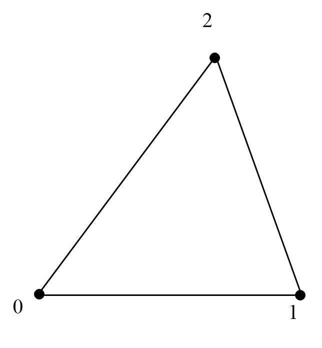
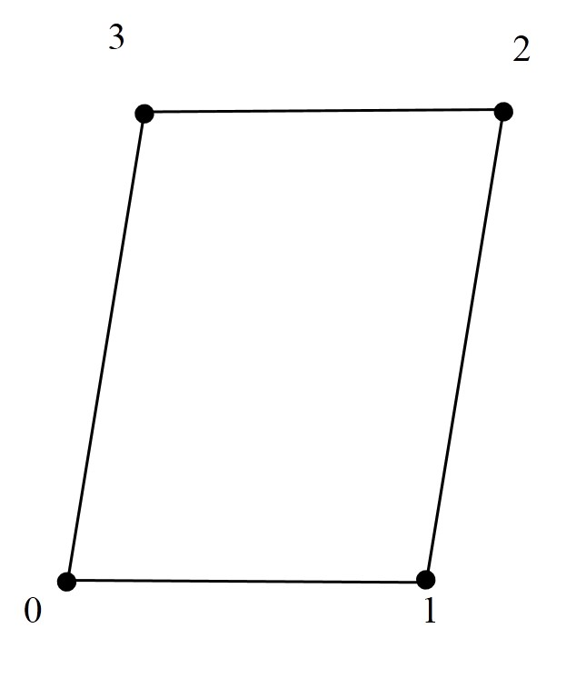
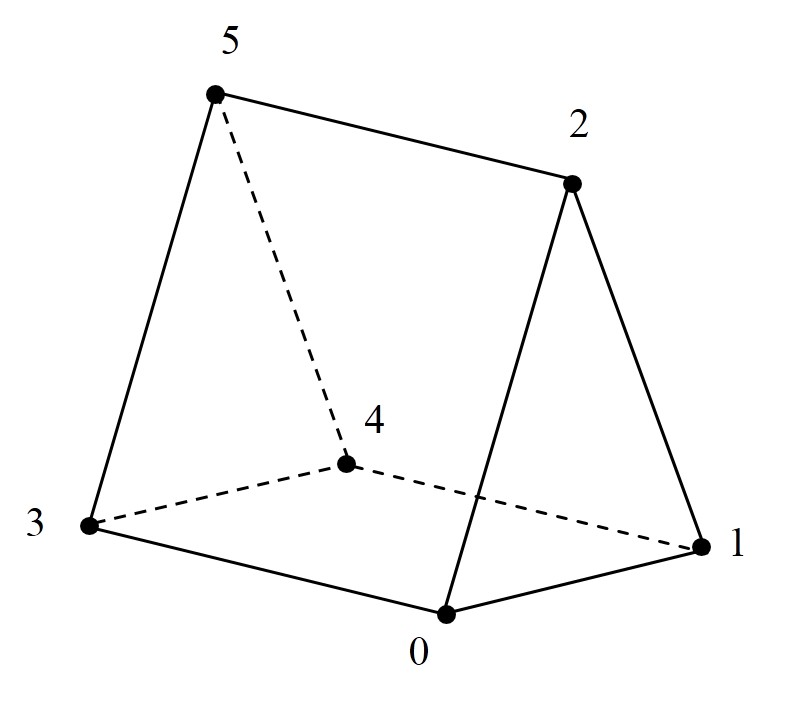
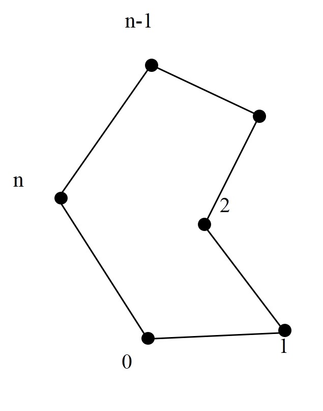
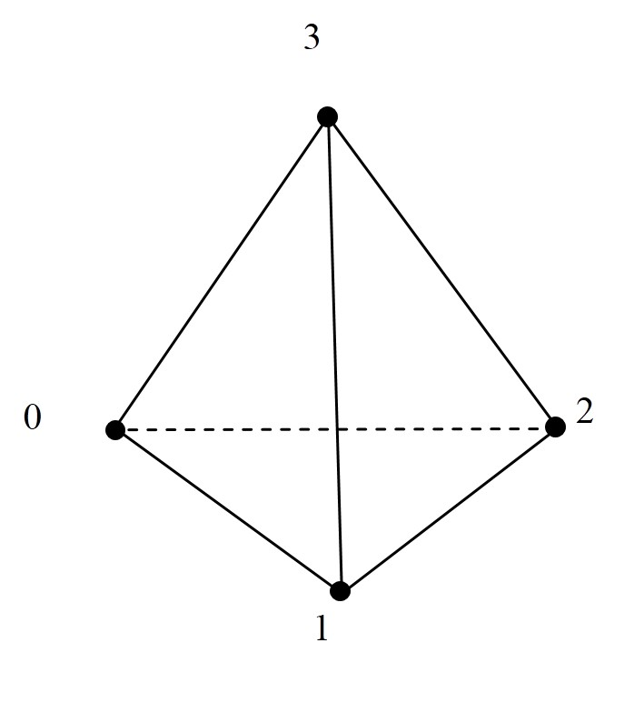
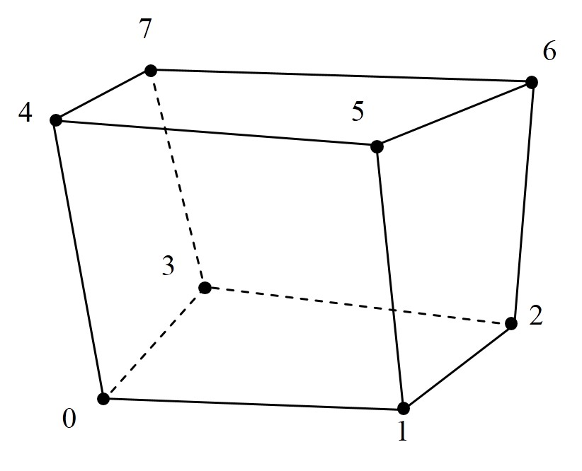
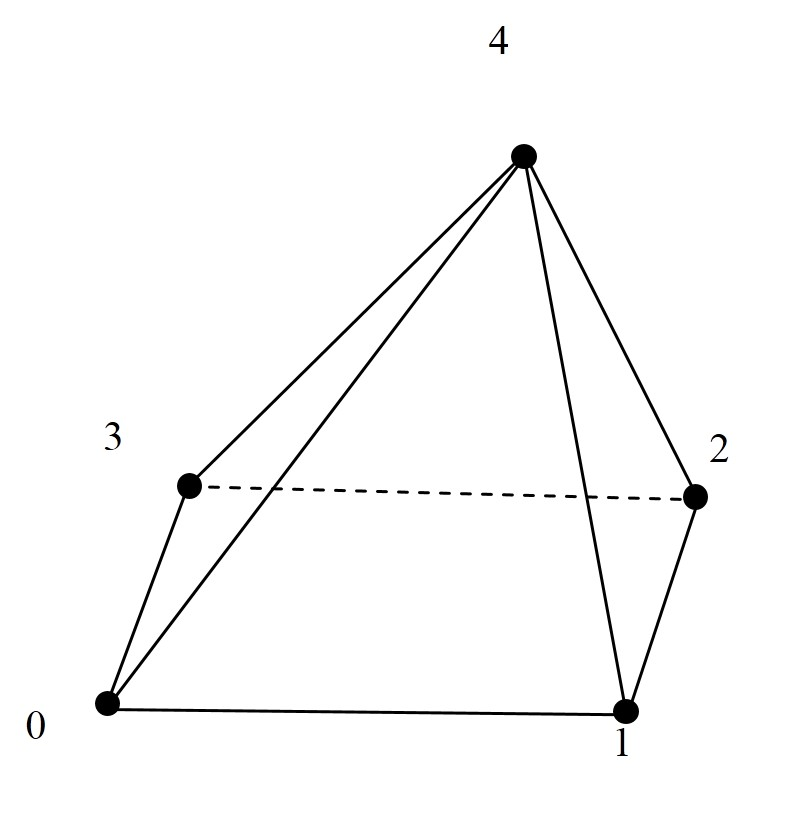

[TOC]


## 内容简介

本手册是JAUMIN框架的入门手册，适合新手熟悉框架快速上手。

手册第1章是使用JAUMIN框架所需的预备知识，会引入一些并行相关的概念，是框架无法绕过的概念，请**仔细阅读**；

从第2章开始正式利用框架写代码，从这章您可以了解JAUMIN框架的主体搭建和函数调用，请**仔细阅读**；

第3～8章是按照数值计算流程所需的知识点编写的，**按需查阅**；

最后是 JAUMIN 框架的安装以及一些附录信息，按需查阅。


## 第一章
本章将简要介绍 JAUMIN及其优势，在介绍JAUMIN 的编程思想过程中，会引入一些并行相关的概念，这些概念会贯穿整个手册，也是用户并行思考的必备知识。这里会用通俗化的语言进行解释，帮助新手形成大致概念。

### 1.1 JAUMIN简介

JAUMIN，北京应用物理与计算数学研究所研制，全称是并行自适应非结构网格应用支撑软件框架(J parallel Adaptive Unstructured Mesh applications INfrastructure)，J代表北京应用物理与计算数学研究所。

### 1.2 并行与 JAUMIN相关预备知识

在进行大规模运算时，串行程序不能充分利用硬件资源，速度慢；当采用多个处理器处理一个问题时，也就是我们所说的并行，会考虑将整个问题分割成小块并派发到不同处理器，这样无疑会缩短时间，但这个过程中会引入一些问题，比如每个小块不是孤立的，它会依赖周围小块的数据结果，或者某个小块算完了，但它依赖的周围数据还在计算中，这个小块就必须等待，这样的问题直接影响结果的准确性和程序的效率，在并行计算中都是需要考虑的。对应上述两个问题在并行中就是数据通信和负载平衡。

由于并行计算引入的问题归根究底是与待求解的问题不相关的，它纯粹是一种追求更快的计算手段，对于关注物理问题的工程师来说，学习并行会浪费大量时间。如何用自己已经了解的串行的程序，稍加变动，使其能够做并行运算？

JAUMIN 框架便是针对这种需求产生的，他对用户的要求只是将放在整个求解域的目光转移到一个小块，用户对小块进行**串行编程**，JAUMIN框架会自动遍历所有的小块进行计算，同时完成数据通信和负载平衡等。这些解释在JAUMIN框架内的描述将在下面说明。（这些称呼将贯穿整个手册，用户在示例程序中的注释中也会碰到）

一个问题用下图描述，它包括整个求解域以及所需的所有信息，这里将整个模型离散化为许多网格。串行程序是考虑整个求解域，进行整体计算。在并行中，整个求解域被离散为若干块，JAUMIN中称每个小块为**网格片**（Patch），如图1.2所示。

<p align="center"></p>
<p align="center">图1.1 串行，整个求解域</p>
<p align="center"></p>
<p align="center">图1.2 并行，求解域分块为若个网格片</p>
JAUMIN要求用户将目光放在一个网格片上，这个网格片不是具体哪一块，而是随意的某一块，任一块，考虑这任一块若是在边界区域该如何处理，与周围块相邻该如何处理，是否要用到相邻块的信息，哪些数据要用邻块的信息，要用多大范围的邻块信息等等问题，这些问题的思考便是框架要求的**并行思考**。这里先说一句：每个网格片上可以存一系列数据，如压力，密度，温度等数据，这便是**数据片**，数据片是网格片上的，一个网格片上可以有多个数据片，分别存储不同的物理量。某些数据片可能依赖邻块信息，不同数据依赖程度也不相同，这个由用户采取的方法决定，需要由用户给定，具体内容将在第4章说明。

在进行并性思考过程中，不可避免地会有依赖相邻网格片的信息，这些信息作为**影像区**存储在**数据片**上，如图1.3所示，图中是两层影像区，称**影像区宽度为2**。具体地定义为，数据片向外扩展一层或多层网格单元，新增的区域称为该数据片**影像区**，延扩的网格单元个数为**影像区宽度**。若有数据片拓展了影像区，则数据片除了网格片上的值，还会包含影像区部分的值。


<p align="center"></p>
<p align="center">图1.3 网格片上的影像区</p>
用户在了解影像区之后，便能发现：一旦影像区的值确定下来，单个网格片上的计算便如同串行程序。至于影像区的值是如何确定下来的，这点交由JAUMIN框架在各个网格片上通信并处理，用户现阶段可以不必关心，可以参考**附录**作进一步了解。在这里需要有的概念便是：影像区范围是用户确定的，影像区的值可以视为已知的。


### 小结

这一章简要解释了 JAUMIN 的一些功能，就**并性思考，串行编程**作了一点解释。阅读完本章，需要对并行计算及JAUMIN的一些知识有所了解：**网格片，数据片，影像区，影像区宽度，并性思考串行编程**。

本章之后，将正式利用JAUMIN框架编写计算程序，JAUMIN的安装信息参考第9章。


***

***

## 第二章 
在对JAUMIN框架的**并性思考，串行编程**有个了解之后，将开始正式使用框架。在这一章，我们将从一个Hello，world！出发介绍框架的终止与启动，随后会介绍JAUMIN文件的读入与输出，这些是JAUMIN中的辅助但是必要的部分，在了解这些部分之后，用户可以参考示例程序，将这些部分剥离，只关注最核心的部分，可以更有方向地把握框架的主体。框架的主体在本章2.4节介绍，会给出框架的调用关系，用户可以对比数值模拟的流程与JAUMIN的流程，会发现二者是一样的，只是JAUMIN中关注的是网格片而已。本章最后会针对数值模拟整个流程所需的具体信息给出对应章节的指引。

### 2.1 JAUMIN框架的启动和终止

利用 JAUMIN 框架进行编程，程序必须调用函数 tbox::MPI::init() 和 tbox::MPI::finalize() 分别启动和终止MPI系统，在这两个函数之间调用tbox::JAUMINManager::startup() 和 tbox::JAUMINManager::shutdown()，用于启动和终止JAUMIN系统。

以一个Hello,world! 的例子说明

```c++
#include <string>

#include "jaumin/MPI.h"
#include "jaumin/JAUMINManager.h"

int main(int argc,char* argv[]){
    //初始化MPI和JAUMIN环境。
    JAUMIN::tbox::MPI::init(&argc,&argv);
    JAUMIN::tbox::JAUMINManager::startup();
    
    //输出
    std::cout<<"Hello,world!"<<std::endl;
    
    //释放JAUMIN和MPI内部资源
    JAUMIN::tbox::JAUMINManager::shutdown();
    JAUMIN::tbox::MPI::finalize();
    
    return(0);
}
```

上面程序的几点解释：

1. 注意头文件，在使用JAUMIN框架中的函数时，要注意是否包含对应头文件。

2. 类tbox::MPI 和类tbox::JAUMINManager 均是静态类，前者提供JAUMIN框架和JAUMIN应用程序可能用到的消息传递通信函数，后者提供JAUMIN框架的管理函数。

3. 在终端会输出

   ```c++
      Hello,world!
   ```

### 2.2 JAUMIN框架读取输入文件

#### 2.2.1 读入.input文件

JAUMIN支持程序从指定的文件中读取计算参数，输入文件.input格式比较简单，用户可以直接从JAUMIN给出的示例程序中复制并修改。下面是个简要示例，取了.input文件中的一部分：

```c++
Main{
    log_all_nodes = FALSE
    ...
    javis_dump_interval = 100
    javis_dump_dirname = "javis_test2d_Rectangle"
    javis_number_procs_per_file = 1
    ...
}
....
GridGeometry{
    MeshImportationParameter{
        file_name = "../input/mesh_2d_20000.k"
    }
}   
....
```

上面程序的几点解释：

1. 计算参数以“**关键词=值**”的形式给出，一行列出一个参数。参数被封装在一对括弧"{ }"中，括弧前给定一个名称，如Main，GridGeometry ,  MeshImportationParameter。这种输入形式类似数据库。称“{}"内包含的内容为一个**数据库**，括弧前的名称为数据库名称，这里截取出的两段是三个数据库，数据库之间可以互相嵌套，数据库可以包含多个子数据库。这里数据库GridGeometry 包含MeshImportationParameter子数据库。
2. 在JAUMIN中，输入文件中的所有数据库都会被读取并存储在名为“input_db"大型数据库中，这个大型数据库称为**根数据库**。从根数据库中，可以由数据库名称获得输入文件中所有的数据库，进一步可以通过关键词访问对应的值，也可以将计算结果以“**关键词=值**“的形式存入数据库。对应上述输入文件片段，取出具体的值的具体操作由下面程序给出：

```c++
#include "MPI.h"
#include "JAUMINManager.h"
#include "InputManager.h"
using namespace JAUMIN;

int main(int argc,char* argv[]){
    //初始化MPI和JAUMIN环境。
    tbox::MPI::init(&argc,&argv);
    tbox::JAUMINManager::startup();
    
    // 解析命令行参数,srgv[1]此处是input文件名
    string  input_filename = argv[1];

    //解析输入文件的参数到根数据库input_db
    tbox::Pointer<tbox::Database> input_db =new
        								tbox::InputDatabase("input_db");
    tbox::InputManager::getManager()->parseInputFile(input_filename, input_db);

    //从根数据库中获取名为Main的子数据库
    tbox::Pointer<tbox::Database> main_db = input_db->getDatabase("Main");
 
    //从Main子数据库通过关键词获得对应的值
    bool log_all_nodes = 
        main_db->getBoolWithDefault("log_all_nodes", false);
    int javis_dump_interval =
        main_db->getIntegerWithDefault("javis_dump_interval", 0);
    string javis_dump_dirname = 
        main_db->getString("javis_dump_dirname");
    int javis_number_procs_per_file =
          main_db->getIntegerWithDefault("javis_number_procs_per_file", 1);
    //从GridGeometry数据库里的MeshImportationParameter数据库获得文件名，一种更直接的写法
    string mesh_file = input_db->getDatabase("GridGeometry")
                         ->getDatabase("MeshImportationParameter")
                         ->getString("file_name");
    
	//输出显示
    std::cout<<log_all_nodes<<std::endl;
    std::cout<<javis_dump_interval<<std::endl;
    std::cout<<javis_dump_dirname<<std::endl;
    std::cout<<javis_number_procs_per_file<<std::endl;
    std::cout<<mesh_file<<std::endl;
    
    //释放JAUMIN和MPI内部资源
    JAUMIN::tbox::JAUMINManager::shutdown();
    JAUMIN::tbox::MPI::finalize();
    
    return(0);
}
```

上面程序的几点解释：

1. 参考上面的代码段可以知道如何解析输入文件，如何从.input文件中获取不同数据库内包括string , int  , bool 类型的值。JAUMIN支持多种类型的参数值，包括所有基本数据类型和JAUMIN提供的数据类型，如类tbox::DataBase和类hier::Box<DIM> ，具体接口从Database.h中查找。这些数据可以以单个数据的形式列出，也可以数组的形式列出，对于数组，连续输入的参数值之间用逗号”，“分割，较长的数组可在连续多行中依次列出。下表是部分接口及功能描述：

| 接口                                                         | 功能                                                         |
| ------------------------------------------------------------ | ------------------------------------------------------------ |
| getString(const string& key)                                 | 读取一个与指定关键字关联的字符串. 若数据库中不存在该关键字, 则出错 |
| getIntegerWithDefault(const string& key,const int& defaultvalue) | 读取一个与指定关键字关联的整数. 若数据库中不存在该关键字,    |
| getBoolWithDefault(const string& key,const bool& defaultvalue) | 读取一个与指定关键字key关联的逻辑型bool数. 若数据库中不存在该关键字,则返回缺省值defaultvalue. |
| getDoubleWithDefault(const string& key,const double& defaultvalue) | 读取一个与指定关键字key关联的double数. 若数据库中不存在该关键字,则返回缺省值 |
| parseInputFile(const string &filename,Pointer<InputDatabase> db) | 解析指定的输入文件filename, 并把其结果存储到指定的数据库中   |
| getDatabase(const string& key)                               | 读取一个与指定关键字key关联的子数据库                        |


2. 程序的输出如下，bool为0表示FALSE

```c++
0
1
javis_poisson_2d
1
../input/mesh_2d_20000.k
```


#### 2.2.2 读入网格文件

目前为止，JAUMIN支持的输入网格文件格式比较单一，仅限于.k文件。关于k文件的内容在**附录**中可以查看。.input文件中需要写出k文件的路径（上面.input文件的代码中可以看到），在主程序中，只需要在网格文件名前面追加input文件的路径，JAUMIN框架会自动读取k文件并保存在根数据库中。具体如何在网格文件名前面追加input文件的路径可以参考示例程序，这部分用户可以直接挪用，不必关注更多细节。这里需要注意的是在.input文件中给定的k文件的路径是？？？？？路径。

### 2.3 JAUMIN框架输出

pout要不要写嘞？？？好不好用？？不同进程日志文件的书写？cout在多进程的时候的缺点？待定。。。。。。plog ， tbox::PIO::logAllNodes等等。。。。。。


### 2.4 程序主函数

在了解了JAUMIN的启动终止输入输出之后，再看JAUMIN框架的主体程序，大致分为‘启动-----预处理（读取所需的input文件，计时等）-----建立算法-----进行计算-----终止‘这五部分，在预处理部分用户可以根据自己所需进行增删，各部分包括的内容如图2.1所示。其中预处理部分重启动，计时器的内容参考附录。整个主函数的写法基本是固定的，对比图2.1与给出的main主函数可了解到这一点，这部分暂且无需细究，心中有个大概即可。

<p align="center"></p>
<p align="center"> 图 2.1 Main函数主体结构</p>
```c++
//main.cpp
//必需头文件
......
......
using namespace JAUMIN;

int main(int argc, char* argv[]) {
//================================1.启动 =====================================
    //1.1 初始化MPI和JAUMIN环境
    tbox::MPI::init(&argc, &argv);
    tbox::JAUMINManager::startup();
    
//================================2. 预处理 =====================================
    //2.1 解析命令行参数，读取根数据库
    if ((argc != 2) && (argc != 4)) {
        tbox::MPI::abort();
        return -1;
    }
    std::string input_filename = argv[1];
    tbox::plog << "input_filename = " << input_filename << endl;
    tbox::Pointer<tbox::Database> input_db = new tbox::InputDatabase("input_db");
    tbox::InputManager::getManager()->parseInputFile(input_filename,input_db);
    tbox::Pointer<tbox::Database> main_db = input_db->getDatabase("Main");

    // 2.2 日志文件控制
    std::string log_file_name = main_db->getString("log_file_name");
    bool log_all_node = main_db->getBoolWithDefault("log_all_node", false);
    if (log_all_node) {
        tbox::PIO::logAllNodes(log_file_name); 
    } else {
        tbox::PIO::logOnlyNodeZero(log_file_name);
    }    

    // 2.3 可视化数据场控制
    int javis_dump_interval = main_db->getIntegerWithDefault("javis_dump_interval", 0); 
    std::string javis_dump_dirname;
    int javis_number_procs_per_file;
    if (javis_dump_interval > 0) {
        javis_dump_dirname = main_db->getString("javis_dump_dirname");  
        javis_number_procs_per_file = main_db
        ->getIntegerWithDefault("javis_number_procs_per_file", 1);  
    }

    // 2.4 计时器控制
    tbox::Pointer<tbox::Database> timer_db = input_db->getDatabase("TimerManager");
    tbox::TimerManager::createManager(timer_db); 
    tbox::Pointer<tbox::Timer> t_write_javis_data = tbox::TimerManager::getManager()
            ->getTimer("apps::main::write_javis_data");  

    // 2.5 网格信息获取
    tbox::Pointer<hier::GridTopology<NDIM> > grid_topology = new 
        hier::GridTopology<NDIM ("GridTopology", input_db->getDatabase("GridTopology"));
    tbox::Pointer<hier::BaseGridGeometry<NDIM> > grid_geometry = new hier::GridGeometry<NDIM> ("GridGeometry", input_db->getDatabase("GridGeometry"));
    tbox::Pointer<hier::PatchHierarchy<NDIM> > patch_hierarchy = new hier::PatchHierarchy<NDIM> ("PatchHierarchy", grid_geometry, grid_topology, true);

//================================3. 算法 =====================================
	//3.1 网格片算法
    PatchCompute* my_patch_compute = new PatchCompute
            ("PatchStrategy",input_db->getDatabase("myProblem"));
	//3.2 网格层算法
    LevelCompute* my_level_compute = new LevelCompute
            ("LevelStrategy", my_patch_compute, input_db->getDatabase("Solver"));

    tbox::Pointer<algs::HierarchyTimeIntegrator<NDIM> > time_integrator = 
        new algs::HierarchyTimeIntegrator<NDIM>(
                "HierarchyTimeIntegrator",input_db->getDatabase("HierarchyTimeIntegrator"),
                patch_hierarchy, my_level_compute);

//================================4. 计算 =====================================
    //4.1 初始计算
    time_integrator->initializeHierarchy();

    //4.2 时间步推进求解
    double loop_time = time_integrator->getIntegratorTime();
    double loop_time_end = time_integrator->getEndTime(); 
    int iteration_num = time_integrator->getIntegratorStep(); 
    while((loop_time < loop_time_end) && time_integrator->stepsRemaining()) {
        double dt_actual = time_integrator->advanceHierarchy();
        loop_time += dt_actual;
        iteration_num = time_integrator->getIntegratorStep();
    }
    //模拟结束
    if(my_level_compute) delete my_level_compute;
    if(my_patch_compute) delete my_patch_compute;
// =============================== 5. 终止 =====================================
    //5.1 释放JAUMIN和MPI内部资源
    tbox::JAUMINManager::shutdown();
    tbox::MPI::finalize();
    return 0;
}

```

对上面程序的几点解释：

1. **JAUMIN中的指针**：JAUMIN框架提供***灵敏指针类***（smart  pointer） tbox::Pointer ,可以避免内存泄露。对JAUMIN 提供的的类，灵敏指针的使用方法与C++提供的标准指针相同，从上述程序第45行，第51行可以看到这一点。

   这里***建议***：JAUMIN框架外用户自己定义的类用C++提供的标准指针，指向JAUMIN框架中的类用灵敏指针。

   灵敏指针指向的内存空间由 JAUMIN管理，不会出现内存泄露；标准指针指向的内存空间不会被JAUMIN释放，故对于标准指针指向的内存空间用户需要自行管理，防止内存泄露，如上述程序83，84行所示，释放的是标准指针指向的内容。

2. 抛开启动终止和预处理这些非常相似的部分，JAUMIN框架的主函数对不同问题的处理的差异就只在下面这几行。这几行在main函数中甚至也可以说是不变的，差异是PatchCompute和LevelCompute两个类的实现细节，这两个类是用户根据问题自行实现的。

```c++
//================================3. 算法 =====================================
   	//3.1 网格片算法
      PatchCompute* my_patch_compute = new PatchCompute
              ("PatchStrategy",input_db->getDatabase("myProblem"));
  	//3.2 网格层算法
       LevelCompute* my_level_compute = new LevelCompute
               ("LevelStrategy", my_patch_compute, input_db->getDatabase("Solver"));

       tbox::Pointer<algs::HierarchyTimeIntegrator<NDIM> > time_integrator = 
           new algs::HierarchyTimeIntegrator<NDIM>("HierarchyTimeIntegrator",
                                     input_db>getDatabase("HierarchyTimeIntegrator"),
                  						 patch_hierarchy, my_level_compute);

   //================================4. 计算 =====================================
       //4.1 初始计算
       time_integrator->initializeHierarchy();

       //4.2 时间步推进求解
       double loop_time = time_integrator->getIntegratorTime();
       double loop_time_end = time_integrator->getEndTime(); 
       int iteration_num = time_integrator->getIntegratorStep(); 
       while((loop_time < loop_time_end) && time_integrator->stepsRemaining()) {
           double dt_actual = time_integrator->advanceHierarchy();
           loop_time += dt_actual;
           iteration_num = time_integrator->getIntegratorStep();
       }
```


### 2.5 整个程序的流程

这节是JAUMIN框架的流程指导，会在后面的所有章节中进行反复提醒，仔细阅读。在main函数的核心得到突显之后，用户需要知道JAUMIN串行编程的步骤和实际上的串行编程是否一致，这点将在本节说明。


从流程图可以看出，JAUMIN框架遵从“       ”的步骤，这与串行编程计算物理问题的程序是一样的，如下图所示。用户只需要将关注点放在网格片上。


这个流程图在接下来的几章中都有提及，用户就是在这个大流程中进行细节填充。第九章会再次回到这个流程图作更细致的说明。


###  小结

本章介绍了JAUMIN框架的**启动、终止，读取输入文件、输出**，在了解这些之后用户再看主函数的时候便会发现：剔除掉这些辅助性的片段后，整个程序的模式是固定的，只存在名称的差别。

之后给出了整个程序各个函数之间的**调用关系**，这便是JAUMIN框架的主体架构了。通过主体架构的调用流程和数值模拟的流程图对比，可以发现二者几乎是一样的，即所谓的串行编程。

在阅读完本章之后，用户可以尝试添加cout输出运行示例程序，查看框架调用流程。

本章之后，将根据数值模拟所需要的信息分章描述：

​	第3章 介绍**网格**；如何获取网格数，网格邻接信息，

​	第4章 介绍**变量与数据**

​	第5章 介绍**构件**

​	第6章 介绍**解法器**

​	第7章 介绍**可视化**

​	第8章 **总结**与回顾整个流程，在这一章，会有一些问题的解答。


***

***

## 第三章  网格
第二章提到，整个求解域上的问题会经过离散，分割成有限个网格单元，网格信息是用户需要的重要的一部分。用户需要的网格方面信息大致包括：

1. **数目相关**。网格单元（简称单元）数目，网格边的数目，面的数目，结点数--------------参考3. 2节。

2. **几何信息**。单元的中心坐标，面的中心坐标，边的中心坐标，结点的坐标--------------------参考3. 3节。

3. **邻接拓扑关系**。任一单元（面/边/结点）相邻的单元（面/边/结点）是哪些-------------------参考3. 4节。

4. 边界条件/外加源项等在JAUMIN中是如何标记的，这里会引入**实体集**的概念------------------参考3. 5节。

5. 待补充

   在本章3.1节，会介绍JAUMIN框架支持的网格类型及单元的存储，3.2～3.5节详细介绍上面几点网格信息的获取。

### 3.1网格类型

JAUMIN框架支持多维度，多几何形状的网格类型，如图3.1所示，目前支持9类基本实体网格类型，在CellType.h文件中查询到JAUMIN框架中支持的网格单元类型。JAUMIN框架也支持混合网格，如图3.2所示。

|  |  |  |  |
| :-------------------------------------------------: | :------------------------------------------------: | :------------------------------------------------: | :------------------------------------------------: |
|   |  |  |  |

<p align="center">3.1 网格类型</p>
### 3.2 数目相关

JAUMIN框架将整个计算区域划分为各网格片，交由多个处理器计算。用户在串行编程的过程中是针对单个网格片，从网格片上获取网格相关的信息，代码如下：

```c++
/// 获取当前网格片上单元数目
  int num_cells = patch.getNumberOfCells(0);
/// 获取当前网格片上结点数目
  int num_nodes = patch.getNumberOfNodes(0);
/// 获取当前网格片上边的数目
  int num_nodes = patch.getNumberOfEdges(0);
/// 获取当前网格片上面的数目
  int num_nodes = patch.getNumberOfFaces(0);
```


对程序的几点解释：

1. 网格片上面的数目的只有在三维情况下才存在；
2. 这些接口的参数列表表示影像区宽度，缺省情况下为0，表示获取网格片内部单元/点/边/面的数目。如果为n，则表示获取网格片内部和前n层影像区中单元/点/边/面的总数。


### 3.3 网格几何信息

```c++
// 从网格片取出几何相关信息
tbox::Pointer<hier::PatchGeometry<NDIM> > patch_geo =patch.getPatchGeometry();

//从几何信息里获得点/边中点/单元中心/面中心的坐标值
tbox::Pointer<pdat::NodeData<NDIM, double> > node_coords =
      											patch_geo->getNodeCoordinates();
tbox::Pointer<pdat::EdgeData<NDIM, double> > edge_coords =
      											patch_geo->getEdgeCoordinates();
tbox::Pointer<pdat::CellData<NDIM, double> > cell_coords =
      											patch_geo->getCellCoordinates();
tbox::Pointer<pdat::FaceData<DIM, double> > face_coords =
      											patch_geo->getFaceCoordinates();


//获取数组第一个元素地址
	double* node_data = node_coords->getPointer();
	double* edge_data = edge_coords->getPointer();
	double* cell_data = cell_coords->getPointer();
	double* face_data = face_coords->getPointer();
```

对程序的几点解释：

1. 在获得各项坐标值之前要先从网格片上获取几何信息，面的中点只有在三维情况下才存在；

2. 更多网格几何的接口参考头文件PatchGeometry.h。


### 3.4 网格邻接拓扑关系

从网格k文件中可以知道单个点的坐标信息和构成单元的点这两点信息。这两部分信息经由JAUMIN框架计算，便产生了所需的所有邻接关系信息，为了方便，将构成单元的点的信息写作<单元，结点>邻接关系，是单元周围的结点，同理点周围的单元<结点，单元>，从<单元，结点>邻接关系出发JAUMIN可以计算出其余所有的邻接关系。用户只需要调用接口。

```c++
// 从网格片取出拓扑相关信息
	tbox::Pointer< hier::PatchTopology< NDIM > > patch_top = patch.getPatchTopology();
//<边，单元>邻接拓扑关系
	tbox::Array< int > edge_adj_cell_extent,edge_adj_cell_index;
	patch_top->getEdgeAdjacencyCells(edge_adj_cell_extent,edge_adj_cell_index);
// 获取<单元, 单元>拓扑关系.
	tbox::Array<int> cell_adj_cell_extent, cell_adj_cell_index;
	patch_top->getCellAdjacencyCells(cell_adj_cell_extent, cell_adj_cell_index);
// 获取<单元, 边>拓扑关系.
	tbox::Array<int> cell_adj_edge_extent, cell_adj_edge_index;
	patch_top->getCellAdjacencyEdges(cell_adj_edge_extent, cell_adj_edge_index);
```


对程序的几点解释：

1. 在获得各项邻接关系之前要先从网格片上获取拓扑信息；

2. 各邻接关系接口如下表所示，更多网格几何的接口参考头文件PatchTopology.h。

   <p align="center">表3.3 邻接关系</p>
   |                  单元                  |             功能             |
   | :------------------------------------: | :--------------------------: |
   | getCellAdjacencyCells（extent,indices) | 获取该单元相邻单元的索引数组 |
   | getCellAdjacencyFaces（extent,indices) |    获取该单元上面索引数组    |
   | getCellAdjacencyEdges（extent,indices) |    获取该单元上边索引数组    |
   | getCellAdjacencyNodes（extent,indices) |    获取该单元上点索引数组    |
   |                 **面**                 |           **功能**        |
   | getFaceAdjacencyCells（extent,indices) |  获取该面相邻网格的索引数组  |
   | getFaceAdjacencyFaces（extent,indices) |   获取该面相邻面的索引数组   |
   | getFaceAdjacencyEdges（extent,indices) |   获取该面相邻边的索引数组   |
   | getFaceAdjacencyNodes（extent,indices) |   获取该面相邻点的索引数组   |
   |                 **边**                 |           **功能**       |
   | getEdgeAdjacencyCells（extent,indices) |  获取该边相邻单元的索引数组  |
   | getEdgeAdjacencyFaces（extent,indices) |   获取该边相邻面的索引数组   |
   | getEdgeAdjacencyEdges（extent,indices) |   获取该边相邻边的索引数组   |
   | getEdgeAdjacencyNodes（extent,indices) |   获取该边相邻点的索引数组   |
   |                 **点**                 |           **功能**        |
   | getNodeAdjacencyCells（extent,indices) |  获取该点相邻网格的索引数组  |
   | getNodeAdjacencyFaces（extent,indices) |   获取该点相邻面的索引数组   |
   | getNodeAdjacencyEdges（extent,indices) |   获取该点相邻边的索引数组   |
   | getNodeAdjacencyNodes（extent,indices) |   获取该点相邻点的索引数组   |


3. 参数列表extent和indices。extent是位置数组， indices是索引数组。以<单元，结点>为例：indices[extent[i]]到indices[extent[i+1]-1]表示与第i个单元邻接的结点索引(即该单元周围结点的编号)。以下图举例，左图是一个网格结构，单元和结点的编号在图上已经标注，构成单元的结点在体点表中列出，可以看出在混合网格的时候数组长度是不一样的，按照最长的数组长对每个单元分配内存显然会造成很大的浪费，在JAUMIN框架中，采用一维压缩方式存储，如图3.3右下。索引数组是遍历所有单元（按照单元编号）排列的结点编号，位置数组则是每个单元第一个点在索引数组的下标（下标从0开始），位置数组的最后一个数表示索引数组的长度。

   <p align="center"></p>
   <p align="center">图3.3 邻接关系存储</p>
显然，<单元，结点>邻接关系的两个数组中，位置数组的长度-1 = 单元数，indices[extent[i]]到indices[extent[i+1]-1]表示与第i个单元邻接的结点索引。


### 3.5 实体集

JAUMIN框架中实体集是一个很重要的概念，这里先简要说明一下。在做数值计算时，无论是采用计算软件或者自行编程，都会遇到处理边界这个问题，在利用计算软件的时候，需选定一条线或者一个面或者一个端点，为其取名并给定性质：绝热边界/自由边界/固壁面等。在自行编程的时候也是如此，按照物理问题对一部分单元或者点/边/面进行特殊的操作。这种操作在JAUMIN中便是对实体集的操作。**实体集**是整个从整个网格的点、边、面或单元总集中抽取出来的具有一类相同性质的部分，其主要用途是标识材料属性、边界条件等。JAUMIN中的实体集类型包括CELL型、NODE型、EDGE型、FACE型，每个实体集的类型只能是其中一种。

JAUMIN框架使用整型对每个实体集编号，编号EntityID与实体集的组成在.K文件中定义。每个实体集与一个<实体集编号ID，实体集类型>对应。

<p align="center">  </p>
<p align="center"> 图3.4 实体集示意图</p>
图3.4左为边界定义了3个边实体集，实体集索引号分别为0、1、2，实体集类型均为边，通过这个编号可推断出上下两个边界是同一类边界，需要进行相同的处理，至于是否和左右两边相同则无法知道，因为用户可以根据自己的习惯将它们分开编号，尽管是同一类边界进行的处理也可能相同。分开编号是被允许的。

图3.4右中的实体集随着网格片被剖分成多个子集，每个网格片就只会存储实体集属于本网格片的部分。

<p align="center">表3.6 实体集相关接口</p>
|                            实体集                            |               职责               |
| :----------------------------------------------------------: | :------------------------------: |
|                        getIdentity()                         |      获取网格片上实体集编号      |
|                          getType()                           |       获取网格上实体集类型       |
|                     getNumberOfEntity()                      |         获取网格片上实体         |
|                      getEntityIndices()                      |       获取网格实体索引数组       |
|        getEntityIndices(const int index_upper_bound)         | 获取一定范围内网格上实体索引数组 |
| getEntityAdjacencyNodes(tbox::Array<int>& xan_ext,tbox::Array<int>& xan_idx) |     获取<实体，结点>拓扑关系     |
|                       getStreamSize()                        |               null               |
|                      getFromDatabase()                       |               null               |


```C++
//添加头文件PatchGeometry.h，内含网格片上网格几何信息接口
#include "PatchGeometry.h"
//添加头文件Patch.h，功能作用在网格片上
#include "Patch.h"
void example(hier::Patch< NDIM >& patch)
{
//获取网格片几何信息
	tbox::Pointer< hier::PatchGeometry<NDIM>> patch_geo = patch.getPatchGeometry();
    //获取网格片结点坐标数据指针node_data
	tbox::Pointer<pdat::NodeData<NDIM,double> > node_data =patch_geo->getCoordinates();
    //通过node_data->getNumberOfEntity()获取实体总数，构造一个Array数组
	tbox::Array<hier::DoubleVector<NDIM>> node_coords(node_data->getNumberOfEntity());
    //将结点坐标存入node_coords
  	  for(int i=0;i<node_coords.size();i++){
   	     //NDIM为维度
   	     for(int j=0;j<NDIM;j++){
   	         node_coords[i][j]=(*node_data)(j,i);
   	     }
  	  }
}
```


### 小结

本章介绍了网格相关信息，包括获取网格片上各项的数目，几何信息（坐标），邻接拓扑关系，最后介绍了实体集。通过阅读本章，用户可以查看所有网格相关的信息，通过这些信息，用户甚至可以自己推测JAUMIN框架中单个网格的编号方式，可以查看附录信息进行验证。


***

***

## 第四章  变量与数据

求解物理问题便是对数据和变量的操作，因此这一章涉及的知识点较多，与另外的章节关联也密切。用户关心的变量与数据相关的信息大致包括：

1. 变量是否可以定义在网格的中心或者结点等位置？
2. 对于同一个物理量，会更新但又需要之前的值，在JAUMIN内如何操作？如何开辟内存？如何存储？
3. 多个分量的物理量在JAUMIN内的存储方式和读取；
4. 矩阵和向量如何存储，又该如何求解？
5. 待补充

这些问题在本章都会得到解释。

本章将按照程序的调用流程安排内容：“注册变量及上下文-----创建数据片-----（创建构件，参考第5章）-----数据片与构件-----对数据片的操作“，这几个部分在4.2～4.4节，因采用的求解方式的差异（显式时间步进求解，隐式求解矩阵方程），在每一步的处理上会有差异，会在每节分条阐述，对于相同步骤则统一说明。4.6节是数据存储格式的说明。


### 4.1 名词解释（变量位置，深度，群数，上下文，数据片）

**变量几何位置：**变量相对网格的位置需要用户确定并调用相应函数，框架提供变量的位置量包括中心量（CellVariable），结点量（NodeVariable），边心量（EdgeVariable），面心量（FaceVariable），粒子量（ParticleVariable），外表面边心量（OuterEdgeVariable），外表面面心量（OuterFaceVariable），外表面结点量（OuterNodeVariable），各种类型相对网格的几何位置如图所示。

|  |  |  |  |
| :----------------------------------------------------------: | :----------------------------------------------------------: | :----------------------------------------------------------: | :----------------------------------------------------------: |
|                            结点量                            |                            边心量                            |                            面心量                            |                            中心量                            |
|  |  |  |  |
|                         外表面结点量                         |                         外表面边心量                         |                         外表面边心量                         |                            粒子量                            |

**变量深度，群数：**框架中的变量深度与群数是存储数据时引入的概念。框架中数据连续存放于内存中。以坐标值存放举例，每个网格的中心坐标为(x,y,z)，在存放所有网格的中心坐标数据时有两种方式：①(x1,x2,x3,x4......xn，y1,y2,y3,y4......yn，z1,z2,z3,z4......zn)，这种存放方式群数为1，深度为3；

②(x1,y1,z1,x2,y2,z2,x3,y3,z3,......xn,yn,zn)，群数为3，深度为1。

具体的，变量深度表示变量分量的个数。例如：在三维空间中，物理量”速度“包含了三个方向的分量，则该变量的深度为3。群体是多个数据元素组成的集合体，群数则是此类集合体的数目。例如：将所有结点的”速度“的三个方向分量分别包含在群体1，群体2，群体3中，此时群数为3。

数据存放方式的选取是基于读取操作**速度**的考虑。在给出的示例中，由于之后的读取与赋值操作是通过fortran程序完成的，fortran存放数据从低维开始，采用第二种（群数，实体集，深度）的存储方式，在遍历所有单元数对变量操作时速度较快。若是通过c语言进行读取赋值等操作，采用第一种[深度][实体集][群数]的存放方式更为合适。用户可以进行选择。

<p align="center">             </p>
<p align="center"> 图4.2 </p>
**上下文（context）:**在工程问题中变量所处的环境（context），在框架中被译为上下文，两者表示含义相同：在物理问题的求解过程中，在相邻两个时间步内物理量会有更新，即当前时间步（/计算步）物理量，求解过程量，下个时间步（/计算步）上的物理量。框架存储同一物理量在不同时刻的值，在框架中称作< context >。即< 变量，context >确定了具体时间点/运算步骤上的物理量。

**数据片**：第二章已经提过，数据片存储网格片上的物理量（若需要，包括影像区），更进一步地说<变量，context>确定一个数据片，二者一一对应。在一个patch上，定义在**不同位置**的**不同物理量**及其**上下文**都会对应一个唯一的数据片。

------

------

### 4.2 注册变量、上下文并创建数据片

**注意：此处仅仅是注册，尚未分配内存**

对于利用矩阵和向量求解的物理量，这些物理量也可以是中心量或者结点量，但同时是存储在矩阵或者向量上，对应的注册会有很大差别，在本节会分开说明。上下文的注册是一致的。

#### 4.2.1 注册变量

#####  4.2.1.1 普通变量注册

变量的创建均需要由变量名，变量位置，群数，深度共同决定。（框架给出的示例中的注释有错误，应该为群数）


```c++
#include "CellVariable.h"
#include "EdgeVariable.h"
#include "StandardComponentPatchStrategy.h"

//注册变量
	//单元体积，中心量，群数为1	，深度为1（缺省）
	tbox::Pointer<pdat::CellVariable<NDIM,double>> d_cell_volume = new pdat::CellVariable<NDIM,double>("cell_volume",1);  
    //速度，中心量，群数为DIM，深度为1（缺省）
    tbox::Pointer<pdat::CellVariable<NDIM,double>>d_cell_velocity = new pdat::CellVariable<NDIM,double>("cell_velocity",NDIM);
    //通量，边心量，群数为NDIM+2，深度为1（缺省）
    tbox::Pointer<pdat::EdgeVariable<NDIM,double>>d_edge_flux = new pdat::EdgeVariable<NDIM,double>("edge_flux",NDIM);
/*********************************************************************
***********************************************************************/
	//注册context
	//变量数据库
	hier::VariableDatabase<NDIM>* variable_db=hier::VariableDatabase<NDIM>::getDatabase();
	//context，先给出全部所需context（当前时刻，演算时刻，新时刻）
	tbox::Pointer<hier::VariableContext> d_current = variable_db->getContext("CURRENT");
	tbox::Pointer<hier::VariableContext> d_scratch = variable_db->getContext("SCRATCH");
	tbox::Pointer<hier::VariableContext> d_new = variable_db->getContext("NEW");
```


对上面程序进行几点解释：

1. 声明变量。是通过接口对取名为cell_volume的变量进行声明，返回值是一个名为d_cell_volume的指针。

2. 变量数据库，通过getDatabase获取变量数据库，返回值是一个指针，指向变量数据库，这个函数是用户获取变量数据库的唯一接口，通过此接口可以获得******，详细的内容可以从***进一步了解（VariableDatabase）。在此处，通过这个接口声明上下文：给定待查找上下文名称的字符串（用户可以自己命名甚至进一步添加，只是作为一个变量所处环境的标记），返回值是一个指针，指向与名称匹配的上下文。

3. 不同几何位置变量的接口及需要的头文件

<p align="center"> 表4.1 定义变量的接口 </p>
<table>
<tr>
<td> 接口</td>
<td> 功能</td>
<td> 头文件</td>
</tr>
    <tr>
<td> pdat::CellVariable<DIM,Type>("name",group,depth)</td>
<td> 中心量</td>
<td> "cellVariable.h"</td>
</tr>
    <tr>
<td> pdat::NodeVariable<DIM,Type>("name",group,depth)</td>
<td> 结点量</td>
<td> "NodeVariable.h"</td>
</tr>
    <tr>
<td> pdat::EdgeVariable<DIM,Type>("name",group,depth)</td>
<td> 边心量</td>
<td> "EdgeVariable.h"</td>
</tr>
    <tr>
<td> pdat::FaceVariable<DIM,Type>("name",group,depth)</td>
<td> 面心量</td>
<td> "FaceVariable.h"</td>
</tr>
    <tr>
<td> pdat::ParticleVariable<DIM,Type>("name",group,depth)</td>
<td> 粒子量</td>
<td> "ParticleVariable.h"</td>
</tr>
<tr>
<td>pdat::OuterEdgeVariable<DIM,Type>("name",group,depth)</td>
<td> 外表面边心量</td>
<td> "OuterEdgeVariable.h"</td>
</tr>
<tr>
<td> pdat::OuterFaceVariable<DIM,Type>("name",group,depth)</td>
<td> 外表面面心量</td>
<td> "OuterFaceVariable.h"</td>
</tr>
<tr>
<td> pdat::OuterNodeVariable<DIM,Type>("name",group,depth)</td>
<td> 外表面结点量</td>
<td>"OuterNodeVariable.h"</td>
</tr>
</table>

##### 4.2.1.2 注册矩阵和向量
<table>
 <tr>
<td> pdat::VectorVariable<DIM,Type>("name",dof_info);</td>
<td> 向量变量</td>
<td>"VectorVariable.h"</td>
</tr>
    <tr>
<td> pdat::CSRMatrixVariable<DIM,Type>("name",dof_info)</td>
<td> 矩阵变量</td>
<td>"CSRMatrixVariable.h"</td>
</tr>
<table>


这里要仔细写一下，CELL，NODE这种都要写清楚。


#### 4.2.2 注册上下文

注册上下文比较简单，实例代码如下：


```C++
//注册context
	//变量数据库
	hier::VariableDatabase<NDIM>* variable_db=hier::VariableDatabase<NDIM>::getDatabase();
	//context，先给出全部所需context（当前时刻，演算时刻，新时刻）
	tbox::Pointer<hier::VariableContext> d_current = variable_db->getContext("CURRENT");
```


#### 4.2.3 创建数据片

 前文已经提过：数据片是网格片上的物理量，物理量用conxt标记使用时间点，数据片与<变量，context>一一对应。第二章也说明了数据片可能会包括影像区的信息。可以容易理解数据片需要变量，上下文，影像区宽度共同决定。创建数据片后返回一个int类型的值，这个值是数据片的ID号码，是对应数据片的唯一标识，之后用户可以用数据片的ID号调用接口对数据片进行操作。


```C++
	//注册数据片
	//注册<单元体积，当前时刻>数据片，用于存储每个时间步的当前单元体积值
	int d_cell_volume_current_id=variable_db->registerVariableAndContext(d_cell_volume,d_current，0)
    //注册<速度，当前时刻>数据片，用于存储每个时间步的当前速度值，影像区为0
	int d_velocity_current_id=variable_db->registerVariableAndContext(d_cell_velocity,d_current，0)
	//注册<通量，新时刻>数据片，用于存储每个时间步的新的通量值，影像区为0
	int d_flux_new_id=variable_db->registerVariableAndContext(d_edge_flux,d_new，0)    
```


这节总结下来如下图所示：
<p align="center"></p> 
<p align="center"> 图4.1 创建数据片流程</p>
**这节内容是patch的构造函数中的内容，在创造patch类的时候就被执行了，这部分仅仅对变量做了声明注册，尚未进行内存分配**


### 4.3 数据片与构件
从第二章的主控程序调用图可知，在数据片创建完之后，要创建计算需要的构件，这部分详情参考**第5章创建构件部分**。（这里可以先简单地认为构件是遍历所有网格片完成对数据片的某种操作的工具。它需要被创建-----和数据片绑定-----操作数据片。和数据片绑定部分会在第五章再次详细说明，这里只是带过）

**绑定构件和数据片**：


```C++
//初始化指定的积分构件：注册待填充的数据片或待调度内存空间的数据片到积分构件。
void Euler::initializeComponent(algs::IntegratorComponent<NDIM>* component) const {
	const string& component_name = component->getName();
	//初值构件
	if (component_name == "INIT_SET_VALUE"){
	component->registerInitPatchData(d_cell_volume_current_id);
	component->registerInitPatchData(d_velocity_current_id);
	}else if(component_name == "ALLOC_NEW_DATA"){//内存构件
	component->registerPatchData(d_flux_new_id);
	}
}
```


对上面程序的一点解释：

1. 对于同一个数据片可能要进行多种操作，可以把ID号注册到多个构件中。


### 4.4 对数据片的操作
在patch层上，用户可以由数据片的ID号获取数据片，并查看数据片的一些信息，更多具体细节参考数据片类型对应的头文件（表4.2所示）：


```C++
	//用户已知的是ID号，所以从ID号出发获取某个<变量，context>
	tbox::Pointer<pdat::CellData<NDIM,double>>cell_volume = patch.getPatchData(d_cell_volume_current_id);
	//获取此<变量，context>存储的首地址
	double * cell_volume_data  = cell_volume->getPointer();
	//获取此<变量，context>的群数
	int group = cell_volume->getGroup();
	//获取此<变量，context>的深度
	int depth = cell_volume->getDepth();
```


表4.2列出了数据片的类型，数据片的类型与变量（准确说是变量几何位置）必须一一对应。

<p align="center">  表4.2 数据片类型 </p>
<table>
<tr>
<td> 接口</td>
<td> 功能</td>
<td> 头文件</td>
</tr>
    <tr>
<td> pdat::CellData&lt;DIM, Type&gt; </td>
<td> 中心量的数据片</td>
<td> "CellData.h"</td>
</tr>
    <tr>
<td> pdat::NodeData&lt;DIM, Type&gt;</td>
<td> 结点量的数据片</td>
<td> "NodeData.h"</td>
</tr>
    <tr>
<td> pdat::EdgeData&lt;DIM, Type&gt;</td>
<td> 边心量的数据片</td>
<td> "EdgeData.h"</td>
</tr>
    <tr>
<td> pdat::FaceData&lt;DIM, Type&gt;</td>
<td> 面心量的数据片</td>
<td> "FaceData.h"</td>
</tr>
    <tr>
<td> pdat::ParticleData&lt;DIM, Type&gt;</td>
<td> 粒子量的数据片</td>
<td> "ParticleData.h"</td>
</tr>
<tr>
<td>pdat::OuterEdgeData&lt;DIM, Type&gt;</td>
<td> 外表面边心量的数据片</td>
<td> "OuterEdgeData.h"</td>
</tr>
<tr>
<td> pdat::OuterFaceData&lt;DIM, Type&gt;</td>
<td> 外表面面心量的数据片</td>
<td> "OuterFaceData.h"</td>
</tr>
<tr>
<td> pdat::OuterNodeData&lt;DIM, Type&gt;</td>
<td> 外表面结点量的数据片</td>
<td>"OuterNodeData.h"</td>
</tr>
    <tr>
<td> pdat::VectorDatae&lt;DIM, Type&gt;</td>
<td> 向量变量的数据片</td>
<td>"VectorData.h"</td>
</tr>
    <tr>
<td> pdat::CSRMatrixData&lt;DIM, Type&gt;</td>
<td> 矩阵变量的数据片</td>
<td>"CSRMatrixData.h"</td>
</tr>
</table>

### 4.5 数据片存储格式
<变量，context>数据片存储格式：对于定义在网格不同位置的<变量,context>，JAUMIN的存储方式是不相同的，分配内存吗？？？哪些构件分配内存？？？了解存储方式之后，方便对数据进行操作。
以fortran为例，存储格式为[群数,实体集,深度]。
当变量定义为中心量CellVariable，在存储<变量，context>时就必须对应为CellData类，存储格式为[         ]
当变量定义为结点量NodeVariable，在存储<变量，context>时就必须对应为NoeData类，存储格式为[        ]。
另外的变量类型也是如此，其存储格式如下表所示：


这个还是不会写哦多克，但还是得写一下的赶脚，能不能删？


### 小结

​	这一章，按照程序的调用顺序介绍了数据与变量的部分信息，创建完数据片之后，数据的处理便是对数据片的处理，这与构件的关系非常紧密。故本章数据的内容到构件为止，对数据片的操作挪至第五章构件部分。
​	这章之后，用户可以更加明白主控程序的流程，对每个流程步完成的工作有进一步了解。

***

***


## 第五章  构件

在说JAUMIN框架是**并行思考，串行编程**的时候提到：用户只需对单个网格片进行串行编程，框架会遍历所有网格片进行相同的数值计算并完成数据通信。这个功能的实现便交由**构件**。

构件内部分工明确。不同数据片要进行的操作是不同的，例如：中间量数据片参与迭代计算之后赋值给新时刻的数据片，中间量要参与计算而新时刻的量只用等待被赋值，这便有了迭代计算和等待被赋值两种分工，对应两种构件。

JAUMIN框架将这些不同的操作对应不同的构件，具体构件分工和接口列在表5.1中。这个例子可以把中间数据片注册到数值构件，把新时刻量和中间量一起注册到复制构件中。
​	这些操作在每个网格片上都是相同的，构件也承担了遍历所有网格片进行数据交互的任务，这个功能用户了解即可，无需进行干预，关注的点仍在单个网格片上。

通过上面的解释，第四章数据片与构件一节提到的“构件是遍历所有网格片完成对数据片的某种操作的工具“便可以得到理解了。用户使用 JAUMIN 最核心的就是**利用构件操作数据片搭建运算步骤**。在编写串行程序的时候，可能先要给物理量一个初始值，求出时间步长，之后可能会对利用前一步已知的物理量计算当前时间步上的量，或者是矩阵运算求得，然后可能要把最新时间步求出的物理量代替之前存的物理量等等等等，这便是运算步骤。JAUMIN框架要求用户把这些步骤的细节和对应的数据片告知构件，构件便会完成所有数据片的相同的运算步骤。

本章会先介绍各种构件和它们的功能，解释第二章出现的流程调用关系图中构件的作用；然后按照“创建构件-----和数据片绑定-----操作数据片“的流程在5.2～5.4节说明。和数据片绑定一节是在第四章的基础上进行更加详尽的解释。

### 5.1 构件种类

JAUMIN 框架提供的构件种类众多，常用的几种：初值构件，内存构件，步长构件，数值构件和复制构件。其功能等信息如表5.1所示。更多构件可以查看附录。

<p align="center">表5.1 基本构件</p>
<table>
 <tr> 
     <th width="22%">构件名</th>
     <th width="30%"> 构件</th>
     <th width="48%">作用</th>
  </tr>
 <tr> 
     <td > 初值构件</td>
     <td > InitializeIntegratorComponent</td>
     <td>为注册的数据片分配内存并初始化。</td>
</tr>
    <tr>
 <tr> 
     <td > 内存构件</td>
     <td > MemoryIntegratorComponent</td>
     <td>为注册的数据片申请或释放内存</td>
</tr>
    <tr>
    <td> 数值构件</td>
	<td>NumericalIntegratorComponent</td>
     <td>1.由源数据片填充目的数据片  2.遍历所有网格片为注册的数据片进行数值计算</td>
</tr>
    <tr>
	<td > 步长构件 </td>
	<td>DtIntegratorComponent</td>
	<td>1.由源数据片填充目的数据片 2.遍历所有网格片为注册的数据片计算时间步长 3.返回步长的最小值</td>
    </tr>
    <tr>
	<td > 复制构件 </td>
	<td>DtIntegratorComponent</td>
	<td>将源数据片复制给目的数据片</td>
    </tr>
</table>


**注意**：能够分配内存的构件是初值构件和内存构件，二者在使用上略有差别：初值构件在调用          函数的时候就 开辟内存，一直到程序结束内存才被释放掉，内存构件在任何需要开辟内存空间或者释放内存空间的地方直接使用即可。另外的构件都不能分配内存，只能对已有数据进行操作。

### 5.2 创建构件

从第二章的流程图中可以看到，创建构件在initializeLevelIntegrator()函数中（Level类中必须要实现的函数之一）创建构件时要提供标准构件网格片类algs::TimeIntegratorLevelStrategy的派生类对象，在下面程序中PoissonLevel类是派生类，对象d_patch_strategy。


```c++
//PiossonLevel类继承TimeIntegratorLevelStrategy类
#include "PiossonLevel.h" 
#include "InitializeIntegratorComponent.h"   //初值构件类
#include "NumericalIntegratorComponent.h"	 //数值构件类
#include "MemoryIntegratorComponent.h"		 //内存构件类
#include "DtIntegratorComponent.h"			 //步长构件类
//已知局部变量为：PoissonLevel* d_patch_strategy

//传入参数manager为构件管理器类，创建的构件会被加入构件管理器的数组中。
void PoissonLevel::initializeLevelIntegrator(
	tbox::Pointer<algs::IntegratorComponentManager<NDIM>> manager){
//创建初值构件comp_init，命名为"COMP_INIT"，用于初始化，
tbox::Pointer<algs::InitializeIntegratorComponent<NDIM>>comp_init = 
new algs::InitializeIntegratorComponent<NDIM>("COMP_INIT",d_patch_strategy,manager);
//创建数值构件comp_MAT，命名为"COMP_MAT",预用来计算总刚度矩阵
tbox::Pointer<algs::NumericalIntegratorComponent<NDIM>>comp_MAT = 
new algs::NumericalIntegratorComponent<NDIM>("COMP_MAT",d_patch_strategy,manager);
//创建数值构件comp_RHS,命名为"COMP_RHS"，预用来计算总右端项
tbox::Pointer<algs::NumericalIntegratorComponent<NDIM>>comp_RHS = 
new algs::NumericalIntegratorComponent<NDIM>("COMP_RHS",d_patch_strategy,manager);
//创建数值构件comp_SOL,命名为"COMP_SOL"，预用来存放结果列阵U
tbox::Pointer<algs::NumericalIntegratorComponent<NDIM>>comp_SOL = 
new algs::NumericalIntegratorComponent<NDIM>("COMP_SOL",d_patch_strategy,manager);
//创建内存构件comp_alloc_mat,命名为"ALLOC_MAT"，预分配矩阵内存
tbox::Pointer<algs::MemoryIntegratorComponent<NDIM>>comp_alloc_mat = 
new algs::MemoryIntegratorComponent<NDIM>("ALLOC_MAT",d_patch_strategy,manager);
//创建内存构件comp_alloc_vec,命名为"ALLOC_VEC"，预分配列阵内存
tbox::Pointer<algs::MemoryIntegratorComponent<NDIM>>comp_alloc_vec = 
new algs::MemoryIntegratorComponent<NDIM>("ALLOC_VEC",d_patch_strategy,manager);
//创建步长构件comp_step,命名为"COMP_STEP"，预计算时间步长
tbox::Pointer<algs::DtIntegratorComponent<NDIM>>comp_step = 
new algs::DtIntegratorComponent<NDIM>("COMP_STEP",d_patch_strategy,manager);
}
```


对上面程序的几点解释：

1. 传入参数：构件对象名称，指向类algs::TimeIntegratorLevelStrategy 派生类对象的指针，指向构件管理器的指针。关于构件管理器的内部管理可以查阅附录。
2. 上面程序是用FEM求解第二章中Poisson方程的片段，从“为左端矩阵，右端向量和解向量准备内存，构造左端项矩阵、构造右端向量、边界条件对左端右端矩阵的影响，以及求解线性方程“这几个点考虑，配合表5.1个构件的功能，可以知道需要创建：为左端矩阵开辟内存的内存构件；右端向量和解向量都是为向量开辟内存，用一个内存构件；左端右端和边界分开考虑，用三个数值构件，最后求解线性方程交由解法器（具体参考第六章）。
3. 确定了所需构件之后，将其一一注册到构件管理器中，这部分用法较为固定。创建初值构件和复制构件与上面类似，如下所示。


```C++
//初值构件: 管理数据片的内存以及初始化
 tbox::Pointer<algs::InitializeIntegratorComponent<NDIM> > d_init_set_value  = 
			new algs::InitializeIntegratorComponent<NDIM>("INIT_SET_VALUE", 														d_patch_strategy, manager);
//复制构件: 接受数值解
  tbox::Pointer<algs::CopyIntegratorComponent<NDIM> > d_copy_solution = 
    		new algs::CopyIntegratorComponent<NDIM>( "COPY_SOLUTION", 
                                                    d_patch_strategy, manager);
```


### 5.3 构件与数据片

这节在4.3中略微提过，这部分是将数据片与构件进行绑定。从5.2节的第1点FEM的解释中，在考虑问题求解流程时就应该确定各数据片的操作，明显的“左端矩阵数据片要和相应的内存构件绑定，右端向量和解向量和对应的内存构件绑定，三个数值构件分别操作上面三个数据片“。代码如下：

```c++
#include "PiossonPatch.h" //开辟内存是在patch计算类中完成
#include "initializeComponent.h"   //构件基类

void PoissonPatch::initializeComponent(
	tbox::Pointer<algs::IntegratorComponent<NDIM>> comp) const{
    //获取构件名
    const string& comp_name = comp->getName();
    //将数据片注册到不同构件中。
    if(comp_name="ALLOC_MAT"){
        //内存构件调用register函数，将数据片注册到内存构件中，仅分配内存
        comp->registerPatchData(U_id);
        comp->registerPatchData(RHS_id);
    }else if(comp_name="ALLOC_VEC"){
        //内存构件调用register函数，将数据片注册到内存构件中，仅分配内存
        comp->registerPatchData(MAT_id);
    }else if(comp_name="COMP_MAT"){
    }else if(comp_name="COMP_RHS"){
    }else if(comp_name="COMP_SOL"){
    }
}
```

几点解释：

1. 这段只将三个数据片注册到了内存构件，数值构件没有相关数据片，但前文却说明了三个数值构件是对数据片的操作。这点在这里作出解释：对于数值构件，它操作的可以是分配好内存的任一个的数据片。数值构件的参数列表是两个数据片的ID号，这两个数据片只有在需要通信的时候才需要注册到数值构件。也就是说，。。。。。。。。。。同理步长构件。具体注册如下：

   ```c++
   //数值构件
   comp->registerCommunicationPatchData(d_plot_id, d_plot_id);
   //步长构件
   comp->registerCommunicationPatchData(A_id, B_id);
   ```

2. 对于初值构件和复制构件，注册数据片的方式如下。初值构件传入一个待分配内存并初始化的数据片ID，复制构件的两个参数分别为目的数据片ID号源数据片ID号，是将数据从同一网格片上的源数据片复制到目的数据片，**注意**不会从相邻数据片复制数据到目的数据片的影像区.
   ```c++
   //初值构件
   comp->registerInitPatchData(A_id);
   //复制构件
   comp->registerCopyPatchData(A_id, B_id);
   ```


4. 注册函数列表

   <p align="center">表5.2 注册数据片到构件的函数</p>
   <table>
    <tr> 
        <th width="22%">构件</th>
        <th width="30%"> 接口</th>
    </tr>
    <tr> 
        <td rowspan="1"> 注册到初值构件</td>
        <td > registerInitPatchData()</td>
    </tr>
   <tr>
     <td rowspan="1"> 注册到内存构件</td>
     <td > registerPatchData()</td>
 </tr>
<tr>
     <td rowspan="1"> 注册到数值构件</td>
     <td > registerCommunicationPatchData()</td>
 </tr>
<tr>
     <td rowspan="1"> 注册到步长构件</td>
     <td> registerCommunicationPatchData()</td>
 </tr>
 <tr>
     <td rowspan="1"> 注册到复制构件</td>
     <td> registerCopyPatchData()</td>
 </tr>
</table>


### 5.4 构件对数据片的操作

这节按照数值计算流程的顺序说明，用户可以从第二章介绍的流程入手，了解各种构件发挥的作用。

#### 5.4.1 初始化（利用初值构件）

JAUMIN框架会调用initializeLevelData()函数，对所有网格片上注册在初值构件的数据片进行初始化。初始化过程共分为两步。第一步:通过初值构件，调用initializeLevelData()函数，示例代码如下：

```c++
#include "PoissonLevel.h"
//已知初值构件comp_init（5.3中代码定义）
void PoissonLevel::initializeLevelData(
	const tbox::Pointer<hier::BasePatchLevel<NDIM> > level,//指向网格层
	const double initial_time, //初始化时刻
	const bool initial_bool)        //真值表示当前是否为初始时刻
{
    //通过初值构件comp_init，调用initializeLevelData，该函数内部会调用PoissonPatch::initializePatchData()，该函数的职责是对Patch的数据片进行初始化
    comp_init->initializeLevelData(level,initial_data_time);
}
```

第二步:initializeLevelData()函数内部会调用PoissonPatch::initializePatchData()函数，其职责是对单个Patch上的数据片进行初始化，具体初始化操作由用户重构initializePatchData()函数完成。JAUMIN框架会根据用户重构的操作，初始化Patch上的数据片（仅针对被注册到初值构件的数据片），最终完成整个level上的数据片初始化。对于普通变量和矩阵变量，具体初始的细节有所不同，如下5.4.1.1与5.4.1.2。

##### 5.4.1.1 初始化普通变量

在在patch.C中的initializePatchData（）函数中，用户编写具体的初始化过程，获取网格片上的变量或者网格信息完成对变量的赋初值。

##### 5.4.1.2 初始化矩阵和向量

初始化自由度信息为例，代码如下：

```c++
#include "PoissonPatch.h"
//已知初值构件comp_init（5.3中代码定义）
//已知tbox::Pointer<solv::DOFInfo<NDIM> > dof_info= 
//newsolv::DOFInfo<NDIM>(true,false,false,false) 是自由度信息列表
void PoissonPatch::initializePatchData(
	hier::Patch<NDIM>& patch,  //网格片
	const double initial_time, //初始时刻
	const bool initial_bool, //真值表示当前是否为初始时刻
	const string& initial_comp_name) //初值构件名
{
    if(initial_time){
        //取出自由度信息列表的首地址指针DOF_distributiom
        int* DOF_distributiom = dof_info->getDOFDistribution(patch,hier::EntityUtilities::NODE);
        //获取Patch与第1层影像区上所有的结点数
        int num_nodes=patch.getNumberOfNodes(1);
        //设置每个结点上的自由度为1
        for (int i=0; i<num_nodes;++i){
            DOF_distributiom[i]=1;
        }
        //通过自由度信息列表，创建自由度全局索引数组
        dof_info->buildPatchDOFMapping(patch);
}
```

​	

**注意**：在初始化数据片之前，注册到初值构件中的数据片的内存已经由JAUMIN框架分配完毕。在分配内存时，会为影像区部分分配，但是在patch.C中的initializePatchData（）函数中赋初值时不需要对影像区数据进行初始化，影像区的值是自然产生的。

#### 5.4.2 开辟内存（内存构件）

变量的存储空间可由内存构件进行，内存构件使用灵活，任何需要开辟内存空间或者释放内存空间的地方直接使用即可。

```c++
	//EulerLevelIntegrator.C中
//参数列表（网格层level，申请内存的时间点）
d_alloc_new_data->allocatePatchData(level,current_time+predict_dt);

/....../
/....../
d_alloc_new_data->deallocatePatchData(level);
/....../
```

#### 5.4.3 计算步长（步长构件）

从表5.1中发现步长构件会自行完成3个步骤（第一个步骤在注册了数据片到步长构件时才有），步长构件会遍历所有网格片计算相应的时间步长，最后返回的是最小值。因此用户无需担心因不同网格片计算出的时间步长的差别。

在.input文件中，用户已经定义了模拟计算的初始时刻start_time，终止时刻end_time，最大时间步数max_integrator_steps，最大时间步步长max_dt，连续两个时间步长的最大放大倍数grow_dt。这意味着，程序计算的时间区间必须介于start_time与end_time之间，最大时间步步长不得超过max_dt，最大时间步长不得超过grow_dt。如果程序中设置的步长相关参数不满足条件时，会按照.input文件中的参数去运行程序。

实际计算过程中，用户通过重构Level计算类的getLevelDt()函数与Patch计算类的getPatchDt()函数，去设置真实的时间步长。通过示例代码如下：

```c++
#include "PoissonLevel.h"
//设置Patch上的时间步长
//已知步长构件comp_step（5.3节代码定义）
//getLevelDt
double PoissonLevel::getLevelDt(
	const tbox::Pointer<hier::BasePatchLevel<NDIM> > level,	//网格片
	const double dt_time,			//当前时刻
	const bool initial_time,	//真值表示当前是否为初始时刻
	const int flag_last_dt,		//上个时间步积分返回的状态
    const double last_dt)		//上个时间步的时间步长
{
    //通过步长构件调用getLevelDt()函数，获取patch上的时间步长
    return comp_step->getLevelDt(level,dt_time,initial_time,flag_last_dt,last_dt);
}

```

```c++
#include "PoissonPatch.h"
//设置Patch上的时间步长
double PoissonPatch::getPatchDt(
	hier::Patch<NDIM>& patch,	//网格片
	const double time,			//当前时刻
	const bool initial_time,	//真值表示当前是否为初始时刻
	const int flag_last_dt,		//上个时间步积分返回的状态
    const double last_dt,		//上个时间步的时间步长
	const string& dt_comp_name)
{
    //单个patch上的时间步长为0.01
    retrun 0.01;
}

```

#### 5.4.4 数值计算（数值构件）

在这里，所有数值构件的computing函数都会指向patch.C中的computeOnPatch（）函数，可以在computeOnPatch（）函数中通过构件名称做了一个判断，将不同的数值构件与它们实际要进行的操作一一对应。

##### 5.4.4.1 普通变量

```c++
  /// 组装右端项
  d_rhs_intc->computing(patch_level, current_time, 0.01);
  /// 组装矩阵
  d_mat_intc->computing(patch_level, current_time, 0.01);
  /// 加载约束
  d_constraint_intc->computing(patch_level, current_time, 0.01);
```

##### 5.4.4.2 矩阵和向量

```c++
#include "PoissonLevel.h"
//已知内存构件comp_alloc_mat，comp_alloc_vec，
//数值构件comp_MAT，comp_RHS，comp_bdry（均在5.3节代码创建）
//tbox::Pointer<solv::BaseLinearSoler<NDIM> > solver是解法器中的内容，后续介绍
double PoissonLevel::advanceLevel(
	const tbox::Pointer<hier::BasePatchLevel<NDIM> > level,	//网格片
	const double current_time,			//当前时刻
	const double predict_dt,	//真值表示当前是否为初始时刻
	const double max_dt,		//上个时间步积分返回的状态
    const double min_dt,		//上个时间步的时间步长
	const bool first_step,		//是否是第一步
	const int hierarchy_step_number, //计算步
	double& actual_dt)          //实际时间步
{
    //给未分配内存的数据片分配内存，若已分配，则更新时间
    comp_alloc_mat->allocatePatchData(level,current_time);
    comp_alloc_vec->allocatePatchData(level,current_time);
    //通过数值构件，调用computing()函数，该函数内部会调用Patch计算类的computeOnPatch()函数
    //从而计算总体刚度矩阵，总体右端项，添加边界条件
    comp_MAT->computing(level,current_time,predict_dt);
    comp_RHS->computing(level,current_time,predict_dt);
    comp_bdry->computing(level,current_time,predict_dt);
    //获取数据片的ID
    int mat_id=patch_strategy->getPatchVariable_ID("MAT");
    int vec_id=patch_strategy->getPatchVariable_ID("RHS");
    int sol_id=patch_strategy->getPatchVariable_ID("U");
    //通过解法器求解代数方程组，关于求解器部分，在后续章节介绍。
    solver->setMatrix(mat_id);
    solver->setRHS(mat_id);
    solver->solv(first_step,sol_id,level,local_db);
    //释放内存
    comp_alloc_mat->deallocatePatchData(level);
    comp_alloc_vec->deallocatePatchData(level);
}

```

```c++
#include "PoissonPatch.h"
//对单个Patch上的数据进行计算，求解函数由用户自己编写
void PoissonPatch::computeOnPatch(
	hier::Patch<NDIM>& patch,
	const double time,
	const double dt,
	const bool initial_time,
	const string& num_comp_name)
{
    //通过构件名，调用对应的函数求解矩阵或列阵
    if(num_comp_name=="COMP_MAT"){
        //求解刚度矩阵
        buildMatrixOnPatch(patch,time,dt,num_comp_name);
    }else if (num_comp_name=="COMP_RHS"){
        //求解右端项
        buildRHSOnPatch(patch,time,dt,num_comp_name);
    }else if (num_comp_name=="COMP_BDRY"){
        //加入边界条件
        applyBoundary(patch,time,dt,num_comp_name);
    }
}
```


#### 5.4.5 数据复制（复制构件）

对于一些显示求解方法，需要更新某个物理量的值，会用到复制构件。

```c++
d_copy_solution->copyPatchData(level, new_time);
```


### 小结


通过本章和前面的学习，可以完整写出第二章中的Poisson方程的显式FVM解法。对于采用FEM方法涉及到矩阵方程的求解，还需要阅读第6章 解法器相关内容。


***


## 第六章 解法器

通常情况下，将数学模型转化为线性代数方程$\mathbf {MAT}*\mathbf {SOL}=\mathbf {RHS}$，通过求解线性代数方程获得隐式解。如何组装左端项矩阵\mathbf {MAT}与右端项向量$\mathbf {SOL}$，如何求解线性代数方程组，是我们必须考虑的两个问题。基于框架求解线性代数方程组共有三步骤： 	

​	第一步：组装网格片矩阵/向量

​	第二步：调用框架的线性/特征值解法器求解

​	第三步：拷贝解向量的值到数据片

​	本章重点介绍JAUMIN框架中的矩阵，向量，以及解法器相关内容。

### 6.1矩阵与向量

前面第4章变量中提到过，JAUMIN框架提供矩阵类型变量CSRMatrixVariable与向量类型变量VectorVariable，其对应的数据片分别为压缩稀疏矩阵CSRMatrixData、向量VectorData。这两种数据片内存的开辟均会涉及到自由度信息的定义。

#### 6.1.1 自由度

<p align="center"> </p>
<p align="center"> 图6.1 通过自由度索引组装矩阵</p>
（有争议）**自由度**是待求变量的个数，可定义在实体上（如点，边，面，体等）。图6.1为例，每个结点上均存在待求变量，自由度定义在结点上，第0，1，2，3个结点上自由度数量分别为1，2，3，1。诸如CSRMatrixData，VectorData等数据片，在定义时必须涉及到自由度信息，以便开辟内存。局部矩阵组装到整体矩阵的过程中，也需要自由度索引信息。JAUMIN框架将自由度信息封装在DOFInfo类中，具体内容请自行查看DOFInfo.h文件。

**自由度类型**：自由度类型分别有node，edge，face，cell这四种，由此区分自由度定义在什么类型实体上。图6.1中的自由度类型为node，所以其待求变量是定义在每个结点上的。

**自由度分布数组**：该数组存储了每个结点上自由度数量。如图6.1所示，自由度分布数组表示为DOF_distribution=[1,2,3,1]。

自由度类型与自由度分布数组的设置直接关系到内存空间的大小，图6.1中，共有4个单元，自由度类型为结点，数据片CSRMatrixData的大小为7*7。倘若网格片上共有n个点，边，面，体，自由度分布数组的值均设置为m，则对应的CSRMatrixData，VectorData数据片空间大小如表6.1所示

<p align="center">表6.1 </p>
<table>
    <tr> 
        <td>自由度类型</td>
        <td> node</td>
        <td> edge</td>
        <td> face</td>
        <td> cell</td>
    </tr>
    <tr>
        <td>矩阵或列阵空间大小</td>
        <td>8*n*m</td>
        <td>12*n*m</td>
        <td>6*n*m</td>
        <td>n*m</td>
    </tr>
</table>

**自由度索引数组**：该数组存储的是每个结点数据添加到整体数据的索引位置编号。如图6.1所示，矩阵$k_a$，$k_b$就是根据自由度索引数组组dof_map装到整体矩阵中去的，dof_map=[0,1,3,6]，第i个结点起始存储位置为dof_map[i]，连续存储宽度为DOF_distribution[i]。

​	   自由度信息的创建代码示例如下：

```C++
#include "DOFInfo.h"
//定义一个自由度类，并设置自由度类型,DOFInfo()是DOFInfo类的构造函数
tbox::Pointer<solv::DOFInfo<NDIM> > dof_info = new solv::DOFInfo<NDIM>（true,false,false,false）
//获取自由度分布数组并赋值
int* DOF_distribution=dof_info->getDOFDistribution(patch,hier::EntityUtilities::NODE);
int num_nodes=patch.getNumberOfNodes(1);
for(int i=0;i<num_nodes;++i){
    //自由度分布组数值均设置为1，表明每个结点上自由度均为1
    DOF_distribution[i]=1;
}
//调用buildPatchDOFMapping()函数，内部建立自由度索引数组
dof_info->buildPatchDOFMapping(patch);
//获取自由度索引数组，
int* dof_map=dof_info->getDOFMapping(patch,hier::EntityUtilities::NODE);
```

着重介绍一下，DOFInfo()是DOFInfo类的构造函数，接口具体为DOFInfo(bool is_dof_on_node, bool is_dof_edge=false, bool is_dof_on_face=false,bool is_dof_on_cell =false, int ghost_width =1,bool is_dof_generic = false)，前四个bool型输入参数依次表示：结点、边、面、单元上是否有自由度，第五个输入参数表示输入影像区宽度，第六个输入参数表示是否有泛型自由度。

DOFInfo类里面有许多接口可供用户使用，经常使用的接口在表6.2中列出，具体接口信息，请自行查看DOFInfo.h文件。

<p align="center"> 表6.2 DOFInfo类接口信息</p>
<table>
    <tr>
        <td>接口</td>
        <td>功能</td>
    </tr>
    <tr>
        <td>DOFInfo()</td>
        <td>定义自由度类型</td>
    </tr>
    <tr>
        <td>DOFInfo()</td>
        <td>定义自由度类型</td>
    </tr>
    <tr>
        <td>registerToInitComponent()</td>
        <td>注册自由度信息到初值构件</td>
    </tr>
    <tr>
        <td>registerToMemoryComponent()</td>
        <td>注册自由度信息到内存构件</td>
    </tr>
    <tr>
        <td>buildPatchDOFMapping()</td>
        <td>建立自由度的网格片索引信息</td>
    </tr>
    <tr>
        <td>buildGlobalDOFMapping()</td>
        <td>建立自由度的全局索引信息</td>
    </tr>
    <tr>
        <td>getDOFDistribution()</td>
        <td>获取自由度分布数组首地址指针</td>
    </tr>
    <tr>
        <td>getDOFMapping()</td>
        <td>建立自由度索引数组首地址指针</td>
    </tr>
    <tr>
        <td>getNumberOfDOFs()</td>
        <td>获取网格片上的自由度总数</td>
    </tr>
    <tr>
        <td>getNumberOfInternalDOFs()</td>
        <td>获取Patch内自由度数量(去除影像区部分)</td>
    </tr>
    <tr>
        <td>getGhostWidth()</td>
        <td>影像区宽度</td>
    </tr>
    <tr>
        <td>getIsDOFOnEntity()</td>
        <td>判断是否有点，边，面，体等类型自由度</td>
    </tr>
</table>


#### 6.1.2 压缩稀疏矩阵

在大规模数值计算中，使用二维数组存储矩阵的方式既浪费大量的内存去存放零元素，又要在运算中花费大量的时间进行零元素的无效计算。因此，JAUMIN框架考虑用CSR(Compressed Sparse Row)格式稀疏矩阵进行压缩存储。CSR存储格式通过行偏量，列号以及数值等三个数组来表达整体矩阵存储形式。图6.2为CSR存储示意图，三种数组释义如下：

行偏移量数组:存储全部非零元的行下标，假设矩阵行数是m，则压缩后的数组长度为m+1，记该数组为row_offsets，第i个元素表示第i行有(row_offsets[i+1]-row_offsets[i])个非零元素。

列号数组:存储全部非零元的列下标。

数值数组:存储全部非零元的值。

​		

<p align="center"> </p>
<p align="center">图6.2 CSR存储示意图</p>
JAUMIN框架中在CSRMatrixData类中提供了许多功能接口，如表6.3所示。具体接口信息请自行查看CSRMatrixData.h文件。

<p align="center"> 表6.3 CSRMatrixData类接口</p>
<table>
    <tr>
        <td>接口</td>
        <td>功能</td>
    </tr>
    <tr>
        <td>getRowStartPointer()</td>
        <td>获取矩阵非零元行起始索引数组指针</td>
    </tr>
    <tr>
        <td>getColumnIndicesPointer()</td>
        <td>获取矩阵非零元列号数组指针</td>
    </tr>
    <tr>
        <td>isValid()</td>
        <td>判断矩阵元素是否有效</td>
    </tr>
    <tr>
        <td>addMatrixValue()</td>
        <td>累加矩阵的元素值</td>
    </tr>
    <tr>
        <td>setMatrixValue()</td>
        <td>设置矩阵的元素值</td>
    </tr>
    <tr>
        <td>getValuePointer()</td>
        <td>获取矩阵非零元素数组指针</td>
    </tr>
    <tr>
        <td>assemble()</td>
        <td>将稠密矩阵转化为CSR存储格式</td>
    </tr>
    <tr>
        <td>disassemble()</td>
        <td>将CSR矩阵拆卸成链表数据结构（即稠密矩阵）</td>
    </tr>
    <tr>
        <td>spMVOnPatch()</td>
        <td>网格片上矩阵向量乘积运算</td>
    </tr>
    <tr>
        <td>getMatrixDiag()</td>
        <td>获取网格片对角线元素</td>
    </tr>
    <tr>
        <td>getMaxNumberOfNonZero()</td>
        <td>获取一行最大的非零元个数</td>
    </tr>
    <tr>
        <td>getTotalNumberOfNonZero()</td>
        <td>获取向量长度</td>
    </tr>
    <tr>
        <td>reorderColumn()</td>
        <td>对列号重新排序</td>
    </tr>
    <tr>
        <td>isAssemble()</td>
        <td>判断是否转换为CSR矩阵</td>
    </tr>
    <tr>
        <td>get_num_rows()</td>
        <td>获取总行数</td>
    </tr>
    <tr>
        <td>get_num_cols()</td>
        <td>获取总列数</td>
    </tr>
    <tr>
        <td>get_num_nonzeros()</td>
        <td>获取总非零元数</td>
    </tr>
</table>		


为便于用户组装矩阵，CSRMatrixData数据片初始是采用链表数据结构，与稠密矩阵类似。用户可先在此基础上组装矩阵，后续计算时，转换为CSR矩阵。示例代码如下:

```C++
#include "CSRMatrixData.h"
//已知数据片ID MAT_id，自由度分布数组DOF_distribution,自由度索引数组dof_map
//以图6.1为例子，将ka存入总刚中，已知单元结点编号为node_id=[0,1,2];
//获取矩阵指针MAT_matrix
tbox::Pointer<pdat::CSRMatrixData<NDIM, double> >MAT_matrix = patch.getPatchData(MAT_id);
vector<int> dof_index;//自由度索引
//建立ka的自由度索引
for (int node=0;node<3;node++){
	for (int t=0;t<DOF_distribution[node_id[node]];++t){
        dof_index.push_back(dof_map[node_id[node]]+t);
    }
}
//ka组装到整体矩阵MAT中
for (int row=0;row<dof_index.size();row++){
    for (int col=0;col<dof_index.size();col++){
        MAT_matrix->addMatrixValue(dof_index[row],dof_index[col],ka[row][col]);
    }
}
//将MAT转换为稀疏矩阵，此后MAT为CSR稀疏矩阵形式
MAT_matrix->assemble();
//获取行偏移数组
int *row_start = MAT_matrix->getRowStartPointer();
//获取列号数组
int *col_idx = MAT_matrix->getColumnIndicesPointer();
//获取数值数组
double* mat_val = MAT_matrix->getValuePointer();
//转换为CSR矩阵后也可以赋值
for (int row=0;row<dof_index.size();row++){
    for (int col=0;col<dof_index.size();col++){
        *(MAT_matrix(dof_index[row],dof_index[col])+=0.0;
    }
}
```


### 6.1.3 向量

向量数据片VectorData的操作与6.1.2类似，表6.4列出了VectorData类的一些功能接口，具体细节请自行查看VectorData.h文件。

<p align="center"> 表6.4 VectorData类接口</p>
<table>
    <tr>
        <td>接口</td>
        <td>功能</td>
    </tr>
    <tr>
        <td>getPointer()</td>
        <td>获取向量数组指针</td>
    </tr>
    <tr>
        <td>setVectorValue()</td>
        <td>设置向量的元素值</td>
    </tr>
    <tr>
        <td>addVectorValue</td>
        <td>累加向量的元素值</td>
    </tr>
    <tr>
        <td>fill()</td>
        <td>填充某深度上的值</td>
    </tr>
    <tr>
        <td>fillALL()</td>
        <td>填充整个向量</td>
    </tr>
    <tr>
        <td>add()</td>
        <td>添加元素到向量指定位置</td>
    </tr>
    <tr>
        <td>getDepth()</td>
        <td>获取深度</td>
    </tr>
    <tr>
        <td>getVectorLength()</td>
        <td>获取向量长度</td>
    </tr>
    <tr>
        <td>getPointerArray</td>
        <td>获取指针数组</td>
    </tr>
</table>

​		示例代码如下：

```C++
#include "VectorData.h"
//已知数据片ID RHS_id，自由度分布数组DOF_distribution,自由度索引数组dof_map
//以图6.1为例子，将rhs存入总刚中，已知单元结点编号为node_id=[0,1,2];
//获取向量指针RHS_vec
tbox::Pointer<pdat::VectorData<NDIM, double> >RHS_vec = patch.getPatchData(RHS_id);
vector<int> dof_index;//自由度索引
//建立rhs的自由度索引
for (int node=0;node<3;node++){
	for (int t=0;t<DOF_distribution[node_id[node]];++t){
        dof_index.push_back(dof_map[node_id[node]]+t);
    }
}
//rhs组装到整体向量RHS中
for (int col=0;col<dof_index.size();col++){
        RHS_vec->addVectorValue(dof_index[col],rhs[col]);
}
```


### 6.2 解法器

JAUMIN框架中解法器有两种：线性解法器与特征值解法器。这两种解法器都只能适用CSRMatrixData类型数据片与VectorData类型数据片。

#### 6.2.1线性解法器

线性解法器通常求解类似$\mathbf {MAT}*\mathbf {SOL}=\mathbf {RHS}$的线性代数方程组。线性解法器需要先由管理器LinearSolverManager类获取，LinearSolverManager类中可使用接口主要有两个，如表6.5。

<p align="center"> 表6.5 LinearSolverManager类</p>
<table>
    <tr>
        <td> 接口</td>
        <td> 功能</td>
    </tr>
    <tr>
        <td>getManager()</td>
        <td> 获取解法器管理器</td>
    </tr>
    <tr>
        <td>lookupLinearSolver()</td>
        <td> 获取指定的解法器指针</td>
    </tr>
</table>

​		BaseLinearSolver类为线性解法器类，可使用接口如下

<p align="center"> 表6.6 BaseLinearSolver类</p>
<table>
    <tr>
        <td>接口</td>
        <td>功能</td>
    </tr>
    <tr>
        <td>setMatrix()</td>
        <td>设置矩阵</td>
    </tr>
    <tr>
        <td>setRHS()</td>
        <td>设置右端项</td>
    </tr>
    <tr>
        <td>solve()</td>
        <td>线性代数方程求解</td>
    </tr>
</table>

示例代码如下：

```C++
#include "LinearSolverManager.h"
#include "BaseLinearSolver.h"
//已知 bool first_step  判断是否为计算的第一步
//已知 MAT_id，RHS_id，SOL_id分别为矩阵，右端项向量，解向量数据片id
//已知level 网格片，local_db 数据包
//获取解法器管理器
tbox::Pointer<solv::LinearSolverManager<NDIM> > solver_manager = solv::LinearSolverManager<NDIM>::getManager();
//根据解法器名字从管理器中选择解法器
tbox::Pointer<solv::BaseLinearSolver<NDIM> > solver = solver_manager->lookupLinearSolver("AMG_CG");
//将数据片放置到方程左右对应位置
solver->setMatrix(MAT_id);
solver->setRHS(RHS_id);
//求解向量数据片SOL_id
solver->solve(first_step,SOL_id,level,local_db);
```

#### 6.2.2特征值解法器

特征值解法器通常求解类似$\mathbf {A}*\mathbf {X}=\lambda \mathbf{B}*\mathbf{X}$的特征值系统方程。特征值解法器由EigenSolverManager类管理，EigenSolverManager类与BaseEigenSolver类所提供的功能接口分别如表6.5与表6.7所示，具体细节请自行查看EigenSolverManager.h与BaseEigenSolver.h文件。

<p align="center"> 表6.5 EigenSolverManager</p>
<table>
    <tr>
        <td> 接口</td>
        <td> 功能</td>
    </tr>
    <tr>
        <td>getManager()</td>
        <td> 获取解法器管理器</td>
    </tr>
    <tr>
        <td>lookupLinearSolver()</td>
        <td> 获取指定的解法器指针</td>
    </tr>
</table>

<p align="center"> 表6.7 BaseEigenSolver类</p>
<table>
    <tr>
        <td>接口</td>
        <td>功能</td>
    </tr>
    <tr>
        <td>setMatrix()</td>
        <td>设置矩阵</td>
    </tr>
    <tr>
        <td>setPreMatrix()</td>
        <td>设置右端项谱变换过程中线性方程组的预条件矩阵T</td>
    </tr>
    <tr>
        <td>solve()</td>
        <td>线性代数方程求解</td>
    </tr>
</table>

示例代码如下：

```C++
#include "EigenSolverManager.h"
#include "BaseEigenSolver.h"
//已知 bool first_step  判断是否为计算的第一步
//已知 A_id，B_id，X_id分别为矩阵，矩阵，解向量数据片id。
//已知level 网格片，local_db 数据包
//获取解法器管理器
tbox::Pointer<solv::EigenSolverManager<NDIM> > solver_manager = solv::EigenSolverManager<NDIM>::getManager();
//根据解法器名字从管理器中选择解法器
tbox::Pointer<solv::BaseEigenSolver<NDIM> > solver = solver_manager->lookupEigenSolver("KrylovSchur");
//将数据片A,B放置到方程左右对应位置，A*X=λB*X
solver->setMatrix(A_id,B_id);
//求解向量数据片X，模态eigen_value
tbox::Array<double> eigen_value(5);
solver->solve(first_step,X_id,level,eigen_value,local_db);
```


### 小结


***

***


## 第七章 可视化

完成并行计算之后，并行得到的数据将如何存储？能否可视化并行，譬如各数据片？对这些问题，JAUMIN框架提供了可视化接口，可将待绘图的物理量（***绘图量***）输出存储，这些数据可以直接用JaVis进行后续的可视化分析。这个过程在JAUMIN框架中分为三步：

1. 创建Javis数据输出器

2. 向输出器注册待绘图的物理量（***绘图量***）

3. 调用输出器的成员函数，输出绘图量的数据

   本章内容也将从这三个部分进行基本使用的阐述。更多使用方法参考附录。


### 7.1 创建Javis数据输出器

​	创建JaVis输出器类在Main函数中，指定类对象名称、输出目录名称以及文件分组情况。

```c++
//string javis_dump_dirname
//int javis_number_procs_per_file
	tbox::Pointer<appu::JaVisDataWriter<NDIM>> javis_data_writer;
	javis_data_writer = new appu::JaVisDataWriter<NDIM>(
			"Poisson_JaVis_Writer",    //Javis数据输出器名称？这个可以干嘛
			javis_dump_dirname,        //存储数据文件的目录名
			javis_number_procs_per_file); //共享同一文件的进程个数
	
```

对上面程序的几点解释：

1. 创建JaVis输出器类在Main函数中，头文件中应该要包含“JaVisDataWriter.h"
2. JaVis数据输出器将并行应用程序的进程分组。组内进程采用接力棒的方式将数据串行写入相同文件，组间进程将数据并行写入不同文件。共享同一文件的进程个数能够影响到可视化数据输出的IO性能，假定程序运行1000个进程，若javis_number_procs_per_file = 20 ，则每个输出时刻输出50个数据文件；若javis_number_procs_per_file = 1 ，则每个输出时刻输出1000个数据文件。


### 7.2 向输出器注册绘图量
​	JaVis输出器类提供了注册函数registerPlotQuantity(  )，将绘图量注册到JaVis数据输出器，绘图量只需注册一次且不能重名。一经注册，可在任意时刻输出绘图量。

```c++
//string variable_name 
//string variable_type
//int patch_data_index
//string variable_centering
	javis_data_writer->registerPlotQuantity(
					variable_name,   //绘图量在图中的名字
					variable_type,   //绘图量类型
					patch_data_index,  //数据片ID
					variable_centering) //绘图量数据位置，缺省为NODE
```

对上面程序的几点解释：

1. 注册绘图量这一步在patch类中实现，在Main中通过patch类调用即可。
2. variable_name是绘图量在图中显示的名字，用户自拟；
3. variable_type绘图量类型对应标量、矢量、张量和组合量，取值依次为SCALAR，VECTOR，TENSOR 和 COMPOSITE；
4. variable_centering 是数据相对网格的位置，JaVis支持位于单元中心、结点和粒子上的数据，依次取值为CELL，NODE。粒子量可以吗？当绘图量不在这几类中时，如：FaceVariable和EdgeVariable数据是在面心和边心上，可利用这个参数将其转换到支持的网格位置处。          HDF5???JAD???
5. 一些注册示例

```c++
//矢量
javis_data_writer->registerPlotQuantity("cell_velocity","VECTOR",d_velocity_current_id) ;
```

### 7.3 输出绘图量的数据

​	在用户需要的时刻，调用数据输出函数，将绘图量输出到文件。代码如下：

```c++
	//tbox::Pointer<hier::PatchHierarchy<NDIM>>patch_hierarchy
	javis_data_writer->writePlotData(
						patch_hierarchy,    //指针
						iteration_number,   //当前时间步序号
						loop_time);         //当前模拟时刻
```


###  7.4 可视化整体流程

​	在主程序main中获取input文件的可视化参数，用于控制可视化输出，读取input文件的细节参看第2章：

```c++
int main(...){
    ......
    //从input文件中获取输出控制参数 
    int javis_dump_interval =        
        main_db->getIntegerWithDefault("javis_dump_interval",0);
    string javis_dump_dirname;
    int javis_number_procs_per_file = -1;
    if (javis_dump_interval>0){
        javis_dump_dirname = main_db->getString("javis_dump_dirname");
        javis_number_procs_per_file = 
            main_db->getIntegerWithDefault("javis_number_procs_per_file",1);
    }
    ......
    //用户自己创建几何类、拓扑类、层次结构、patch类，Level类，积分类对象，为数据输出器类提供数据片ID
    ......
    //创建JaVis数据输出器
    tbox::Pointer<appu::JaVisDataWriter<NDIM>> javis_data_writer;
    if (javis_dump_interval>0){
        javis_data_writer = new appu::JaVisDataWriter<NDIM>(
			"Poisson_JaVis_Writer",    
			javis_dump_dirname,        //目录名
			javis_number_procs_per_file); //共享同一文件进程数
        
    //注册绘图量。
    //由patch内的函数执行，因为要用到数据片ID号，这个ID号放在patch类的private里比较好。
    //置于public内也可以，就可以在main函数中直接写具体操作，不利于数据封装而已
        Poisson_patch->registerPlotData(javis_data_writer);
    }
    ......
    //输出数据，在任意需要输出的时候,判断条件由用户自己确定。（以下条件是在间隔步数的整数倍时输出数据）
    if (javis_dump_interval>0 && (interation_num%javis_dump_interval)==0){
        javis_data_writer->writePlotData(
						patch_hierarchy,    
						iteration_number,   //当前时间步序号
						loop_time);         //当前模拟时刻
    }
    ......
}
```

在patch类中具体实现注册绘图量这一步骤

```c++
void Poisson::registerPlotData(tbox::Pointer<appu::JaVisDataWriter<NDIM>> javis_data_writer){
    javis_data_writer->registerPlotQuantity(
					"UUU",   //绘图量在图中的名字
					"SCALAR",   //绘图量类型
					d_uval_current_id)  //数据片ID
}
```


### 小结

​	本章提供可视化的信息。


## 第八章

​	本章是对3～7章的总结，会就流程图进行进一步补充说明。然后给出针对Poisson方程的显示FVM和FEM程序。

### 8.1 流程图的进一步说明


### 8.2 程序代码


### 小结


## 附录

### 附录1 JAUMIN安装

### 附录2 并行，影像区，数据通信
### 附录 k文件

### 附录 计时器 重启动 日志文件

### 附录 管理器，根数据库

### 附录 单个网格编号信息

### 附录 更多构件，规约

### 附录 teravap简单使用


​	